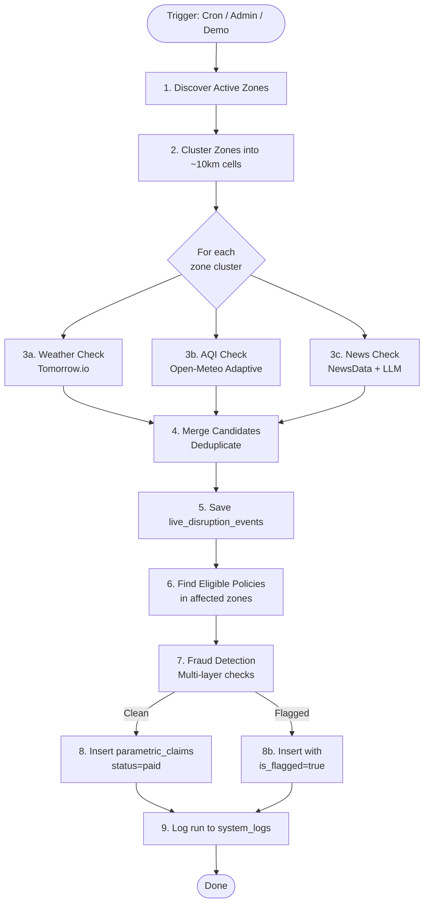
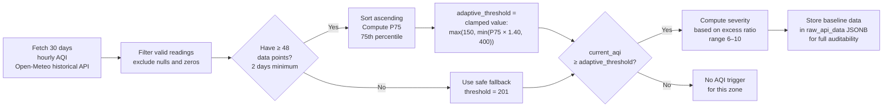
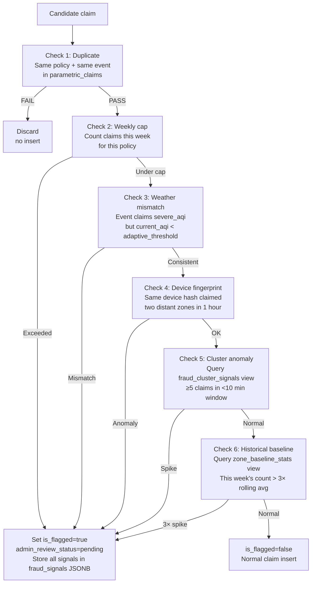

# Adjudicator Engine — Oasis

The adjudicator is the **core intelligence** of the Oasis platform. It runs autonomously every 6 hours, detects active disruptions using real external data sources, and automatically creates insurance claim payouts for eligible riders — **zero human intervention required**.

---

## Files

| File | Runtime | Purpose |
|------|---------|---------|
| `lib/adjudicator/run.ts` | Node.js (Next.js) | Primary adjudicator, called by cron route |
| `supabase/functions/enterprise-adjudicator/index.ts` | Deno (Edge Function) | Supabase-hosted version, feature parity |

---

## Execution Flow



---

## Step 1: Dynamic Zone Discovery

The adjudicator does **not** use hardcoded coordinates. Instead it queries the database for all riders who currently have active policies:

```typescript
const { data: zones } = await supabase
  .from("weekly_policies")
  .select("profiles!inner(zone_latitude, zone_longitude)")
  .eq("is_active", true)
  .gte("week_end_date", today);
```

This returns the actual geographic spread of covered riders, making the platform fully location-aware regardless of how many cities it expands to.

---

## Step 2: Zone Clustering

Nearby zones are grouped into ~10 km grid cells to avoid redundant API calls:

```typescript
// Round to 1 decimal degree ≈ 11 km
const clusterKey = `${Math.round(lat * 10) / 10},${Math.round(lng * 10) / 10}`;
```

A city like Mumbai with 50 active riders in the same neighborhood generates only **one** set of API calls, not 50.

---

## Step 3a: Weather Trigger (Tomorrow.io)

**API:** `https://api.tomorrow.io/v4/weather/realtime`

**Trigger conditions:**

| Condition | Threshold | Severity Range |
|-----------|-----------|---------------|
| Wind speed | ≥ 60 km/h | 6–9 (scales linearly) |
| Precipitation | ≥ 50 mm/h | 7–10 (scales logarithmically) |

**Geofence:** 15 km radius circle centered on zone cluster.

---

## Step 3b: AQI Trigger — Adaptive Algorithm

**API:** `https://air-quality.api.open-meteo.com/v1/air-quality`

### The Problem with Fixed Thresholds

A naive implementation might use `if (currentAqi >= 201) → trigger`. This breaks in Indian cities:

| City | Baseline AQI | Fixed threshold (201) | Adaptive threshold |
|------|-----------|-----------------------|-------------------|
| Delhi | ~280 | Triggers **every day** | ~392 (40% above baseline) |
| Bangalore | ~65 | Almost never triggers | ~182 (40% above baseline) |
| Mumbai | ~120 | Triggers ~3×/week | ~210 (40% above baseline) |

### The Adaptive Algorithm



**Formula:**
```
adaptive_threshold = clamp(P75 × 1.40, min=150, max=400)
```

**Severity calculation:**
```
excess_ratio = (current_aqi - baseline_p75) / baseline_p75
severity = clamp(6 + excess_ratio × 8, min=6, max=10)
```

**Raw data stored per event:**
```json
{
  "trigger": "severe_aqi",
  "current_aqi": 380,
  "adaptive_threshold": 336,
  "baseline_p75": 240,
  "baseline_mean": 195,
  "historical_days": 30,
  "excess_percent": 58,
  "source": "openmeteo_adaptive"
}
```

---

## Step 3c: News / Social Disruption (NewsData.io + LLM)

**API:** `https://newsdata.io/api/1/news`

**Query:** Top news headlines for the zone's city and state in the last 24 hours.

**LLM Classification (OpenRouter — Llama 3.1 8B):**

```
Prompt: Given these news headlines about [city], are there any reports of:
1. Significant traffic disruptions or road blockages?
2. Civil unrest, protests, curfews, or lockdowns?
Respond with JSON: { "traffic": true/false, "social": true/false, "confidence": 0-1, "reason": "..." }
```

**Trigger conditions:**

| LLM output | Severity | Geofence |
|------------|---------|---------|
| `traffic: true, confidence ≥ 0.7` | 6–8 | 10 km radius |
| `social: true, confidence ≥ 0.7` | 7–9 | 12 km radius |

---

## Step 4: Demo Mode

Admins can inject synthetic events without calling real APIs:

```typescript
interface DemoTriggerOptions {
  eventSubtype: string;  // e.g. "extreme_wind"
  lat: number;
  lng: number;
  radiusKm: number;
  severity: number;      // 1–10
}
```

When `demoTrigger` is provided, the adjudicator skips all external API calls and directly creates a disruption event with the specified parameters. All downstream claim processing (fraud detection, DB inserts, logging) runs normally.

---

## Step 7: Fraud Detection

The fraud detector runs `runAllFraudChecks()` before each claim is inserted.



**Fraud signals JSONB structure:**
```json
{
  "checks_run": ["duplicate", "weekly_cap", "weather_mismatch", "device_fingerprint", "cluster_anomaly", "historical_baseline"],
  "flags": ["cluster_anomaly"],
  "cluster_anomaly": {
    "claim_count": 8,
    "window_seconds": 420,
    "flag_rate": 0.0
  }
}
```

---

## Geofence Matching

To determine if a rider's zone is inside a disruption event's geofence, the adjudicator uses **Haversine distance**:

```typescript
function haversineDistance(lat1, lng1, lat2, lng2): number {
  const R = 6371; // Earth radius km
  const dLat = (lat2 - lat1) * Math.PI / 180;
  const dLng = (lng2 - lng1) * Math.PI / 180;
  const a = Math.sin(dLat/2)**2 +
    Math.cos(lat1 * Math.PI/180) *
    Math.cos(lat2 * Math.PI/180) *
    Math.sin(dLng/2)**2;
  return R * 2 * Math.atan2(Math.sqrt(a), Math.sqrt(1-a));
}

// Rider in geofence if:
haversineDistance(riderLat, riderLng, eventLat, eventLng) <= event.radius_km
```

---

## Claim Amount Calculation

The payout amount is read directly from the rider's active plan:

```typescript
const payoutAmount = policy.plan_packages.payout_per_claim_inr;
// ₹300 (Basic) | ₹400 (Standard) | ₹600 (Premium)
```

No ML or complex calculation — the amount is fixed by the subscribed plan. The **risk** of the parametric system is on the insurer's side through careful threshold calibration.

---

## Logging

Every adjudicator run — whether successful, failed, or demo — is logged to `system_logs`:

```json
{
  "event_type": "adjudicator_run",
  "severity": "info",
  "metadata": {
    "zones_processed": 3,
    "events_detected": 2,
    "claims_created": 14,
    "flagged_claims": 1,
    "duration_ms": 4210,
    "triggered_by": "cron"
  }
}
```

Admins can view this log in the System Health dashboard at `/admin/health`.

---

## Edge Function vs. Next.js

Both implementations are kept in sync:

| Feature | `lib/adjudicator/run.ts` | `supabase/functions/enterprise-adjudicator/index.ts` |
|---------|------------------------|-----------------------------------------------------|
| Runtime | Node.js 20 | Deno 1.x |
| Trigger | `/api/cron/adjudicator` | Supabase Edge Function HTTP |
| Zone discovery | ✅ | ✅ |
| Zone clustering | ✅ | ✅ |
| Adaptive AQI | ✅ | ✅ |
| Fraud detection | ✅ | ✅ |
| Demo mode | ✅ | ✅ |
| System logging | ✅ | ✅ |

The Next.js version is the primary execution path. The Deno Edge Function can be deployed as a fallback or for lower-latency execution from the Supabase region.
