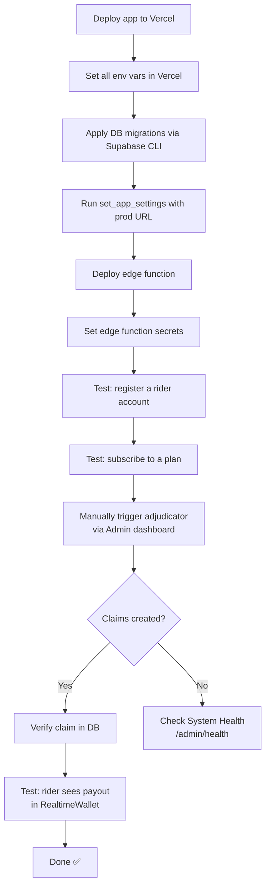

# Deployment Guide — Oasis

This guide covers local development setup, database migration runbook, and full production deployment on Vercel + Supabase.

---

## Prerequisites

| Tool         | Version | Purpose               |
| ------------ | ------- | --------------------- |
| Node.js      | ≥ 20    | Runtime               |
| npm          | ≥ 10    | Package manager       |
| Supabase CLI | latest  | Database migrations   |
| Vercel CLI   | latest  | Deployment (optional) |

---

## Local Development Setup

### 1. Clone and Install

```bash
git clone https://github.com/lohitkolluri/oasis.git
cd oasis
npm install
```

### 2. Configure Environment Variables

```bash
cp .env.local.example .env.local
```

Edit `.env.local` and fill in all values:

| Variable                        | Required | Source                                                   | Notes                                        |
| ------------------------------- | -------- | -------------------------------------------------------- | -------------------------------------------- |
| `NEXT_PUBLIC_SUPABASE_URL`      | ✅       | Supabase Dashboard → Project Settings → API              | Public URL                                   |
| `NEXT_PUBLIC_SUPABASE_ANON_KEY` | ✅       | Supabase Dashboard → Project Settings → API              | Public anon key                              |
| `SUPABASE_SERVICE_ROLE_KEY`     | ✅       | Supabase Dashboard → Project Settings → API              | **Never expose to client**                   |
| `TOMORROW_IO_API_KEY`           | ✅       | [app.tomorrow.io](https://app.tomorrow.io)               | Free tier: 500 req/day                       |
| `NEWSDATA_IO_API_KEY`           | ✅       | [newsdata.io](https://newsdata.io)                       | Free tier: 200 req/day                       |
| `OPENROUTER_API_KEY`            | ✅       | [openrouter.ai](https://openrouter.ai)                   | LLM classification                           |
| `GOOGLE_MAPS_API_KEY`           | ⚠️       | [Google Cloud Console](https://console.cloud.google.com) | Optional — for routing features              |
| `RAZORPAY_KEY_ID`               | ⚠️       | [Razorpay Dashboard](https://dashboard.razorpay.com)     | Leave blank for demo mode                    |
| `RAZORPAY_KEY_SECRET`           | ⚠️       | Razorpay Dashboard                                       | Leave blank for demo mode                    |
| `PAYMENT_DEMO_MODE`             | ⚠️       | —                                                        | Set `true` to bypass payments in dev         |
| `ADMIN_EMAILS`                  | ⚠️       | —                                                        | Comma-separated; empty = all users are admin |
| `CRON_SECRET`                   | ✅       | Generate randomly                                        | Protects cron endpoints                      |

**Generate a CRON_SECRET:**

```bash
openssl rand -hex 32
```

### 3. Apply Database Migrations

```bash
# Link to your Supabase project
npx supabase login
npx supabase link --project-ref YOUR_PROJECT_REF

# Apply all migrations
npx supabase db push
```

**Alternative — using Supabase MCP (if CLI not available):**
Apply each migration file from `supabase/migrations/` manually in the Supabase SQL editor, in filename order.

### 4. Configure pg_cron (Post-Migration)

After migrations are applied, run this once to configure the weekly premium cron job with your app URL:

```sql
SELECT set_app_settings(
  'https://your-app.vercel.app',  -- or http://localhost:3000 for dev
  'your-cron-secret-here'
);
```

Run in Supabase SQL editor or via the MCP `execute_sql` tool.

### 5. Start Development Server

```bash
npm run dev
```

Visit [http://localhost:3000](http://localhost:3000).

---

## Database Migration Runbook

### Check Applied Migrations

```sql
-- In Supabase SQL editor
SELECT version, name, inserted_at FROM supabase_migrations.schema_migrations ORDER BY inserted_at;
```

### Apply a New Migration

```bash
npx supabase db push
```

### Verify Schema After Migration

```sql
-- Check all tables exist
SELECT table_name FROM information_schema.tables
WHERE table_schema = 'public' ORDER BY table_name;

-- Expected tables:
-- claim_verifications, live_disruption_events, parametric_claims,
-- plan_packages, premium_recommendations, profiles, rider_delivery_reports,
-- rider_wallet (view), system_logs, weekly_policies

-- Check indexes
SELECT indexname, tablename FROM pg_indexes
WHERE schemaname = 'public' ORDER BY tablename, indexname;

-- Check RLS is enabled
SELECT tablename, rowsecurity FROM pg_tables
WHERE schemaname = 'public' ORDER BY tablename;
```

### Rollback Strategy

Supabase does not support automatic rollbacks. To roll back a migration:

1. Write a reverse SQL script manually
2. Apply it via `supabase db push` with a new migration file named `YYYYMMDD999999_rollback_xxx.sql`
3. Or apply directly in the SQL editor

---

## Production Deployment (Vercel + Supabase)

### Vercel Setup

```bash
# Install Vercel CLI
npm i -g vercel

# Deploy
vercel --prod
```

Or connect your GitHub repo to Vercel for automatic deployments on push.

### Vercel Environment Variables

Add all variables from `.env.local.example` in Vercel Dashboard → Project → Settings → Environment Variables.

> **Important:** Set variables for all environments: Production, Preview, and Development.

### Vercel Cron Configuration

The `vercel.json` file already defines the cron schedule:

```json
{
  "crons": [
    {
      "path": "/api/cron/adjudicator",
      "schedule": "0 */6 * * *"
    },
    {
      "path": "/api/cron/weekly-premium",
      "schedule": "30 17 * * 0"
    }
  ]
}
```

Vercel sends requests to cron endpoints with `Authorization: Bearer {CRON_SECRET}` automatically on the hobby+ plan.

> **Note:** Vercel Cron requires Pro plan or higher for custom schedules. On the free plan, use the pg_cron jobs instead.

### Supabase Edge Function Deployment

```bash
# Deploy the enterprise adjudicator edge function
npx supabase functions deploy enterprise-adjudicator

# Set edge function secrets
npx supabase secrets set TOMORROW_IO_API_KEY=xxx
npx supabase secrets set NEWSDATA_IO_API_KEY=xxx
npx supabase secrets set OPENROUTER_API_KEY=xxx
```

---

## Post-Deployment Checklist



**Verification SQL:**

```sql
-- Check plan packages seeded correctly
SELECT slug, name, weekly_premium_inr, payout_per_claim_inr FROM plan_packages;

-- Check pg_cron jobs registered
SELECT jobname, schedule, active FROM cron.job WHERE jobname LIKE 'oasis%';

-- Check system_logs has at least one entry after first adjudicator run
SELECT event_type, severity, created_at FROM system_logs ORDER BY created_at DESC LIMIT 5;
```

---

## Supabase Storage Setup

For optional photo uploads (claim verification proofs and delivery reports):

1. Go to Supabase Dashboard → Storage
2. Create bucket: `rider-reports` (private)
3. Create bucket: `claim-proofs` (private)
4. Add RLS policy allowing authenticated users to upload to their own folder:

```sql
CREATE POLICY "Riders upload own proofs"
ON storage.objects FOR INSERT TO authenticated
WITH CHECK (bucket_id = 'claim-proofs' AND (storage.foldername(name))[1] = (SELECT auth.uid()::text));

CREATE POLICY "Riders view own proofs"
ON storage.objects FOR SELECT TO authenticated
USING (bucket_id = 'claim-proofs' AND (storage.foldername(name))[1] = (SELECT auth.uid()::text));
```

---

## Monitoring

### System Health Dashboard

Visit `/admin/health` after login to see:

- Last adjudicator run timestamp and stats
- 24-hour error count
- External API connectivity checks
- Recent system log events

### Key Metrics to Monitor

| Metric                  | Query                                                                                                                                 | Alert if |
| ----------------------- | ------------------------------------------------------------------------------------------------------------------------------------- | -------- |
| Failed adjudicator runs | `SELECT count(*) FROM system_logs WHERE severity='error' AND event_type='adjudicator_run' AND created_at > NOW()-INTERVAL '24h'`      | > 0      |
| Stale active policies   | `SELECT count(*) FROM weekly_policies WHERE is_active=true AND week_end_date < CURRENT_DATE`                                          | > 0      |
| Pending fraud reviews   | `SELECT count(*) FROM parametric_claims WHERE admin_review_status='pending'`                                                          | > 10     |
| Claims flagged rate     | `SELECT round(count(*) FILTER(WHERE is_flagged) * 100.0 / count(*), 1) FROM parametric_claims WHERE created_at > NOW()-INTERVAL '7d'` | > 20%    |

---

## Troubleshooting

### Adjudicator creates no events

1. Check external API keys are valid and not rate-limited
2. Verify active riders have `zone_latitude`/`zone_longitude` set in `profiles`
3. Check `system_logs` for errors:
   ```sql
   SELECT metadata FROM system_logs WHERE severity='error' ORDER BY created_at DESC LIMIT 5;
   ```

### Riders can't see their policies

1. Verify RLS policies are enabled on `weekly_policies`
2. Check `is_active=true` and dates are correct
3. Run in Supabase SQL editor with the rider's UID to test RLS:
   ```sql
   SET LOCAL role authenticated;
   SET LOCAL request.jwt.claims = '{"sub": "rider-uuid-here"}';
   SELECT * FROM weekly_policies;
   ```

### pg_cron not running

1. Confirm `pg_cron` extension is enabled:
   ```sql
   SELECT * FROM pg_extension WHERE extname = 'pg_cron';
   ```
2. Check cron job is registered:
   ```sql
   SELECT * FROM cron.job WHERE jobname LIKE 'oasis%';
   ```
3. Check job run history:
   ```sql
   SELECT * FROM cron.job_run_details ORDER BY start_time DESC LIMIT 10;
   ```

### Payments failing in production

1. Verify `RAZORPAY_KEY_ID` and `RAZORPAY_KEY_SECRET` are live keys (not test keys)
2. Confirm webhook is set up in Razorpay dashboard pointing to `/api/payments/verify`
3. If testing: set `PAYMENT_DEMO_MODE=true` to bypass payment gateway

---

## Security Hardening (Pre-Launch)

- [ ] Remove `PAYMENT_DEMO_MODE=true` from production
- [ ] Set `ADMIN_EMAILS` to specific email addresses
- [ ] Rotate `CRON_SECRET` to a production value
- [ ] Enable Supabase Auth email confirmation
- [ ] Set up Supabase auth rate limits (Settings → Auth → Rate Limits)
- [ ] Review and tighten RLS policies with `EXPLAIN ANALYZE` on common queries
- [ ] Add Vercel WAF or Cloudflare for DDoS protection
- [ ] Enable Supabase Point-in-Time Recovery (PITR) for production database
