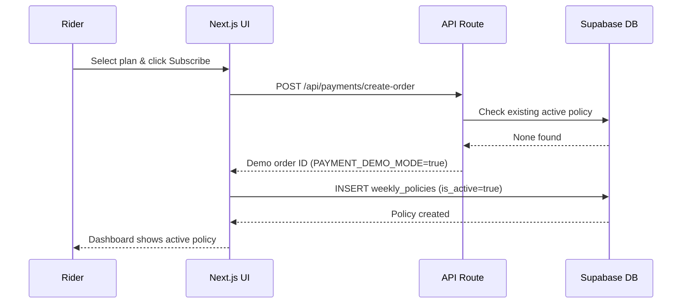
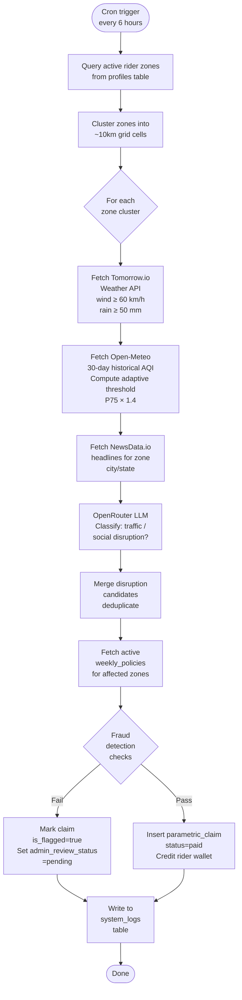
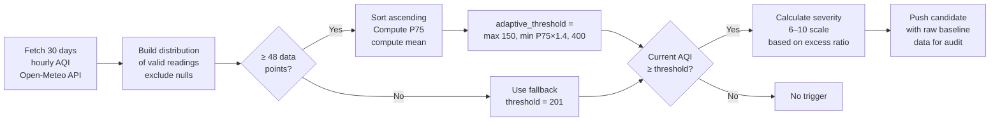
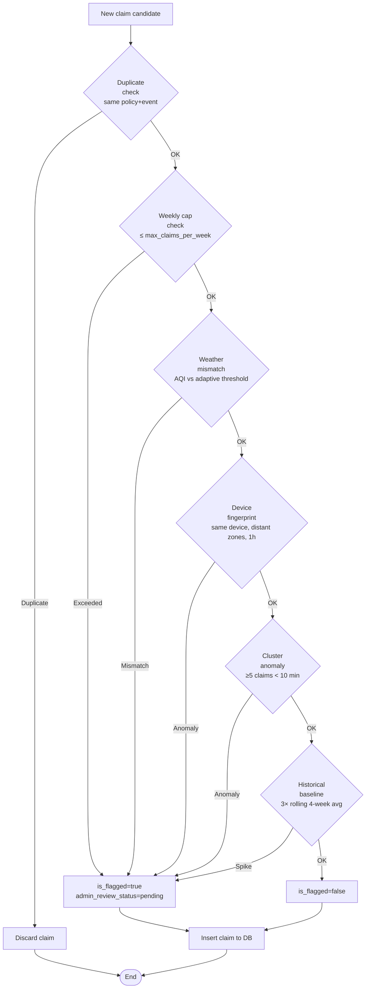
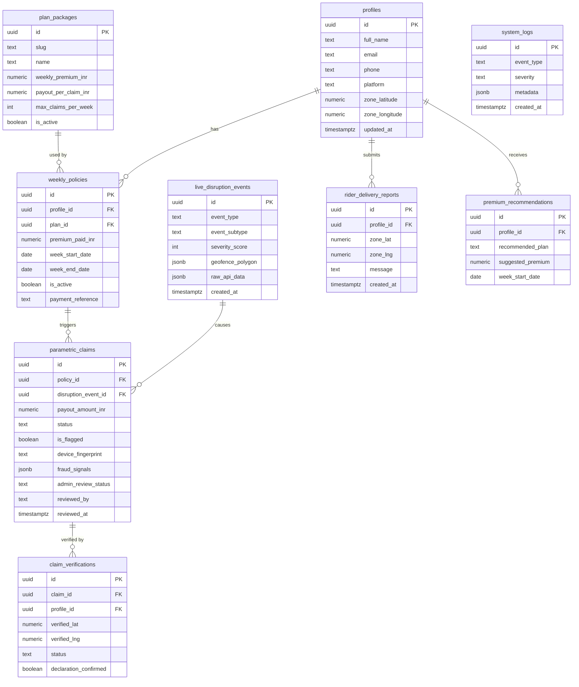
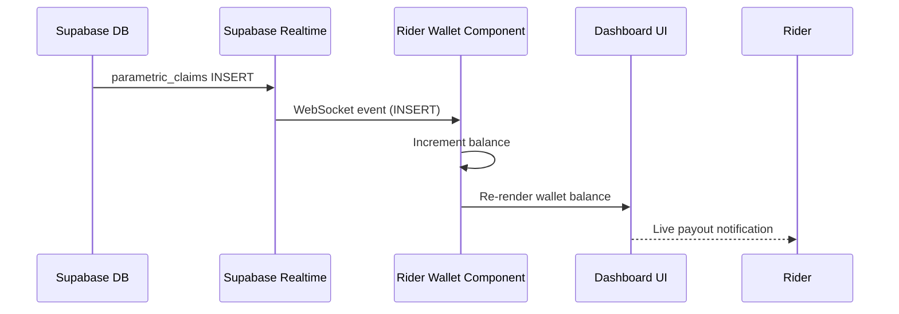
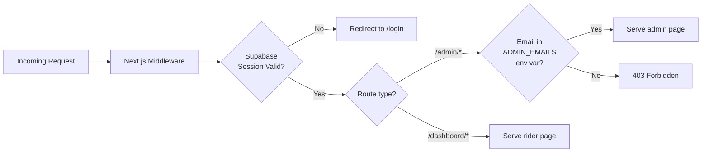
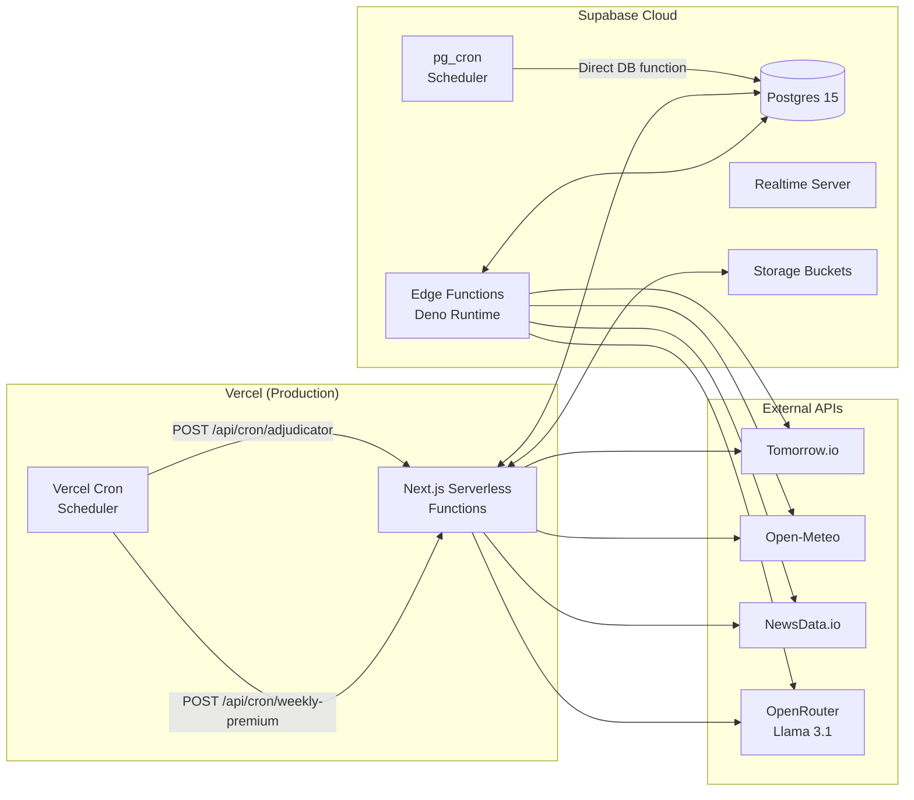

# Architecture — Oasis

This document describes the system architecture, component interactions, and data flows for the Oasis platform.

---

## System Overview

```mermaid
graph TB
    subgraph Rider["Rider (Mobile / PWA)"]
        R1[Dashboard]
        R2[Policy Subscription]
        R3[Risk Radar]
        R4[Claims History]
        R5[Location Verify]
    end

    subgraph Admin["Admin Panel"]
        A1[Triggers Dashboard]
        A2[Fraud Queue]
        A3[Analytics]
        A4[System Health]
        A5[Demo Mode]
    end

    subgraph NextJS["Next.js 15 App Router"]
        API1[/api/cron/adjudicator]
        API2[/api/admin/*]
        API3[/api/rider/*]
        API4[/api/claims/*]
        MW[Middleware / Auth]
    end

    subgraph Supabase["Supabase (Postgres + Realtime + Storage)"]
        DB[(Database)]
        RT[Realtime]
        ST[Storage]
        EF[Edge Function\nadjudicator]
    end

    subgraph External["External Data Sources"]
        TIO[Tomorrow.io\nWeather + Wind]
        OME[Open-Meteo\nAQI + Historical]
        NDA[NewsData.io\nNews Headlines]
        OAI[OpenRouter\nLLM Classifier]
    end

    subgraph Infra["Infrastructure"]
        VCL[Vercel\nHosting + Cron]
        PGC[pg_cron\nDB Scheduler]
    end

    Rider --> NextJS
    Admin --> NextJS
    NextJS --> Supabase
    NextJS --> External
    VCL -->|Cron HTTP| API1
    PGC -->|Direct SQL| DB
    RT -->|WebSocket| Rider
    EF --> DB
    EF --> External
```

---

## Request Flow: Policy Subscription



---

## Request Flow: Parametric Adjudicator (Core Engine)



---

## Adaptive AQI Algorithm



> **Why adaptive?** Delhi has a chronic baseline AQI of ~250–300. A fixed threshold of 201 would trigger every day — financially unsustainable. The adaptive algorithm triggers only when air quality is meaningfully *worse than normal for that city*.

---

## Fraud Detection Pipeline



---

## Database Entity Relationships



---

## Component Architecture (Frontend)

```mermaid
graph TD
    subgraph Pages["App Router Pages"]
        P1[/dashboard]
        P2[/dashboard/policy]
        P3[/dashboard/claims]
        P4[/admin]
        P5[/admin/triggers]
        P6[/admin/fraud]
        P7[/admin/analytics]
        P8[/admin/health]
    end

    subgraph RiderComponents["Rider Components"]
        RC1[DashboardContent]
        RC2[PolicyCard]
        RC3[RealtimeWallet]
        RC4[RiskRadar]
        RC5[RiderInsight]
        RC6[ClaimVerificationPrompt]
        RC7[ReportDeliverySection]
        RC8[PlatformStatus]
    end

    subgraph AdminComponents["Admin Components"]
        AC1[AdminInsights]
        AC2[TriggersList]
        AC3[FraudList]
        AC4[AnalyticsCharts]
        AC5[SystemHealth]
        AC6[DemoTriggerButton]
        AC7[RunAdjudicatorButton]
        AC8[AdminRiderActions]
    end

    P1 --> RC1
    RC1 --> RC2
    RC1 --> RC3
    RC1 --> RC4
    RC1 --> RC5
    RC1 --> RC6
    RC1 --> RC7
    RC1 --> RC8

    P4 --> AC1
    P4 --> AC6
    P4 --> AC5
    P5 --> AC2
    P6 --> AC3
    P7 --> AC4
    P8 --> AC5
```

---

## Real-Time Data Flow



---

## Authentication & Authorization



---

## Deployment Architecture


