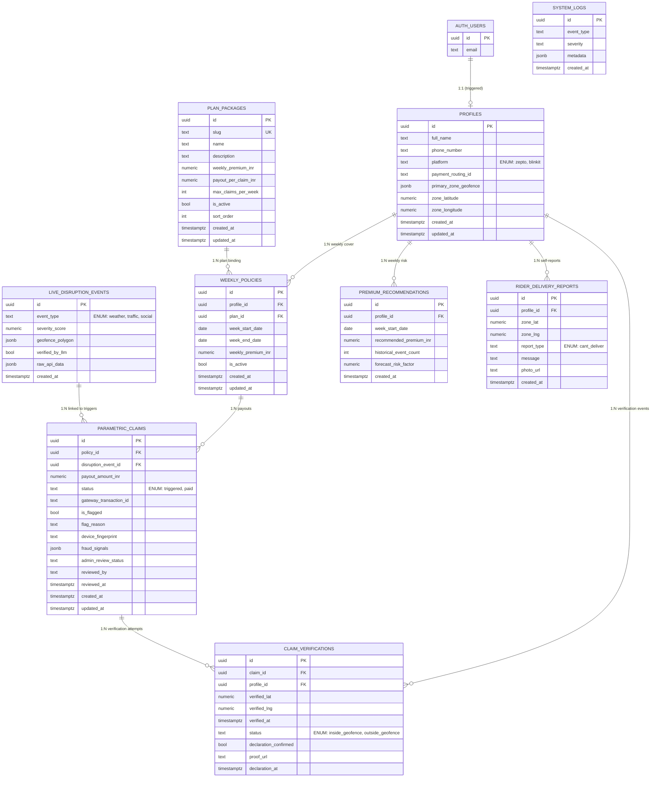

## Database Schema Overview

This document summarises the **parametric insurance data model** implemented in Supabase Postgres via the `supabase/migrations/*.sql` files. All financial logic is strictly **weekly** and covers only **loss of income from external disruptions**, not health, life, accidents, or vehicle repairs.

### Entity Relationship Diagram

### Core Tables and Views

#### `profiles`

- **Purpose**: Rider master data, one row per `auth.users` entry.
- **Important columns**:
  - `platform`: `platform_type` enum (`zepto`, `blinkit`).
  - `zone_latitude` / `zone_longitude`: rider’s geo center for matching disruptions.
  - `primary_zone_geofence`: optional JSON geofence.
- **Automation**:
  - `create_profile_for_new_user` trigger on `auth.users` ensures a profile always exists.
  - `trg_profiles_updated_at` sets `updated_at` on every update.

#### `plan_packages`

- **Purpose**: Weekly product catalogue (Basic / Standard / Premium).
- **Key logic**:
  - `weekly_premium_inr`: amount the rider pays per week.
  - `payout_per_claim_inr` and `max_claims_per_week`: drive parametric payout amounts and caps.
- **RLS**:
  - Riders (authenticated) can see only `is_active = true` plans.
  - `service_role` (admin APIs) has full access.

#### `weekly_policies`

- **Purpose**: The actual **weekly parametric cover** per rider.
- **Important constraints**:
  - `valid_week_range` check (`week_end_date >= week_start_date`).
  - Unique index `uq_one_active_policy_per_rider_week` ensures at most one active policy per rider per week.
- **Automation & indexes**:
  - `trg_weekly_policies_updated_at` for timestamps.
  - `idx_weekly_policies_profile_active`, `idx_weekly_policies_active_week` for fast adjudicator queries.

#### `live_disruption_events`

- **Purpose**: Raw parametric triggers from weather, AQI, traffic, and news.
- **Key fields**:
  - `event_type`: `disruption_event_type` enum (`weather`, `traffic`, `social`).
  - `severity_score`: 0–10, used to prioritise payouts and dashboards.
  - `geofence_polygon`: JSON circle (lat, lng, radius_km) or other shapes.
  - `raw_api_data`: full payload from APIs and LLMs.
- **RLS**:
  - Authenticated users can read; `service_role` has full access for ingestion.

#### `parametric_claims`

- **Purpose**: Automated loss-of-income payouts.
- **Key behaviour**:
  - Inserted exclusively by adjudicator logic using `service_role` or by trusted backend APIs.
  - `auto_promote_claim_status` ensures any claim with a `gateway_transaction_id` is `paid`.
  - `expire_policy_on_claim_insert` deactivates policies whose week has ended at the moment of insertion.
- **Fraud & review enhancements**:
  - `is_flagged` + `flag_reason`: basic fraud flags.
  - `device_fingerprint` + `fraud_signals`: richer fraud signal bag.
  - `admin_review_status`, `reviewed_by`, `reviewed_at`: support manual review workflow via `admin_review_claim`.

#### `premium_recommendations`

- **Purpose**: Output of ML pipeline for next-week pricing (still weekly).
- **Usage**:
  - Identified by `(profile_id, week_start_date)` unique key.
  - Read by rider policy pages and admin tools to suggest pricing.

#### `rider_delivery_reports`

- **Purpose**: Rider self-reports when they cannot deliver (e.g., local flooding).
- **Usage**:
  - Powers platform status dashboards and risk analytics.
  - Indexed by `profile_id`, `created_at`, and `(zone_lat, zone_lng)` for spatial queries.

#### `claim_verifications`

- **Purpose**: Optional post-claim validation (GPS + declaration + proof).
- **Key fields**:
  - `status`: `inside_geofence` vs `outside_geofence`.
  - `declaration_confirmed`, `declaration_at`, `proof_url`.

#### `system_logs`

- **Purpose**: Central observability table: adjudicator runs, errors, fraud reviews.
- **Usage**:
  - Admin dashboard reads `system_logs` via `service_role` policies.
  - `admin_review_claim` writes logs on every review action.

#### Views & Helper Functions

- **`rider_wallet` view**
  - Aggregates `parametric_claims` into wallet-style metrics per rider.
  - Used directly by the dashboard instead of client-side aggregation.

- **`fraud_cluster_signals` view**
  - Detects suspicious clusters (≥5 claims within 10 minutes of the same disruption).
  - Exposes `claim_count`, time window, unique device count, and flag rate.

- **`zone_baseline_stats` view**
  - Computes rolling claim baselines per spatial cluster to detect anomalies.

- **`aqi_zone_baselines` view + `get_zone_aqi_baseline(lat, lng)`**
  - Extracts adaptive AQI thresholds from `live_disruption_events.raw_api_data`.
  - Allows admins to query “what AQI level normally triggers payouts in this zone?”

- **`set_app_settings(base_url, cron_secret)`**
  - Stores application-level settings for pg_cron HTTP jobs.
  - Must be called once per environment after deployment.

