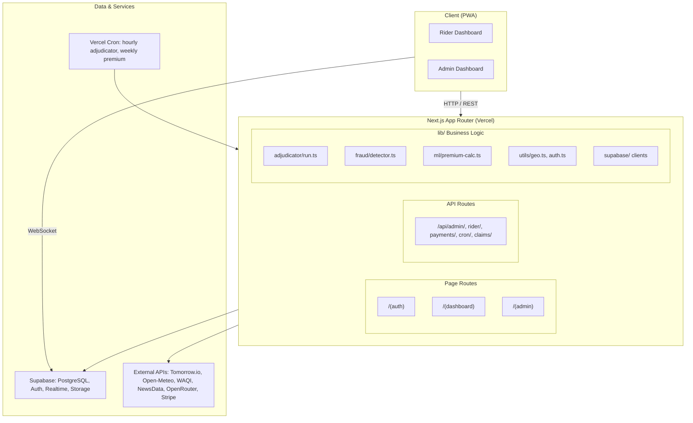
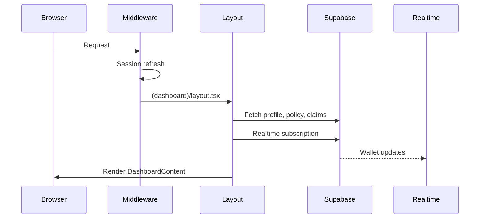
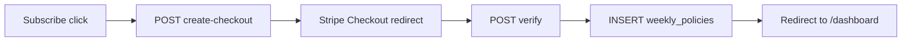
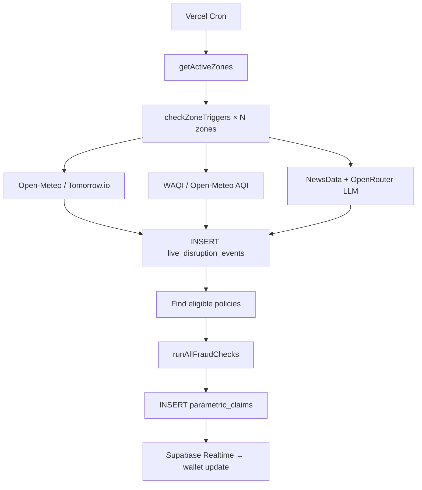

# Architecture

Oasis is a **Next.js 15 full-stack application** with Supabase as the data and auth layer. It is structured in three logical planes: the presentation layer (App Router pages + React components), the application layer (API routes + server-side lib modules), and the data layer (Supabase PostgreSQL + Realtime).

---

## High-Level Diagram

---

## Request Flow

### Rider Dashboard Load

### Premium Subscription

### Adjudicator (Hourly Cron)

---

## Key Modules

### `lib/adjudicator/run.ts`
The core business engine. Runs on every cron tick and on admin-triggered demo events. Responsible for:
- Discovering active rider zones (dynamic, not hardcoded)
- Clustering zones to avoid duplicate API calls (≈11 km grid)
- Calling five trigger pipelines in parallel
- Deduplicating triggers across overlapping zones (30 km radius check)
- Inserting disruption events and claims to the database

### `lib/fraud/detector.ts`
Seven-check fraud detection layer. Runs synchronously before each claim is inserted. Checks are ordered from cheapest (in-memory) to most expensive (DB query):
1. Duplicate claim (same policy + same event)
2. Rapid claims (≥5 claims in 24 hours)
3. Weather mismatch (raw API data doesn't support the trigger)
4. Location verification (rider GPS outside geofence)
5. Device fingerprint (same device, multiple zones, 1 hour)
6. Cluster anomaly (≥10 claims for same event in 10 min)
7. Historical baseline (current rate >3× 4-week rolling average)

### `lib/ml/premium-calc.ts`
Dynamic weekly premium calculator:
- Base premium: ₹79
- Max premium: ₹149
- Risk adjustment: +₹8 per historical disruption event in the zone (last 4 weeks)
- Forecast factor: up to +₹15 based on Tomorrow.io 5-day forecast

### `lib/supabase/`
Four Supabase client factories for different execution contexts:
- `client.ts` — browser client (uses anon key)
- `server.ts` — Next.js Server Components (cookie-based session)
- `admin.ts` — server-side admin operations (service role key)
- `middleware.ts` — session refresh in edge middleware

---

## Authentication Flow

Supabase Auth handles email/password and OAuth. The Next.js edge middleware (`middleware.ts`) refreshes the session cookie on every request. Route groups enforce access:

- `/(auth)` — public (login, register, onboarding)
- `/(dashboard)` — requires authenticated rider session
- `/(admin)` — requires authenticated session + admin email check (`lib/utils/auth.ts`)

The admin check is dual-gated: the user's email must be in `ADMIN_EMAILS` env var **or** their `profiles.role` must be `'admin'` (set by an existing admin).

---

## Realtime Architecture

Supabase Realtime delivers live wallet updates to the rider's browser via WebSocket. The `RealtimeWallet` component subscribes to the `parametric_claims` table filtered by `policy_id`. When a new claim row is inserted by the adjudicator, the component increments the displayed balance without a page reload.

---

## PWA Architecture

The service worker (generated by `@ducanh2912/next-pwa`) pre-caches the app shell at build time. The offline fallback at `/~offline` is served when the network is unavailable. The `manifest.ts` registers PWA shortcuts to the rider dashboard and admin portal.
