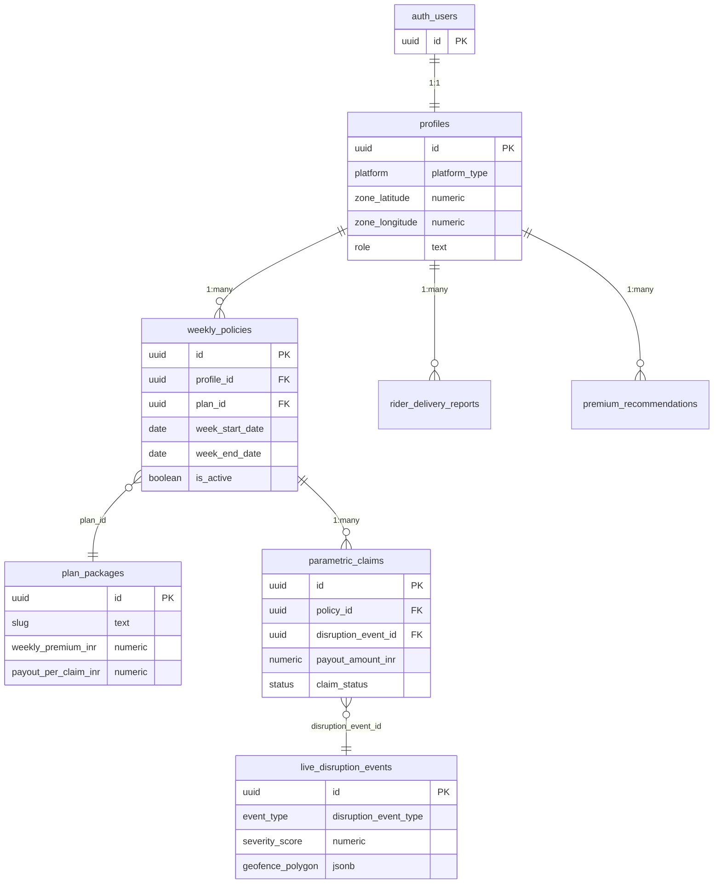

# Database Schema

Oasis uses **Supabase PostgreSQL** with Row Level Security (RLS) on every table. All business logic accesses the database through one of the four Supabase client factories in `lib/supabase/`.

---

## Entity Relationship Overview



---

## Tables

### `profiles`

Stores rider identity and delivery zone. Created on first sign-in.

```sql
CREATE TABLE profiles (
  id                   UUID PRIMARY KEY REFERENCES auth.users(id) ON DELETE CASCADE,
  full_name            TEXT,
  phone_number         TEXT,
  platform             platform_type,        -- 'zepto' | 'blinkit'
  payment_routing_id   TEXT,
  primary_zone_geofence JSONB,
  zone_latitude        NUMERIC,
  zone_longitude       NUMERIC,
  role                 TEXT DEFAULT 'rider', -- 'rider' | 'admin'
  created_at           TIMESTAMPTZ DEFAULT NOW(),
  updated_at           TIMESTAMPTZ DEFAULT NOW()
);
```

**RLS:** Users can only read and write their own row.

---

### `plan_packages`

Insurance plan tiers. Seeded with three default plans.

```sql
CREATE TABLE plan_packages (
  id                    UUID PRIMARY KEY DEFAULT gen_random_uuid(),
  slug                  TEXT UNIQUE NOT NULL,           -- 'basic' | 'standard' | 'premium'
  name                  TEXT NOT NULL,
  description           TEXT,
  weekly_premium_inr    NUMERIC(10, 2) NOT NULL,
  payout_per_claim_inr  NUMERIC(10, 2) NOT NULL,
  max_claims_per_week   INT DEFAULT 2,
  is_active             BOOLEAN DEFAULT true,
  sort_order            INT DEFAULT 0
);
```

**Seeded data:**

| slug | Weekly Premium | Payout/Claim | Max Claims |
|---|---|---|---|
| `basic` | ₹79 | ₹300 | 2 |
| `standard` | ₹99 | ₹400 | 2 |
| `premium` | ₹149 | ₹600 | 3 |

---

### `weekly_policies`

One row per rider per week of coverage. The `is_active` flag is flipped to `false` at week end by the weekly-premium cron.

```sql
CREATE TABLE weekly_policies (
  id                  UUID PRIMARY KEY DEFAULT gen_random_uuid(),
  profile_id          UUID NOT NULL REFERENCES profiles(id) ON DELETE CASCADE,
  plan_id             UUID REFERENCES plan_packages(id) ON DELETE SET NULL,
  week_start_date     DATE NOT NULL,
  week_end_date       DATE NOT NULL,
  weekly_premium_inr  NUMERIC(10, 2) NOT NULL,
  is_active           BOOLEAN DEFAULT true,
  CONSTRAINT valid_week_range CHECK (week_end_date >= week_start_date)
);
```

**Indexes:**
- `(profile_id, is_active)` — fast lookup for dashboard
- `(week_start_date, week_end_date)` — adjudicator range query

**RLS:** Riders see only their own policies.

---

### `live_disruption_events`

Created by the adjudicator when a trigger threshold is crossed. One row per detected disruption.

```sql
CREATE TABLE live_disruption_events (
  id               UUID PRIMARY KEY DEFAULT gen_random_uuid(),
  event_type       disruption_event_type NOT NULL,  -- 'weather' | 'traffic' | 'social'
  severity_score   NUMERIC(4, 2) NOT NULL CHECK (severity_score BETWEEN 0 AND 10),
  geofence_polygon JSONB,        -- { type: 'circle', lat, lng, radius_km }
  verified_by_llm  BOOLEAN DEFAULT false,
  raw_api_data     JSONB,        -- full API response stored for audit
  created_at       TIMESTAMPTZ DEFAULT NOW()
);
```

The `geofence_polygon` field uses a custom JSON format:
```json
{
  "type": "circle",
  "lat": 12.9716,
  "lng": 77.5946,
  "radius_km": 15
}
```

**RLS:** Authenticated users can read; only service role can write.

---

### `parametric_claims`

Auto-inserted by the adjudicator when a rider is eligible for a payout. Status goes directly to `'paid'` — no manual approval step.

```sql
CREATE TABLE parametric_claims (
  id                      UUID PRIMARY KEY DEFAULT gen_random_uuid(),
  policy_id               UUID NOT NULL REFERENCES weekly_policies(id),
  disruption_event_id     UUID NOT NULL REFERENCES live_disruption_events(id),
  payout_amount_inr       NUMERIC(10, 2) NOT NULL,
  status                  claim_status DEFAULT 'triggered',  -- 'triggered' | 'paid'
  gateway_transaction_id  TEXT,      -- 'oasis_payout_<timestamp>_<policyId>'
  is_flagged              BOOLEAN DEFAULT false,
  flag_reason             TEXT,
  created_at              TIMESTAMPTZ DEFAULT NOW()
);
```

**Indexes:**
- `(policy_id)` — rider dashboard claims list
- `(status)` — admin claims overview
- `(created_at DESC)` — recent activity feed

**RLS:** Riders see only claims linked to their own policies. Service role has full access.

---

### `rider_delivery_reports`

Optional GPS-attached reports that riders submit to confirm they were in an affected zone. Used by the location verification fraud check.

```sql
CREATE TABLE rider_delivery_reports (
  id                UUID PRIMARY KEY DEFAULT gen_random_uuid(),
  profile_id        UUID NOT NULL REFERENCES profiles(id),
  zone_latitude     NUMERIC,
  zone_longitude    NUMERIC,
  disruption_note   TEXT,
  file_url          TEXT,         -- Supabase Storage URL
  created_at        TIMESTAMPTZ DEFAULT NOW()
);
```

---

### `claim_verifications`

Links a GPS reading to a specific claim. Created when a rider submits the `ClaimVerificationPrompt`.

```sql
CREATE TABLE claim_verifications (
  id            UUID PRIMARY KEY DEFAULT gen_random_uuid(),
  claim_id      UUID NOT NULL REFERENCES parametric_claims(id),
  latitude      NUMERIC,
  longitude     NUMERIC,
  status        TEXT,   -- 'within_geofence' | 'outside_geofence'
  created_at    TIMESTAMPTZ DEFAULT NOW()
);
```

---

### `premium_recommendations`

Stores per-rider weekly premium suggestions generated by the ML module. Used to display the pricing recommendation before subscription.

```sql
CREATE TABLE premium_recommendations (
  id                    UUID PRIMARY KEY DEFAULT gen_random_uuid(),
  profile_id            UUID NOT NULL REFERENCES profiles(id),
  recommended_premium   NUMERIC(10, 2),
  risk_factors          JSONB,
  week_start_date       DATE,
  created_at            TIMESTAMPTZ DEFAULT NOW()
);
```

---

### `system_logs`

Append-only audit log written by the adjudicator after each run.

```sql
CREATE TABLE system_logs (
  id          UUID PRIMARY KEY DEFAULT gen_random_uuid(),
  event_type  TEXT,      -- 'adjudicator_run' | 'adjudicator_demo'
  metadata    JSONB,     -- { candidates_found, claims_created, zones_checked, duration_ms }
  created_at  TIMESTAMPTZ DEFAULT NOW()
);
```

---

### `payment_transactions`

Records every Stripe payment for audit and reconciliation.

```sql
CREATE TABLE payment_transactions (
  id                  UUID PRIMARY KEY DEFAULT gen_random_uuid(),
  profile_id          UUID REFERENCES profiles(id),
  stripe_checkout_session_id TEXT,
  stripe_payment_intent_id  TEXT,
  amount_inr          NUMERIC(10, 2),
  status              TEXT,    -- 'created' | 'verified' | 'failed'
  created_at          TIMESTAMPTZ DEFAULT NOW()
);
```

---

## Row Level Security Summary

| Table | Rider read | Rider write | Admin | Service role |
|---|---|---|---|---|
| `profiles` | Own only | Own only | Via service role | Full |
| `weekly_policies` | Own only | Own only | Via service role | Full |
| `parametric_claims` | Own only | — | Via service role | Full |
| `live_disruption_events` | All | — | Via service role | Full |
| `plan_packages` | Active only | — | Via service role | Full |
| `claim_verifications` | Own only | Own only | Via service role | Full |
| `system_logs` | — | — | Via service role | Full |

---

## Type Enums

```sql
CREATE TYPE platform_type AS ENUM ('zepto', 'blinkit');
CREATE TYPE disruption_event_type AS ENUM ('weather', 'traffic', 'social');
CREATE TYPE claim_status AS ENUM ('triggered', 'paid');
```
