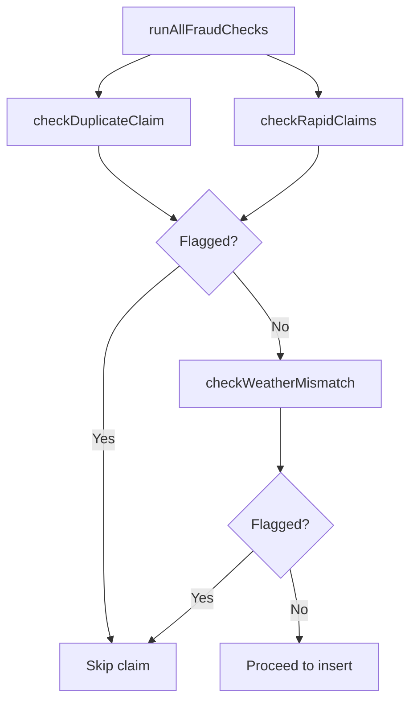

# Fraud Detection

Oasis runs a multi-layered fraud detection pipeline on every claim before it is inserted. The checks are ordered from cheapest (in-memory) to most expensive (multiple DB queries) to minimize latency and database load.

---

## Check Pipeline



**Full sequence:**

```
runAllFraudChecks(supabase, policyId, disruptionEventId, rawApiData?)
│
├── [parallel DB calls]
│   ├── checkDuplicateClaim()   → same policy + same event = instant skip
│   └── checkRapidClaims()      → ≥ 5 claims in 24h = flag
│
└── [synchronous, no DB]
    └── checkWeatherMismatch()  → raw API data doesn't support trigger = flag

    [Extended checks — run after claim insertion, if device fingerprint available]
    ├── checkDeviceFingerprint() → same device in 2+ distant zones in 1h
    ├── checkClusterAnomaly()    → ≥ 10 claims for same event in 10 min
    └── checkHistoricalBaseline()→ claim rate > 3× 4-week rolling average
```

The core `runAllFraudChecks()` is called before each claim insert. If any check returns `isFlagged: true`, the claim is skipped. The extended checks run asynchronously after insertion and can retroactively flag a claim via `flagClaimAsFraud()`.

---

## Check 1: Duplicate Claim

The simplest check. If a claim already exists for the same `(policy_id, disruption_event_id)` pair, the new claim is a duplicate.

```typescript
export async function checkDuplicateClaim(
  supabase, policyId, disruptionEventId
): Promise<FraudCheckResult> {
  const { data } = await supabase
    .from("parametric_claims")
    .select("id")
    .eq("policy_id", policyId)
    .eq("disruption_event_id", disruptionEventId)
    .limit(1);

  if (data?.length > 0) {
    return { isFlagged: true, reason: "Duplicate: same policy + disruption event" };
  }
  return { isFlagged: false };
}
```

This is the most common fraud vector: submitting the same claim twice for the same event.

---

## Check 2: Rapid Claims

Flags a policy that has accumulated too many claims in a short time window. Threshold: **5 claims in 24 hours**.

```typescript
const RAPID_CLAIMS_WINDOW_HOURS = 24;
const RAPID_CLAIMS_THRESHOLD = 5;  // 3 legit triggers/day + 1 buffer + margin
```

Legitimate scenario: a rider in a high-disruption day (heat in the morning, rain in the afternoon, gridlock in the evening) might see 3 real claims. The threshold of 5 allows this while flagging anything above it.

---

## Check 3: Weather Mismatch

Validates that the raw API data stored on the disruption event actually supports the claimed trigger. This catches cases where the trigger type has been tampered with or the data arrived corrupted.

**Extreme heat:** Flag if `temperature < 40°C` in raw data (trigger requires ≥43°C — 3°C buffer for edge cases).

**Heavy rain:** Flag if `precipitationIntensity < 3 mm/h` in raw data (trigger requires ≥4 mm/h).

**Severe AQI (adaptive):** Flag if `current_aqi < adaptive_threshold × 0.8`. The raw data stores both the current reading and the computed adaptive threshold, so the check validates against the zone-specific threshold, not a hardcoded global number:

```typescript
if (currentAqi < adaptiveThreshold * 0.8) {
  return {
    isFlagged: true,
    reason: `Weather mismatch: severe_aqi claimed (threshold=${adaptiveThreshold}) but AQI=${currentAqi}`
  };
}
```

This 20% tolerance handles minor timing differences between when the trigger fired and when the fraud check runs.

---

## Check 4: Location Verification

If the rider has submitted a GPS verification (via `ClaimVerificationPrompt`), and that verification recorded `outside_geofence`, the claim is flagged.

```typescript
export async function checkLocationVerification(
  supabase, claimId
): Promise<FraudCheckResult> {
  const { data } = await supabase
    .from("claim_verifications")
    .select("status")
    .eq("claim_id", claimId)
    .limit(1);

  if (data?.[0]?.status === "outside_geofence") {
    return { isFlagged: true, reason: "Rider GPS outside event geofence" };
  }
  return { isFlagged: false };
}
```

Location verification is optional — riders are not required to submit GPS data. If no verification exists, this check passes.

---

## Check 5: Device Fingerprint

Detects the same device submitting claims for disruption events in multiple geographically distant zones within 1 hour. A real rider cannot physically be in two locations 55+ km apart in 60 minutes.

```typescript
// Flag if same device_fingerprint appears in claims for events
// with geofence centers > 0.5 degree latitude apart (~55 km)
if (latDiff > 0.5) {
  return {
    isFlagged: true,
    reason: `Device fingerprint: same device in ${eventIds.length} distant zones within 1h`
  };
}
```

---

## Check 6: Cluster Anomaly

Detects coordinated or bot-like patterns where many claims for the same event are created in a very short window.

**Threshold:** ≥ 10 claims for the same `disruption_event_id` within a 10-minute window.

```typescript
const tenMinutesAgo = new Date(Date.now() - 10 * 60 * 1000).toISOString();

const { count } = await supabase
  .from("parametric_claims")
  .select("id", { count: "exact", head: true })
  .eq("disruption_event_id", disruptionEventId)
  .gte("created_at", tenMinutesAgo);

if (count >= 10) {
  return { isFlagged: true, reason: `Cluster anomaly: ${count} claims in <10 min` };
}
```

---

## Check 7: Historical Baseline

Compares the current event's claim volume against a 4-week rolling average. Uses the `zone_baseline_stats` database view when available.

**Threshold:** Current claim count > 3× the rolling weekly average.

```typescript
if (avg > 0 && current > avg * 3) {
  return {
    isFlagged: true,
    reason: `Historical baseline: ${current} claims vs. ${avg} avg (${pct}% above baseline)`
  };
}
```

This catches coordinated fraud where multiple accounts claim the same event well above historical norms, even if each individual account looks clean.

---

## Fraud Review in Admin Dashboard

The **Admin → Fraud** page (`/admin/fraud`) lists all `parametric_claims` where `is_flagged = true`, sorted by creation time. For each flagged claim, admins can see:
- The `flag_reason` string (set by the fraud check that fired)
- The policy and rider details
- The disruption event details
- An override button to unflag legitimate claims

Flagged claims are not deleted — they remain in the database for audit purposes.

---

## FraudCheckResult Type

```typescript
export interface FraudCheckResult {
  isFlagged: boolean;
  reason?: string;  // Human-readable explanation when isFlagged=true
}
```

The `reason` string is stored in `parametric_claims.flag_reason` for admin review.
