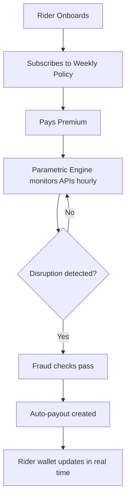

# Oasis

**AI-powered parametric wage protection for India's Q-commerce delivery partners.**

Oasis protects gig workers (Zepto, Blinkit) against income loss caused by external disruptions — extreme weather, zone lockdowns, and traffic gridlock — through automated, zero-touch payouts and a weekly pricing model aligned to their earnings cycle.

:::info Scope
The platform covers **loss of income only** — no health, life, accident, or vehicle repair coverage.
:::

---

## The Problem

Q-commerce relies on strict 10-minute delivery SLAs. Minor external disruptions cause large drops in order completions and rider earnings. These workers are especially vulnerable to income loss from events entirely outside their control.

| Scenario | What happens |
|---|---|
| **Extreme heat** | Rahul delivers for Blinkit in Bangalore. When temperatures exceed 43°C for 3+ hours, he logs off for safety. Oasis detects the event via weather API and automatically credits his protected wage. |
| **Zone lockdown / curfew** | Priya delivers for Zepto in Mumbai. An unplanned curfew blocks her zone. NewsData.io + LLM verify the disruption; riders in the geofence receive instant parametric payouts. |
| **Heavy rain / waterlogging** | During monsoon, localized flooding halts a specific delivery area. Weather APIs identify the event; active policyholders in that zone get automated payouts for lost income. |

---

## How It Works

1. **Onboarding** — Rider signs up, selects platform (Zepto/Blinkit), sets delivery zone, then completes KYC: government ID (Aadhaar) and face liveness verification.
2. **Weekly policy** — Rider subscribes to coverage for the coming week. Premium is calculated dynamically based on zone risk.
3. **Parametric monitoring** — APIs (weather, AQI, news) are polled every hour by a Vercel cron job.
4. **Trigger & payout** — When a disruption meets a threshold, the adjudicator identifies affected riders and creates paid claims automatically.
5. **Fraud checks** — Seven layered checks flag GPS spoofing, weather mismatches, rapid claims, and coordinated fraud patterns.

---

## Parametric Triggers

| Trigger | Source | Threshold |
|---|---|---|
| Extreme heat | Open-Meteo / Tomorrow.io | >43°C sustained for 3+ hours |
| Heavy rain | Tomorrow.io | Precipitation ≥ 4 mm/hr |
| Severe AQI | WAQI / Open-Meteo | Adaptive (40% above zone's 30-day p75 baseline) |
| Zone curfew / strike | NewsData.io + LLM | LLM verifies local disruption, severity ≥ 6/10 |
| Traffic gridlock | NewsData.io + LLM | LLM verifies road closures, severity ≥ 6/10 |

---

## Weekly Premium Model

Oasis uses a **strictly weekly pricing model** to match gig workers' pay cycles.

- **Policy period:** Monday – Sunday
- **Premium range:** ₹79 – ₹149/week (3 tiers)
- **Dynamic factors:** Zone historical disruption frequency, next-week weather forecast
- **Renewal:** Automated every Sunday at 17:30 UTC via Vercel cron

| Plan | Weekly Premium | Payout Per Claim | Max Claims/Week |
|---|---|---|---|
| Basic | ₹79 | ₹300 | 2 |
| Standard | ₹99 | ₹400 | 2 |
| Premium | ₹149 | ₹600 | 3 |

---

## Tech Stack

| Layer | Technology |
|---|---|
| Frontend | Next.js 15 (App Router), TypeScript, Tailwind CSS, Framer Motion |
| Backend / DB | Supabase (PostgreSQL, Auth, Realtime, Edge Functions) |
| AI / LLM | OpenRouter API (`arcee-ai/trinity-large-preview:free`) |
| Weather APIs | Tomorrow.io, Open-Meteo, WAQI |
| News APIs | NewsData.io |
| Payments | Stripe (test mode) |
| Deployment | Vercel (Mumbai region, `bom1`) |
| PWA | `@ducanh2912/next-pwa` with offline fallback |

---

## Platform Choice

Oasis is a **mobile-first PWA** — no app store, instant updates, installable on Android (Chrome banner) and iOS (Share → Add to Home Screen). Built dark-first for outdoor / night use by delivery riders.
