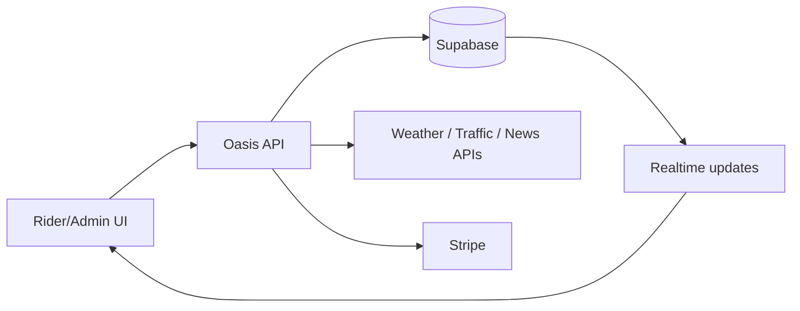

import { CardGrid, LinkCard } from '@astrojs/starlight/components';

Oasis APIs power three experiences:

- **Rider experience**: buy weekly cover, self-report disruptions, verify GPS, see wallet updates
- **Admin experience**: monitor system health, run demos, review the platform
- **Automation**: scheduled adjudicator runs detect disruptions and create payouts automatically

---

## Interactive OpenAPI Reference

Most endpoints are documented in the interactive OpenAPI pages below (requests, responses, and examples).

<CardGrid>
  <LinkCard
    title="Cron Jobs"
    description="Automated 15-min adjudicators and weekly premium renewals."
    href="/api/openapi/operations/getcronadjudicator/"
    icon="setting"
  />
  <LinkCard
    title="Admin Operations"
    description="Manual overrides and synthetic metric injections."
    href="/api/openapi/operations/postadminrunadjudicator/"
    icon="laptop"
  />
  <LinkCard
    title="KYC & Onboarding"
    description="Face liveness verification and Aadhaar processing."
    href="/api/openapi/operations/postverifygovernmentid/"
    icon="approve-check"
  />
  <LinkCard
    title="Payments & Subscriptions"
    description="Stripe Checkout creation and asynchronous Webhooks."
    href="/api/openapi/operations/postcreatecheckout/"
    icon="rocket"
  />
</CardGrid>

---

## How requests flow (high level)



---

## Auth & access (plain English)

- **Most rider/admin routes** use the user’s Supabase session (signed-in cookies).
- **System routes** (like cron jobs) are protected with a shared secret (`CRON_SECRET`) so only Oasis can run them.

---

## Internal routes (not in OpenAPI)

The following are internal or proxy routes that do not have formal OpenAPI contracts as they rely strictly on Supabase Auth context.

### Admin monitoring

- `GET /api/admin/system-health`: quick “is everything up?” status (DB + keys + last run)
- `GET /api/admin/analytics`: aggregated admin dashboard numbers
- `GET /api/admin/insights`: AI-generated insights (risk + top disruption zones)

<details>
<summary>Show example responses</summary>

```json
{
  "systemHealth": { "database": "ok", "lastRun": "2024-03-05T11:00:00.000Z" },
  "analytics": { "totalRiders": 120, "activePolicies": 87, "totalPayoutInr": 136800 }
}
```
</details>

### `POST /api/routing/check`

Proxy to the OSRM routing API. Returns route details between two coordinates.

**Body:** origin + destination coordinates.

### `POST /api/auth/signout`
Signs out the current session by clearing Supabase auth cookies. Redirects to `/login`.

### `POST /api/admin/demo-trigger`
Injects a synthetic disruption event for demo purposes (admin only). Useful for testing the full trigger → claim → payout pipeline without waiting for real API data.

### `POST /api/admin/update-role`
Updates a rider's profile role (admin only). Used for promoting users to admin.

### `POST /api/admin/update-policy`
Admin override for policy updates (status changes, plan modifications).

### `GET /api/rider/insight`
Returns AI-generated insights for the authenticated rider, including risk assessment for their zone and upcoming weather outlook.

### Public status

### `GET /api/platform/status`
Public endpoint returning platform operational status — database health, API connectivity, and recent adjudicator activity.

### `GET /api/health`
Lightweight health check returning `{ "status": "ok" }`. Used by uptime monitors and deployment probes.

### `POST /api/onboarding/verify-government-id`
Processes Aadhaar/PAN uploads during onboarding. Validates the document format and extracts basic metadata.

### `POST /api/webhooks/disruption`
Webhook endpoint for external trigger providers to push disruption events directly. Validates the payload against a signing secret.

---

### `POST /api/claims/verify-location`

Used when a rider taps **Verify** on a pending claim. If the GPS check passes, the claim can move to **paid**.

| Field | Type | Required | Description |
|---|---|---|---|
| `claimId` | string | Yes | UUID of the claim to verify |
| `latitude` | number | Yes | Rider's current latitude |
| `longitude` | number | Yes | Rider's current longitude |
| `deviceFingerprint` | string | No | Browser/device fingerprint for multi-device fraud detection |
| `gpsAccuracy` | number | No | GPS accuracy in meters (rejected if > 100m) |

**What happens next (simplified):** GPS accuracy → claim age window → geofence check → fraud checks → mark paid (if all good).

---

### `POST /api/rider/report-delivery`

Rider self-report for delivery disruptions. Now includes rate limiting and external corroboration.

**Rate limit:** 3 reports per rider per day (returns `429` if exceeded).

**Body:** `multipart/form-data` with fields:
- `disruption_note` (string) — description of the disruption
- `latitude` / `longitude` (number) — rider's GPS coordinates
- `file` (File, optional) — photo evidence

**Response:** includes whether the report was corroborated by external data.
