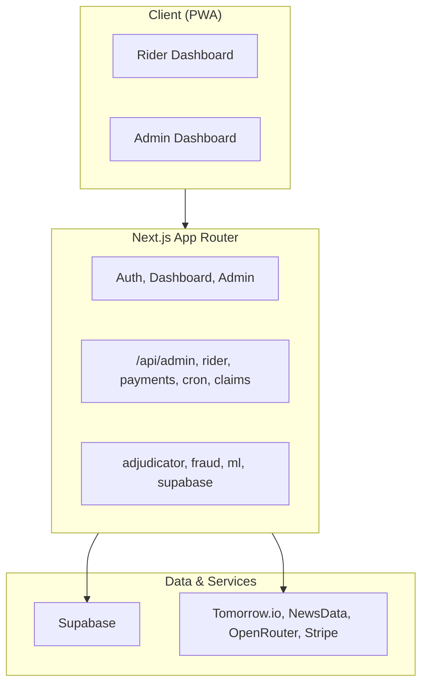

Next.js 15 App Router + Supabase (Postgres, Auth, Realtime). Three layers: presentation (pages + components), application (API routes + lib), data (Supabase + external APIs).

## Overview



**Flow:** Client (PWA) → Next.js (pages, API, lib) → Supabase + external APIs. Cron jobs trigger adjudicator and weekly premium renewal.

---

## Request Flows

### Dashboard Load

```
Request → Middleware (session refresh) → Layout → Supabase (profile, policy, claims)
       → Realtime subscription → Wallet updates
```

### Premium Subscription

```
Subscribe → POST create-checkout → Stripe Checkout → Webhook → INSERT weekly_policies → Redirect
```

### Adjudicator (Hourly)

```
Vercel Cron → getActiveZones → checkZoneTriggers (weather, AQI, news)
           → INSERT live_disruption_events → Find policies → runAllFraudChecks
           → INSERT parametric_claims → Realtime → wallet update
```

---

## Key Modules

| Module | Role |
|--------|------|
| `lib/adjudicator/run.ts` | Zone discovery, trigger checks, fraud pipeline, claim creation |
| `lib/fraud/detector.ts` | 7 checks: duplicate, rapid claims, weather mismatch, location, device, cluster, baseline |
| `lib/ml/premium-calc.ts` | Base ₹79, max ₹149, +₹8/event, forecast factor |
| `lib/supabase/*` | Browser, server, admin, middleware clients |

---

## Auth

Supabase Auth. Middleware refreshes session. Route groups: `(auth)` public, `(dashboard)` rider, `(admin)` admin-only (email in `ADMIN_EMAILS` or `role=admin`).

---

## Realtime

`RealtimeWallet` subscribes to `parametric_claims` by `policy_id`. New claim → balance updates without reload.
