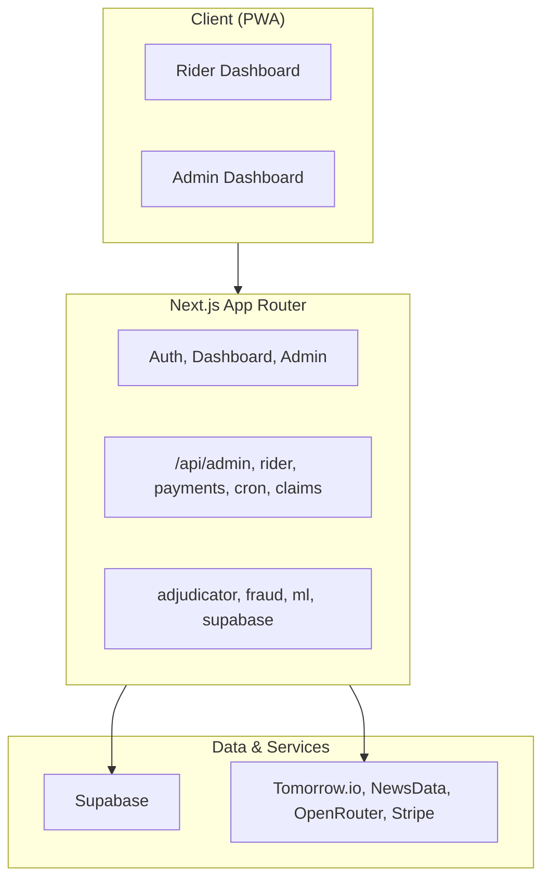

import { Badge } from '@astrojs/starlight/components';

Next.js 15 App Router + Supabase (Postgres, Auth, Realtime). Three layers: presentation (pages + components), application (API routes + lib), data (Supabase + external APIs).

## Overview



**Flow:** Client (PWA) → Next.js (pages, API, lib) → Supabase + external APIs. Cron jobs trigger adjudicator and weekly premium renewal.

---

## Request Flows

### Dashboard Load

```text
Dashboard Load
│
├── 1. Request
│      └── Middleware (session refresh)
│
├── 2. Render Layout
│      ├── Fetch Profile
│      ├── Fetch Policy
│      └── Fetch Claims
│
└── 3. Initialize Subscription
       └── Supabase Realtime (Wallet updates)
```

### Premium Subscription

```text
Premium Subscription
│
├── 1. User Initialization
│      └── POST create-checkout
│
├── 2. Payment Processing
│      └── Stripe Checkout
│
└── 3. Post-Payment (Webhook)
       ├── INSERT weekly_policies
       └── Redirect
```

### Adjudicator (Hourly)

```text
runAdjudicator()
│
├── 1. Discover active zones
│      └── Query weekly_policies + profiles → cluster ~11 km grid
│
├── 2. Check triggers per zone (parallel, batch of 5)
│      ├── checkZoneTriggers(zone)
│      │   ├── Trigger 1: Extreme heat (Open-Meteo → Tomorrow.io fallback)
│      │   ├── Trigger 2: Heavy rain (Tomorrow.io)
│      │   ├── Trigger 3: AQI adaptive (WAQI → Open-Meteo fallback)
│      │   ├── Trigger 4: Traffic gridlock (NewsData + LLM)
│      │   └── Trigger 5: Zone curfew/strike (NewsData + LLM + geocoding)
│      └── Deduplicate: skip if same trigger type within 30 km
│
├── 3. For each trigger candidate:
│      ├── INSERT live_disruption_events
│      ├── Find active policies with riders inside geofence
│      ├── Check plan weekly claim cap (max_claims_per_week)
│      ├── runAllFraudChecks()
│      └── INSERT parametric_claims (status='paid')
│
└── 4. Log result to system_logs
```


---

## Key Modules

| Module | Role |
|--------|------|
| `lib/adjudicator/run.ts` | Zone discovery, trigger checks, fraud pipeline, claim creation |
| `lib/fraud/detector.ts` | 7 checks: duplicate, rapid claims, weather mismatch, location, device, cluster, baseline |
| `lib/ml/premium-calc.ts` | Base ₹79, max ₹149, +₹8/event, forecast factor |
| `lib/supabase/*` | Browser, server, admin, middleware clients |

---

## Auth

Supabase Auth. Middleware refreshes session. Route groups: `(auth)` public, `(dashboard)` rider, `(admin)` admin-only (email in `ADMIN_EMAILS` or `role=admin`).

---

## Realtime

`RealtimeWallet` subscribes to `parametric_claims` by `policy_id`. New claim → balance updates without reload.
