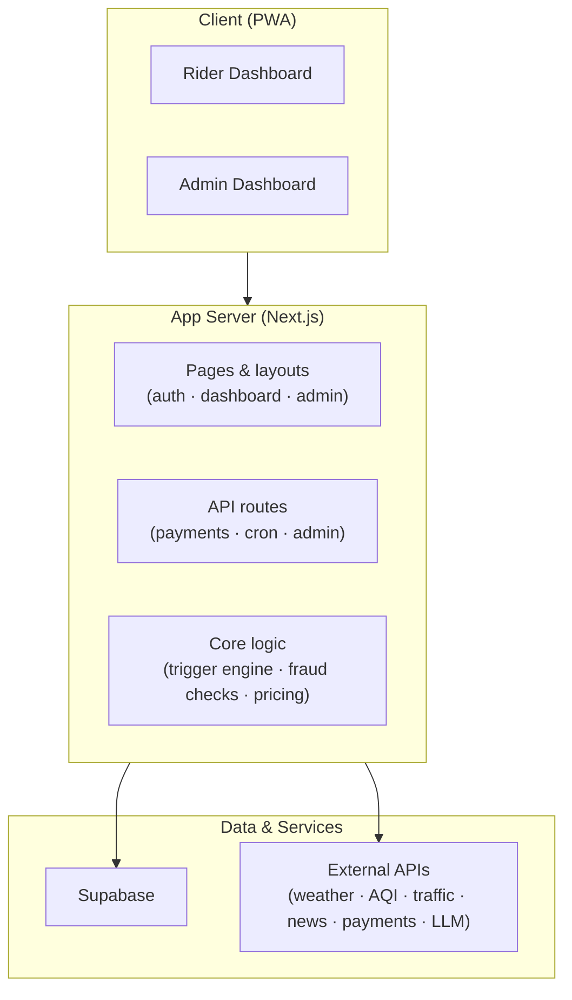
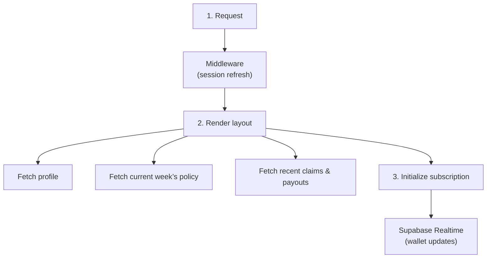
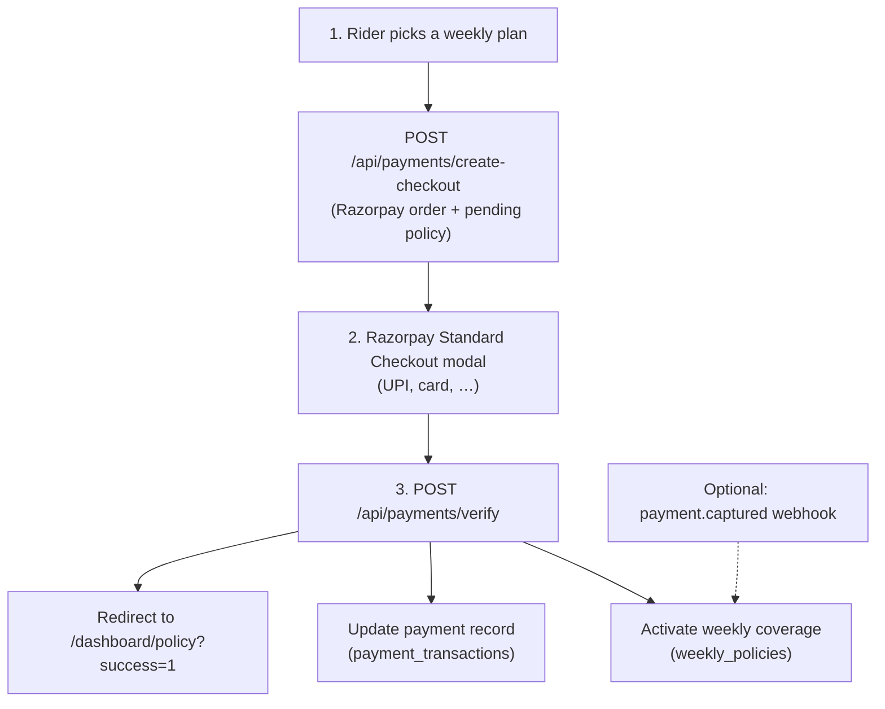
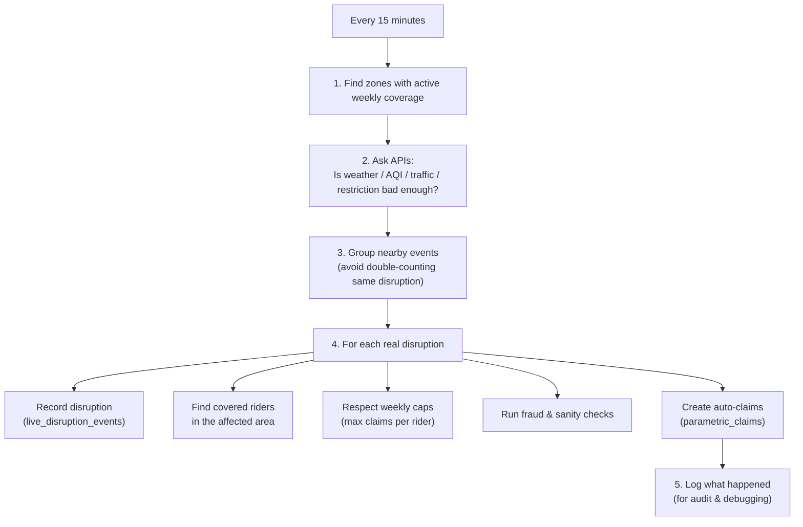

import { Badge } from '@astrojs/starlight/components';

Oasis is built like a simple three-layer cake so it’s easy to reason about:

- **What riders and admins see** (the app UI)
- **The brain** that decides what to do (APIs + business logic)
- **The memory** where we store everything safely (database + external data feeds)

Under the hood this is **Next.js 15 App Router + Supabase (Postgres, Auth, Realtime)**, but you can ignore those names if you just want the big picture.

## Overview

**In plain language:**
The **rider/admin app** talks to the **Oasis brain (Next.js app)**, which in turn talks to **Supabase** for data and to **external APIs** for live weather, traffic, and news.
Every 15 minutes, background jobs wake up the brain to:

- Check if any **zone looks risky** right now
- Decide if riders in that zone **deserve an automatic payout**
- Update their **wallets and dashboards in real time**

---

## Request Flows

### Dashboard Load

**What this means for a rider:**
Open the dashboard → Oasis quietly checks who you are, your policy, and recent claims → then it “subscribes” to live updates so that **new payouts just appear without refresh**.

### Premium Subscription

Server-side **`POST /api/payments/webhook`** can also finalize payment if configured in the Razorpay Dashboard; it uses the same idempotent processing as verify.

### Adjudicator (Every 15 min)

You can think of this as a **robotic claims adjuster** that wakes up regularly, scans India’s metros for disruptions, and **instantly credits riders** who were covered and affected.

---

## Key Modules

| Piece of the system | What it does |
|---------------------|--------------|
| **Adjudicator brain** | Wakes up on a schedule, looks at the map of India, decides **where something bad is happening**, and creates automatic claims for covered riders in those zones. |
| **Fraud shield** | Stops obvious abuse (too many claims, wrong location, suspicious devices) while still keeping the rider experience **instant and hassle-free**. |
| **Pricing engine** | A deterministic actuarial model calculating unified risk (0-1) via Zone History, Weather Forecasts, Income Exposure, Social Events & Rider Behavior. Generates 3 dynamic mathematical tiers (Basic `0.7x`, Standard `1.0x`, Premium `1.3x`) strictly clamped between `₹49–₹199/week`. Ensures extreme platform solvency via a `40%` required profit margin, while executing **"Option B" Growth Mode** automatic claim-capping and payout subsidization during severe localized Black Swan cyclical events. |
| **Database helpers** | Small utilities that let the app read and write data safely without repeating the same low-level code everywhere. |

---

## Auth

We use **Supabase Auth** to keep riders and admins signed in securely.

- Public routes live under an `(auth)` group (login, register, etc.)
- Rider dashboards live under `(dashboard)` and require a logged-in rider
- Admin screens require an email in `ADMIN_EMAILS` or `role = 'admin'` in the database

In practice: **riders never see admin controls**, and admins can quickly inspect the system without special tooling.

---

## Realtime

The **Realtime wallet** experience comes from Supabase Realtime subscriptions:

- The dashboard subscribes to any new claims for the rider’s active policy
- When an auto-claim is created, the **wallet balance and timeline update live**

This makes Oasis feel less like a traditional insurance portal and more like a **live financial app**, where riders immediately **see money arriving** when disruptions hit.
