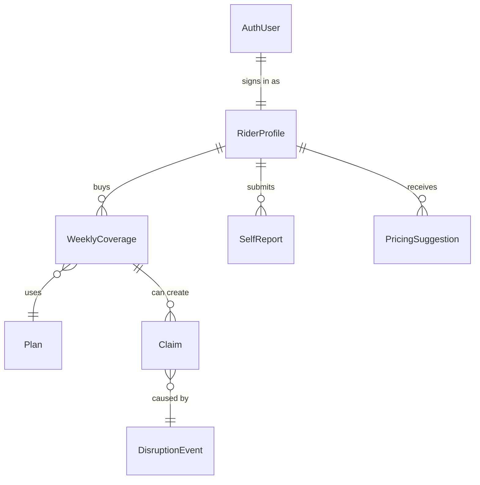

Oasis stores its data in **Supabase PostgreSQL** with Row Level Security (RLS) on every table, so **each rider only sees their own information** and admins get the full picture.

If you’re **not** implementing the database yourself, you can mostly focus on the **conceptual diagram** below and skim the table descriptions. The `CREATE TABLE` SQL is here mainly for engineers wiring things up.

---

## Entity Relationships

At a high level, the data model is simple:

- A **rider profile** connects to **weekly policies**
- Each **weekly policy** can generate **multiple parametric claims**
- Each **claim** is tied back to a specific **disruption event**



**For riders:** this translates to “I have a profile, I buy a weekly plan, and whenever a qualifying disruption hits my zone, Oasis records an event and creates a claim against my current week.”

**For admins:** it means every payout is **auditable end‑to‑end** — from the disruption trigger to the rider, policy, and final payment transaction.

---

| From | To | Relation |
|------|-----|----------|
| auth.users | profiles | 1:1 |
| profiles | weekly_policies | 1:many |
| weekly_policies | plan_packages | plan_id |
| weekly_policies | parametric_claims | 1:many |
| parametric_claims | live_disruption_events | event_id |
| profiles | rider_delivery_reports | 1:many |
| profiles | premium_recommendations | 1:many |

---

## Tables

### `profiles`

Stores rider identity and delivery zone. Created on first sign-in.

**Key fields:**
- **platform**: where the rider delivers (e.g. Zepto/Blinkit)
- **primary_zone_geofence**: rider’s “home zone” used for eligibility checks
- **zone_latitude / zone_longitude**: lightweight zone center for quick lookups

<details>
<summary>Show SQL</summary>

```sql
CREATE TABLE profiles (
  id                   UUID PRIMARY KEY REFERENCES auth.users(id) ON DELETE CASCADE,
  full_name            TEXT,
  phone_number         TEXT,
  platform             platform_type,        -- 'zepto' | 'blinkit'
  payment_routing_id   TEXT,
  primary_zone_geofence JSONB,
  zone_latitude        NUMERIC,
  zone_longitude       NUMERIC,
  role                 TEXT DEFAULT 'rider', -- 'rider' | 'admin'
  created_at           TIMESTAMPTZ DEFAULT NOW(),
  updated_at           TIMESTAMPTZ DEFAULT NOW()
);
```
</details>

**RLS:** Users can only read and write their own row.

---

### `plan_packages`

Insurance plan tiers. Seeded with three default plans.

**Key fields:**
- **weekly_premium_inr**: weekly price (Oasis uses weekly pricing only)
- **payout_per_claim_inr**: amount paid per qualifying disruption
- **max_claims_per_week**: plan cap to prevent unlimited payouts

<details>
<summary>Show SQL</summary>

```sql
CREATE TABLE plan_packages (
  id                    UUID PRIMARY KEY DEFAULT gen_random_uuid(),
  slug                  TEXT UNIQUE NOT NULL,           -- 'basic' | 'standard' | 'premium'
  name                  TEXT NOT NULL,
  description           TEXT,
  weekly_premium_inr    NUMERIC(10, 2) NOT NULL,
  payout_per_claim_inr  NUMERIC(10, 2) NOT NULL,
  max_claims_per_week   INT DEFAULT 2,
  is_active             BOOLEAN DEFAULT true,
  sort_order            INT DEFAULT 0
);
```
</details>

**Seeded data:**

| slug | Weekly Premium | Payout/Claim | Max Claims |
|---|---|---|---|
| `basic` | ₹49 | ₹300 | 1 |
| `standard` | ₹99 | ₹700 | 2 |
| `premium` | ₹199 | ₹1,500 | 3 |

---

### `weekly_policies`

One row per rider per week of coverage. The `is_active` flag is flipped to `false` at week end by the weekly-premium cron.

**Key fields:**
- **week_start_date / week_end_date**: always a single coverage week
- **is_active**: used by the adjudicator to find covered riders

<details>
<summary>Show SQL</summary>

```sql
CREATE TABLE weekly_policies (
  id                  UUID PRIMARY KEY DEFAULT gen_random_uuid(),
  profile_id          UUID NOT NULL REFERENCES profiles(id) ON DELETE CASCADE,
  plan_id             UUID REFERENCES plan_packages(id) ON DELETE SET NULL,
  week_start_date     DATE NOT NULL,
  week_end_date       DATE NOT NULL,
  weekly_premium_inr  NUMERIC(10, 2) NOT NULL,
  is_active           BOOLEAN DEFAULT true,
  CONSTRAINT valid_week_range CHECK (week_end_date >= week_start_date)
);
```
</details>

**Indexes:**
- `(profile_id, is_active)` - fast lookup for dashboard
- `(week_start_date, week_end_date)` - adjudicator range query

**RLS:** Riders see only their own policies.

---

### `live_disruption_events`

Created by the adjudicator when a trigger threshold is crossed. One row per detected disruption.

**Key fields:**
- **event_type / event_subtype**: what happened (heat, rain, AQI, traffic gridlock, curfew)
- **severity_score**: 0–10 scale used for reporting and analytics
- **geofence_polygon**: who is “in the affected area”
- **raw_api_data**: full trigger evidence for audit/debugging

<details>
<summary>Show SQL</summary>

```sql
CREATE TABLE live_disruption_events (
  id               UUID PRIMARY KEY DEFAULT gen_random_uuid(),
  event_type       disruption_event_type NOT NULL,  -- 'weather' | 'traffic' | 'social'
  event_subtype    TEXT,                             -- 'extreme_heat' | 'heavy_rain' | 'severe_aqi' | 'traffic_gridlock' | 'zone_curfew'
  severity_score   NUMERIC(4, 2) NOT NULL CHECK (severity_score BETWEEN 0 AND 10),
  geofence_polygon JSONB,        -- { type: 'circle', lat, lng, radius_km }
  verified_by_llm  BOOLEAN DEFAULT false,
  raw_api_data     JSONB,        -- full API response stored for audit
  created_at       TIMESTAMPTZ DEFAULT NOW()
);
```
</details>

The `event_subtype` column (added via migration `20240323000000_add_event_subtype.sql`) provides granular trigger classification beyond the three broad `event_type` enum values. An index on `event_subtype` supports efficient analytics queries.

The `geofence_polygon` field uses a custom JSON format:
```json
{
  "type": "circle",
  "lat": 12.9716,
  "lng": 77.5946,
  "radius_km": 15
}
```

**RLS:** Authenticated users can read; only service role can write.

---

### `parametric_claims`

Auto-inserted by the adjudicator when a rider is eligible for a payout. Status starts as `pending_verification` and transitions to `paid` after GPS confirmation.

**Key fields:**
- **status**: starts `pending_verification`, becomes `paid` after GPS confirmation
- **is_flagged / flag_reason**: fraud checks can flag suspicious claims for admin review

<details>
<summary>Show SQL</summary>

```sql
CREATE TABLE parametric_claims (
  id                      UUID PRIMARY KEY DEFAULT gen_random_uuid(),
  policy_id               UUID NOT NULL REFERENCES weekly_policies(id),
  disruption_event_id     UUID NOT NULL REFERENCES live_disruption_events(id),
  payout_amount_inr       NUMERIC(10, 2) NOT NULL,
  status                  claim_status DEFAULT 'pending_verification',
                          -- 'pending_verification' | 'paid' | 'triggered'
  gateway_transaction_id  TEXT,      -- 'oasis_payout_<timestamp>_<policyId>'
  is_flagged              BOOLEAN DEFAULT false,
  flag_reason             TEXT,
  created_at              TIMESTAMPTZ DEFAULT NOW()
);
```
</details>

**Indexes:**
- `(policy_id)` - rider dashboard claims list
- `(status)` - admin claims overview
- `(created_at DESC)` - recent activity feed

**RLS:** Riders see only claims linked to their own policies. Service role has full access.

---

### `rider_delivery_reports`

Optional GPS-attached reports that riders submit to confirm they were in an affected zone. Used by the location verification fraud check.

<details>
<summary>Show SQL</summary>

```sql
CREATE TABLE rider_delivery_reports (
  id                UUID PRIMARY KEY DEFAULT gen_random_uuid(),
  profile_id        UUID NOT NULL REFERENCES profiles(id),
  zone_latitude     NUMERIC,
  zone_longitude    NUMERIC,
  disruption_note   TEXT,
  file_url          TEXT,         -- Supabase Storage URL
  created_at        TIMESTAMPTZ DEFAULT NOW()
);
```
</details>

---

### `claim_verifications`

Links a GPS reading to a specific claim. Created when a rider submits the `ClaimVerificationPrompt`.

<details>
<summary>Show SQL</summary>

```sql
CREATE TABLE claim_verifications (
  id            UUID PRIMARY KEY DEFAULT gen_random_uuid(),
  claim_id      UUID NOT NULL REFERENCES parametric_claims(id),
  latitude      NUMERIC,
  longitude     NUMERIC,
  status        TEXT,   -- 'within_geofence' | 'outside_geofence'
  created_at    TIMESTAMPTZ DEFAULT NOW()
);
```
</details>

---

### `premium_recommendations`

Stores per-rider weekly premium suggestions generated by the ML module. Used to display the pricing recommendation before subscription.

<details>
<summary>Show SQL</summary>

```sql
CREATE TABLE premium_recommendations (
  id                    UUID PRIMARY KEY DEFAULT gen_random_uuid(),
  profile_id            UUID NOT NULL REFERENCES profiles(id),
  recommended_premium   NUMERIC(10, 2),
  risk_factors          JSONB,
  week_start_date       DATE,
  created_at            TIMESTAMPTZ DEFAULT NOW()
);
```
</details>

---

### `system_logs`

Append-only audit log written by the adjudicator after each run.

<details>
<summary>Show SQL</summary>

```sql
CREATE TABLE system_logs (
  id          UUID PRIMARY KEY DEFAULT gen_random_uuid(),
  event_type  TEXT,      -- 'adjudicator_run' | 'adjudicator_demo'
  metadata    JSONB,     -- { candidates_found, claims_created, zones_checked, duration_ms }
  created_at  TIMESTAMPTZ DEFAULT NOW()
);
```
</details>

---

### `payment_transactions`

Records every Stripe payment for audit and reconciliation.

<details>
<summary>Show SQL</summary>

```sql
CREATE TABLE payment_transactions (
  id                  UUID PRIMARY KEY DEFAULT gen_random_uuid(),
  profile_id          UUID REFERENCES profiles(id),
  stripe_checkout_session_id TEXT,
  stripe_payment_intent_id  TEXT,
  amount_inr          NUMERIC(10, 2),
  status              TEXT,    -- 'created' | 'verified' | 'failed'
  created_at          TIMESTAMPTZ DEFAULT NOW()
);
```
</details>

---

### `payout_ledger`

Simulated instant payout tracking for demo and location verification.

<details>
<summary>Show SQL</summary>

```sql
CREATE TABLE payout_ledger (
  id UUID PRIMARY KEY DEFAULT gen_random_uuid(),
  claim_id UUID NOT NULL REFERENCES parametric_claims(id) ON DELETE CASCADE,
  profile_id UUID NOT NULL REFERENCES profiles(id) ON DELETE CASCADE,
  amount_inr NUMERIC(10,2) NOT NULL,
  payout_method TEXT NOT NULL DEFAULT 'upi_instant',
  status TEXT NOT NULL DEFAULT 'processing',
  mock_upi_ref TEXT,
  initiated_at TIMESTAMPTZ DEFAULT NOW(),
  completed_at TIMESTAMPTZ,
  metadata JSONB DEFAULT '{}'::jsonb
);
```
</details>

---

### `rider_notifications`

Autonomous notifications for riders (payout, disruption). Realtime pushes to app.

<details>
<summary>Show SQL</summary>

```sql
CREATE TABLE rider_notifications (
  id UUID PRIMARY KEY DEFAULT gen_random_uuid(),
  profile_id UUID NOT NULL REFERENCES profiles(id) ON DELETE CASCADE,
  title TEXT NOT NULL,
  body TEXT,
  type TEXT NOT NULL DEFAULT 'payout',
  read_at TIMESTAMPTZ,
  created_at TIMESTAMPTZ NOT NULL DEFAULT NOW(),
  metadata JSONB DEFAULT '{}'::jsonb
);
```
</details>

---

### `stripe_webhook_events`

Processed Stripe webhook event IDs for idempotency, ensuring the same payment hook is not processed twice.

<details>
<summary>Show SQL</summary>

```sql
CREATE TABLE stripe_webhook_events (
  id UUID PRIMARY KEY DEFAULT gen_random_uuid(),
  event_id TEXT NOT NULL UNIQUE,
  processed_at TIMESTAMPTZ NOT NULL DEFAULT NOW()
);
```
</details>

---

### `rate_limit_entries`

Rate limit counters; shared across app instances when using the Supabase store.

<details>
<summary>Show SQL</summary>

```sql
CREATE TABLE rate_limit_entries (
  key TEXT PRIMARY KEY,
  count INT NOT NULL DEFAULT 0,
  reset_at TIMESTAMPTZ NOT NULL
);
```
</details>

---

### `plan_pricing_snapshots`

Weekly snapshots of plan tier prices. Useful for reporting, forecasting, and historical audibility of dynamic pricing.

<details>
<summary>Show SQL</summary>

```sql
CREATE TABLE plan_pricing_snapshots (
  id UUID PRIMARY KEY DEFAULT gen_random_uuid(),
  week_start_date DATE NOT NULL,
  plan_id UUID NOT NULL REFERENCES plan_packages(id) ON DELETE CASCADE,
  weekly_premium_inr NUMERIC(10, 2) NOT NULL,
  source TEXT NOT NULL DEFAULT 'manual' CHECK (source IN ('manual', 'model')),
  created_at TIMESTAMPTZ DEFAULT NOW(),
  UNIQUE(week_start_date, plan_id)
);
```
</details>

---

## Row Level Security Summary

| Table | Rider read | Rider write | Admin | Service role |
|---|---|---|---|---|
| `profiles` | Own only | Own only | Via service role | Full |
| `weekly_policies` | Own only | Own only | Via service role | Full |
| `parametric_claims` | Own only | - | Via service role | Full |
| `live_disruption_events` | All | - | Via service role | Full |
| `plan_packages` | Active only | - | Via service role | Full |
| `claim_verifications` | Own only | Own only | Via service role | Full |
| `system_logs` | - | - | Via service role | Full |
| `payment_transactions` | Own only | - | Via service role | Full |
| `payout_ledger` | Own only | - | Via service role | Full |
| `rider_notifications` | Own only | - | Via service role | Full |
| `stripe_webhook_events` | - | - | Via service role | Full |
| `rate_limit_entries` | - | - | Via service role | Full |
| `plan_pricing_snapshots` | All | - | Via service role | Full |
| `payment_transactions` | Own only | - | Via service role | Full |
| `payout_ledger` | Own only | - | Via service role | Full |
| `rider_notifications` | Own only | - | Via service role | Full |
| `stripe_webhook_events` | - | - | Via service role | Full |
| `rate_limit_entries` | - | - | Via service role | Full |
| `plan_pricing_snapshots` | All | - | Via service role | Full |

---

## Migrations

Migrations live in `supabase/migrations/`.

- **Dashboard approach**: run the SQL files in **timestamp order** (top to bottom).
- **CLI approach**: use `supabase db push` (or your project’s `yarn db:migrate` script) after linking the project.

You don’t need to memorize migration filenames — the timestamps enforce the correct order.

---

## Type Enums

These enums keep the database values consistent (so we don’t end up with “paid”, “PAID”, “Paid”, etc.).

<details>
<summary>Show SQL</summary>

```sql
CREATE TYPE platform_type AS ENUM ('zepto', 'blinkit');
CREATE TYPE disruption_event_type AS ENUM ('weather', 'traffic', 'social');
CREATE TYPE claim_status AS ENUM ('triggered', 'pending_verification', 'paid');
```
</details>
