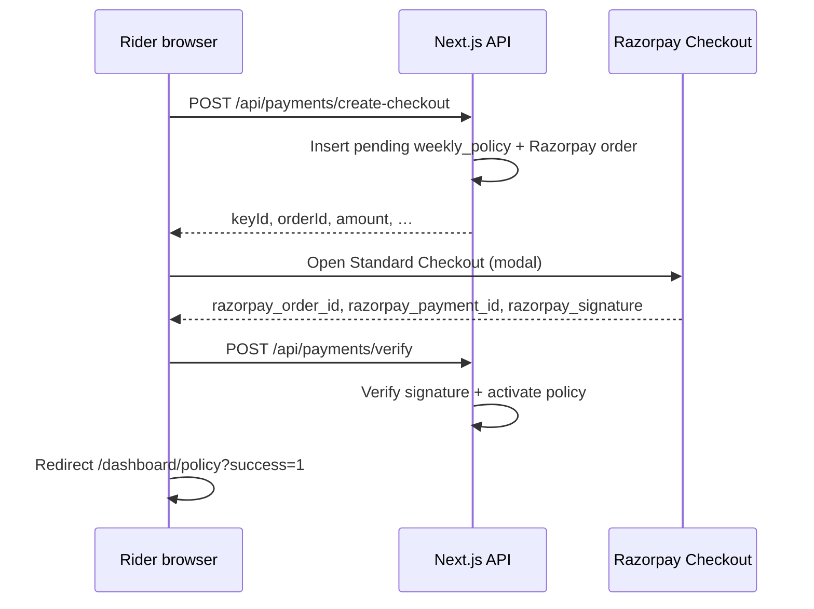

Oasis collects weekly premiums through **Razorpay Standard Checkout** (embedded modal). In **test mode**, no real INR is charged. Use this page when you need a repeatable demo or local QA.

---

## Prerequisites

1. A [Razorpay account](https://razorpay.com/) with **Test mode** enabled (toggle in the Razorpay Dashboard).
2. **Test API keys** from **Dashboard → Account & Settings → API Keys** (use the **Key ID** and **Key Secret** shown in test mode).
3. Oasis environment variables set (see below).
4. A rider who has finished **onboarding** (platform, zone, government ID, face verification) so `/dashboard/policy` can show the subscribe flow.

---

## Environment variables

Copy from [`.env.local.example`](https://github.com/lohitkolluri/Oasis/blob/main/.env.local.example) and fill payment fields:

```bash
# Client: must start with rzp_test_ (enforced in code for non-production builds)
NEXT_PUBLIC_RAZORPAY_KEY_ID=rzp_test_...

# Server-only
RAZORPAY_KEY_SECRET=...

# Optional: backup path when the Dashboard sends webhooks to your app
RAZORPAY_WEBHOOK_SECRET=...
```

The publishable **Key ID** is safe to expose in the browser; the **Key Secret** and **Webhook Secret** must never use a `NEXT_PUBLIC_` prefix.

If either key is missing or invalid, `POST /api/payments/create-checkout` returns **503** and the policy page shows a configuration error.

---

## End-to-end flow in the app



1. Sign in as a rider and complete **onboarding** (`/onboarding`).
2. Open **Policy** (`/dashboard/policy`).
3. Choose a **weekly plan** (Basic / Standard / Premium) and start checkout.
4. The app calls **`POST /api/payments/create-checkout`** with `planId`, `weekStart`, and `weekEnd`. Oasis creates a **pending** `weekly_policies` row and a Razorpay **order**, then returns options for the Checkout script.
5. The **Razorpay modal** opens (`checkout.razorpay.com`). Complete payment using a **test** method (next section).
6. On success, the client calls **`POST /api/payments/verify`** with the Razorpay response fields. The server verifies the signature, calls `process_razorpay_payment_event`, and marks the policy **paid** / **active**.
7. You are redirected to `/dashboard/policy?success=1` with coverage active.

:::tip[Primary vs webhook]
The **happy path for demos** is client-side **verify** after Checkout succeeds. The **`POST /api/payments/webhook`** handler is an optional **backup** for `payment.captured` when Razorpay calls your server directly (useful in production).
:::

---

## Test payment methods (no real money)

Razorpay maintains the authoritative list of **test cards, UPI VPAs, and netbanking** flows:

- **[Test card and payment details](https://razorpay.com/docs/payments/payments/test-card-details/)** (official Razorpay docs)

Common patterns in test mode:

- **UPI:** use the success VPA documented by Razorpay for test mode (e.g. `success@razorpay` — confirm on the page above; Razorpay may update labels).
- **Cards:** use the success card numbers from the same doc for domestic and international test scenarios.

Always keep the Dashboard in **Test mode** when using these methods.

---

## Optional: Razorpay webhooks (local or deployed)

1. In **Razorpay Dashboard → Webhooks**, add your public URL:
   `https://<your-host>/api/payments/webhook`
2. Subscribe at least to **`payment.captured`** (this is what Oasis handles).
3. Copy the **Webhook secret** into `RAZORPAY_WEBHOOK_SECRET`.

For **local development**, expose your machine with a tunnel (ngrok, Cloudflare Tunnel, etc.) and register that URL, or rely on **verify-only** without webhooks.

The webhook uses the `x-razorpay-signature` header and the same idempotent `process_razorpay_payment_event` path as verify.

---

## Troubleshooting

| Symptom | What to check |
| -------- | --------------- |
| “Payment not configured” / 503 on subscribe | `NEXT_PUBLIC_RAZORPAY_KEY_ID` and `RAZORPAY_KEY_SECRET` set; Key ID starts with `rzp_test_` in test mode |
| Checkout does not open | Browser console for script errors; ad blockers blocking `checkout.razorpay.com` |
| Verify fails after “success” in modal | Server logs for `/api/payments/verify`; clock skew is rare—usually wrong secret or order/policy mismatch |
| Webhook 503 “Webhook not configured” | `RAZORPAY_WEBHOOK_SECRET` unset—optional if you only use verify |
| Policy stays pending | Confirm `payment.captured` fired and amount matches policy premium in paise |

---

## Related

- [Development Setup](/development-setup/) — install, env, database
- [Deployment](/deployment/) — production env and Razorpay webhook URL
- [API overview](/api-overview/) — payment routes at a glance
