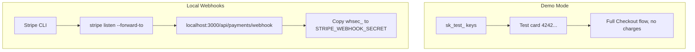

## Prerequisites

| Tool         | Minimum version | Notes                                                                 |
| ------------ | --------------- | --------------------------------------------------------------------- |
| Node.js      | 20+             | Pinned in `package.json` `engines`; LTS recommended                   |
| Bun          | Latest          | Recommended runtime/package manager (`curl -fsSL https://bun.sh/install \| bash`) |
| Supabase CLI | Latest          | `npm i -g supabase`                                                   |
| Git          | Any             |                                                                       |

---

## 1. Clone & Install

```bash
git clone https://github.com/lohitkolluri/oasis.git
cd oasis
bun install
```

---

## 2. Environment Variables

Copy the example file and fill in every value:

```bash
cp .env.local.example .env.local
```

### Required Variables

```bash
# Supabase - create a project at supabase.com
NEXT_PUBLIC_SUPABASE_URL=https://<project-ref>.supabase.co
NEXT_PUBLIC_SUPABASE_ANON_KEY=<anon-key>
SUPABASE_SERVICE_ROLE_KEY=<service-role-key>

# Admin access - comma-separated emails
ADMIN_EMAILS=you@example.com

# Cron job protection
CRON_SECRET=<random-secure-string>
```

### Weather APIs (for trigger automation)

```bash
# Tomorrow.io - heat + rain triggers
# Free tier: 500 calls/day - https://app.tomorrow.io/
TOMORROW_IO_API_KEY=

# WAQI - ground-station AQI (optional, Open-Meteo fallback used if empty)
# Free token: https://aqicn.org/api/
WAQI_API_KEY=
```

### Traffic (for gridlock detection)

```bash
# TomTom - multi-point traffic flow sampling
# Free tier: 2500 calls/day - https://developer.tomtom.com/
TOMTOM_API_KEY=
```

### News & LLM (for curfew/traffic triggers)

```bash
# NewsData.io - news-based disruption detection
# Free tier: 200 calls/day - https://newsdata.io/
NEWSDATA_IO_API_KEY=

# OpenRouter - LLM verification of news triggers
# Free tier available - https://openrouter.ai/
OPENROUTER_API_KEY=
```

### Payments

```bash
# Stripe test keys - https://dashboard.stripe.com/test/apikeys
STRIPE_SECRET_KEY=sk_test_...
STRIPE_WEBHOOK_SECRET=whsec_...   # From Stripe Dashboard → Developers → Webhooks

```

:::tip[Demo Mode]{icon="approve-check-circle"}
Use Stripe test keys (`sk_test_...`) to run the full Checkout flow without real charges: test cards (e.g. `4242 4242 4242 4242`) and **UPI** in test mode (see [Stripe UPI payments](https://stripe.com/docs/payments/upi)).
:::



For local testing with real webhook events, use the [Stripe CLI](https://stripe.com/docs/stripe-cli):

```bash
stripe listen --forward-to localhost:3000/api/payments/webhook
```

Use the `whsec_...` signing secret from the CLI output in `STRIPE_WEBHOOK_SECRET`.

---

## 3. Database Setup

### Option A - Supabase Dashboard (recommended for first-time setup)

1. Create a project at [supabase.com/dashboard](https://supabase.com/dashboard)
2. Go to **SQL Editor → New query**
3. Run **all SQL files in `supabase/migrations/` in timestamp order** (top to bottom in the folder view).

If you prefer more guidance, open the folder and apply them in this rough sequence:

- **Core tables** (profiles, weekly policies, claims, disruption events, plans)
- **Improvements & fixes** (fraud flags, zone coordinates, audit logs)
- **Payments & cron jobs** (Stripe, Supabase cron, rate limits)
- **Quality-of-life updates** (notifications, pricing tweaks, extra columns)

### Option B - Supabase CLI

Migrations are applied with `supabase db push`, which requires the project to be linked. You can link via the **Supabase plugin** (in Cursor: connect your project in the Supabase panel) or via the CLI:

```bash
# 1. Log in (one-time; or set SUPABASE_ACCESS_TOKEN)
npx supabase login

# 2. Link to your project (ref = from NEXT_PUBLIC_SUPABASE_URL, e.g. https://<ref>.supabase.co)
npx supabase link --project-ref <project-ref>

# 3. Apply all migrations
bun run db:migrate
# or: make db-migrate
```

If you use the **Supabase plugin** in Cursor, ensure the project is connected; then you can run migrations from the plugin UI or run `yarn db:migrate` in the terminal after linking once via CLI.

### Seeding Demo Data

An idempotent seed script is available at `scripts/seed-demo-data.sql`. It quickly fills your database with a **ready-to-demo Oasis environment**:

- **5 demo riders** across cities and platforms
- **3 weekly plans** (Basic, Standard, Premium)
- A mix of **realistic disruption events, claims, payouts, and notifications**

You don’t need to read the SQL; just run it once in the **Supabase SQL Editor**:

1. Open **Supabase Dashboard → SQL Editor → New query**
2. Paste the contents of `scripts/seed-demo-data.sql`
3. Click **Run**

The script is safe to re-run — it cleans up the previous demo data before inserting fresh records.

**Demo rider credentials (for logging in quickly):**

| Email                     | Password      | City      | Platform |
| ------------------------- | ------------- | --------- | -------- |
| `demo.rider1@oasis.test` | `DemoRider1!` | Bangalore | Zepto    |
| `demo.rider2@oasis.test` | `DemoRider2!` | Mumbai    | Blinkit  |
| `demo.rider3@oasis.test` | `DemoRider3!` | Delhi     | Zepto    |
| `demo.rider4@oasis.test` | `DemoRider4!` | Chennai   | Blinkit  |
| `demo.rider5@oasis.test` | `DemoRider5!` | Hyderabad | Zepto    |

---

### Storage Bucket Setup

Run `bun run setup-storage` to create all required buckets:

| Bucket           | Purpose                                          |
| ---------------- | ------------------------------------------------ |
| `rider-reports`  | Delivery reports and claim proof photos          |
| `government-ids` | KYC government ID uploads (Aadhaar, PAN, etc.)   |
| `face-photos`    | Face liveness verification photos for onboarding |

```bash
bun run setup-storage
```

Or create them manually via **Supabase Dashboard → Storage → New bucket** (all private, 5MB limit, images only).

---

## 4. Run the Development Server

```bash
bun dev
```

The app starts on [http://localhost:3000](http://localhost:3000) with Turbopack.

### First Login

1. Navigate to `/register` and create an account.
2. To access `/admin`, your email must be in `ADMIN_EMAILS`.
3. Complete the onboarding flow at `/onboarding` (Step 1: platform, name, phone, zone; Step 2: government ID + face verification).

---

## 5. Useful Scripts

| Script           | Command                 | Description                                                     |
| ---------------- | ----------------------- | --------------------------------------------------------------- |
| Dev server       | `bun dev`               | Next.js + Turbopack                                             |
| Production build | `bun run build`         | Full Next.js build with type check                              |
| Lint             | `bun run lint`          | ESLint with Next.js ruleset                                     |
| DB migrate       | `bun run db:migrate`    | Supabase CLI push                                               |
| Storage setup    | `bun run setup-storage` | Create `rider-reports`, `government-ids`, `face-photos` buckets |

---

## 6. Running the Adjudicator Locally

The adjudicator runs automatically on Vercel's cron schedule. To trigger it manually during development, call the API with your `CRON_SECRET`:

```bash
curl -H "Authorization: Bearer <CRON_SECRET>" \
  http://localhost:3000/api/cron/adjudicator
```

Or use the **Admin Dashboard → Run Adjudicator** button (requires admin login).

---

## 7. Project Structure Quick Reference

```
app/          → pages and API routes (Next.js App Router)
components/   → React UI components
lib/          → business logic (no React)
supabase/     → SQL migrations + Deno edge function
Docs/         → this Starlight docs site
```

See [Folder Structure](/folder-structure/) for a complete breakdown.
