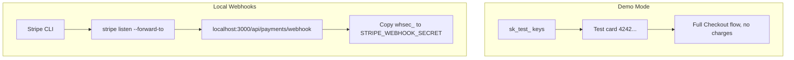

## Prerequisites

| Tool | Minimum version | Notes |
|---|---|---|
| Node.js | 18.x | LTS recommended |
| Yarn | 1.22+ | `npm i -g yarn` |
| Supabase CLI | Latest | `npm i -g supabase` |
| Git | Any |  |

---

## 1. Clone & Install

```bash
git clone https://github.com/lohitkolluri/oasis.git
cd oasis
yarn install
```

---

## 2. Environment Variables

Copy the example file and fill in every value:

```bash
cp .env.local.example .env.local
```

### Required Variables

```bash
# Supabase — create a project at supabase.com
NEXT_PUBLIC_SUPABASE_URL=https://<project-ref>.supabase.co
NEXT_PUBLIC_SUPABASE_ANON_KEY=<anon-key>
SUPABASE_SERVICE_ROLE_KEY=<service-role-key>

# Admin access — comma-separated emails
ADMIN_EMAILS=you@example.com

# Cron job protection
CRON_SECRET=<random-secure-string>
```

### Weather APIs (for trigger automation)

```bash
# Tomorrow.io — heat + rain triggers
# Free tier: 500 calls/day — https://app.tomorrow.io/
TOMORROW_IO_API_KEY=

# WAQI — ground-station AQI (optional, Open-Meteo fallback used if empty)
# Free token: https://aqicn.org/api/
WAQI_API_KEY=
```

### News & LLM (for curfew/traffic triggers)

```bash
# NewsData.io — news-based disruption detection
# Free tier: 200 calls/day — https://newsdata.io/
NEWSDATA_IO_API_KEY=

# OpenRouter — LLM verification of news triggers
# Free tier available — https://openrouter.ai/
OPENROUTER_API_KEY=
```

### Payments

```bash
# Stripe test keys — https://dashboard.stripe.com/test/apikeys
STRIPE_SECRET_KEY=sk_test_...
STRIPE_WEBHOOK_SECRET=whsec_...   # From Stripe Dashboard → Developers → Webhooks

```

:::tip[Demo Mode]{icon="approve-check-circle"}
Use Stripe test keys (`sk_test_...`) to run the full Checkout flow with test cards (e.g. 4242 4242 4242 4242) without real charges.
:::



For local testing with real webhook events, use the [Stripe CLI](https://stripe.com/docs/stripe-cli):

```bash
stripe listen --forward-to localhost:3000/api/payments/webhook
```

Use the `whsec_...` signing secret from the CLI output in `STRIPE_WEBHOOK_SECRET`.

---

## 3. Database Setup

### Option A — Supabase Dashboard (recommended for first-time setup)

1. Create a project at [supabase.com/dashboard](https://supabase.com/dashboard)
2. Go to **SQL Editor → New query**
3. Run migrations in timestamp order from `supabase/migrations/`:

```
20240304000001_create_profiles.sql
20240304000002_create_weekly_policies.sql
20240304000003_create_live_disruption_events.sql
20240304000004_create_parametric_claims.sql
20240304000005_add_fraud_flags.sql
20240304000006_add_zone_coords.sql
20240304000007_premium_recommendations.sql
20240304000008_rider_delivery_reports.sql
20240304000009_claim_verifications.sql
20240304100000_plan_packages.sql
20240305000000_autonomous_db_improvements.sql
20240306000000_system_logs_and_fraud_enhancements.sql
20240306000001_aqi_baseline_tracking.sql
20240307000000_add_profile_role.sql
20240308000000_add_payment_tracking.sql
20240308000001_payment_transactions.sql
20240309000000_comprehensive_fixes.sql
20240310000000_add_government_id.sql
20240311000000_supabase_cron_integration.sql
20240312000000_stripe_payments.sql
20240313000000_add_face_verification.sql
```

### Option B — Supabase CLI

```bash
# Link to your project
npx supabase link --project-ref <project-ref>

# Apply all migrations
yarn db:migrate
```

### Storage Bucket Setup

Run `yarn setup-storage` to create all required buckets:

| Bucket | Purpose |
|--------|---------|
| `rider-reports` | Delivery reports and claim proof photos |
| `government-ids` | KYC government ID uploads (Aadhaar, PAN, etc.) |
| `face-photos` | Face liveness verification photos for onboarding |

```bash
yarn setup-storage
```

Or create them manually via **Supabase Dashboard → Storage → New bucket** (all private, 5MB limit, images only).

---

## 4. Run the Development Server

```bash
yarn dev
```

The app starts on [http://localhost:3000](http://localhost:3000) with Turbopack.

### First Login

1. Navigate to `/register` and create an account.
2. To access `/admin`, your email must be in `ADMIN_EMAILS`.
3. Complete the onboarding flow at `/onboarding` (Step 1: platform, name, phone, zone; Step 2: government ID + face verification).

---

## 5. Useful Scripts

| Script | Command | Description |
|---|---|---|
| Dev server | `yarn dev` | Next.js + Turbopack |
| Production build | `yarn build` | Full Next.js build with type check |
| Lint | `yarn lint` | ESLint with Next.js ruleset |
| Tests | `yarn test` | Vitest unit tests |
| DB migrate | `yarn db:migrate` | Supabase CLI push |
| Storage setup | `yarn setup-storage` | Create `rider-reports`, `government-ids`, `face-photos` buckets |

---

## 6. Running the Adjudicator Locally

The adjudicator runs automatically on Vercel's cron schedule. To trigger it manually during development, call the API with your `CRON_SECRET`:

```bash
curl -H "Authorization: Bearer <CRON_SECRET>" \
  http://localhost:3000/api/cron/adjudicator
```

Or use the **Admin Dashboard → Run Adjudicator** button (requires admin login).

---

## 7. Project Structure Quick Reference

```
app/          → pages and API routes (Next.js App Router)
components/   → React UI components
lib/          → business logic (no React)
supabase/     → SQL migrations + Deno edge function
docs/         → this Starlight docs site
```

See [Folder Structure](/folder-structure/) for a complete breakdown.
