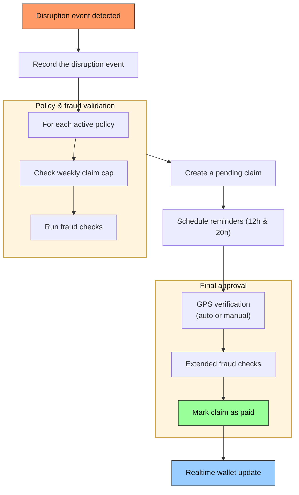
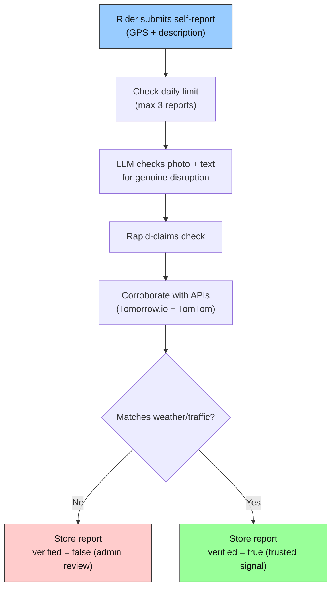

Oasis uses automated parametric claims. No claim form, adjuster handoff, or document chase is required. When a threshold is crossed, eligible riders receive a claim automatically and the payout is released after lightweight geofence confirmation within a **48-hour verification window**.

## What Makes It "Parametric"

Traditional insurance requires the policyholder to:
1. Submit a claim form
2. Provide evidence (photos, reports)
3. Wait for an adjuster to verify
4. Receive payment after approval

Parametric insurance replaces all of this with **objective trigger thresholds**:
- The trigger condition (temperature ≥ 43°C for 3+ hours) is verified by a third-party API
- If the threshold is crossed, all eligible policyholders in the affected zone automatically receive a claim
- Oasis uses GPS confirmation plus fraud checks before releasing payout funds
- No manual claims form and no adjuster review in the normal flow

---

## Claim Lifecycle



---

## 48-Hour Verification Window

Riders have **48 hours** from claim creation to verify their location. This extended window (up from the original 24h) accommodates:

- Riders who are mid-delivery when the disruption event fires
- Riders who may not have reliable data connectivity at the time
- Battery-saving modes that delay push notification delivery

If a rider does not verify within 48 hours, the claim remains in `pending_verification` state and can be reviewed by an admin.

---

## Verification Reminders

The adjudicator schedules two automatic reminder notifications via the `rider_notifications` table:

| Reminder | Timing | Message |
|---|---|---|
| First | 12 hours after claim | "Reminder: verify your location to receive your payout" |
| Second | 20 hours after claim | "Last chance: verify within 48h or your claim may expire" |

Reminders are scheduled at claim creation time using `scheduled_for` timestamps and delivered by the notification system when the time arrives.

---

## Self-Report Corroboration

When riders manually report a delivery disruption via `/api/rider/report-delivery`, Oasis cross-checks the report against real-time external data:



The corroboration result is returned in the API response and stored alongside the claim for audit.

---

## Geofence Eligibility

A rider is eligible for a payout only if their delivery zone is inside the disruption event's geofence. The check uses geodesic distance:

```typescript
export function isWithinCircle(
  pointLat, pointLng,
  centerLat, centerLng,
  radiusKm
): boolean {
  return distanceKm(pointLat, pointLng, centerLat, centerLng) <= radiusKm;
}
```

Riders without a zone coordinate recorded are skipped.

---

## Weekly Claim Cap

Each plan has a maximum number of claims per week (`max_claims_per_week`). Before inserting a claim, the adjudicator counts the rider's claims since the current Monday:

```typescript
const { count: weekClaimCount } = await supabase
  .from("parametric_claims")
  .select("id", { count: "exact", head: true })
  .eq("policy_id", policy.id)
  .gte("created_at", weekStart);

if ((weekClaimCount ?? 0) >= maxClaimsPerWeek) continue;
```

This prevents unlimited payouts in high-disruption weeks.

---

## Payout Amount

The payout is determined by the rider's plan (`payout_per_claim_inr` from `plan_packages`):

| Plan | Payout per claim | Max Claims/Week |
|---|---|---|
| Basic | ₹300 | 1 |
| Standard | ₹700 | 2 |
| Premium | ₹1,500 | 3 |

The `gateway_transaction_id` field stores a deterministic ID in the format `oasis_payout_<timestamp>_<policyId[0:8]>_<random>` for audit traceability.

---

## Real-Time Wallet Update

After a verified claim is marked `paid`, Supabase Realtime pushes the change to connected clients subscribed to that policy's claims. The `RealtimeWallet` component accumulates the payout:

```typescript
supabase
  .channel('wallet-updates')
  .on('postgres_changes', {
    event: 'INSERT',
    schema: 'public',
    table: 'parametric_claims',
    filter: `policy_id=eq.${policyId}`
  }, (payload) => {
    setBalance(prev => prev + payload.new.payout_amount_inr);
  })
  .subscribe();
```

Riders see their wallet balance increase in real time without refreshing the page.

---

## Manual Claim Review

Admins can manually review flagged claims in **Admin → Claims**. The admin can:
- View the fraud flag reason
- Override the flag (unflag a legitimate claim)
- Add a manual flag with a reason

This is accessible via `PATCH /api/admin/review-claim`:

```json
{
  "claimId": "uuid",
  "isFlagged": false,
  "reason": "Verified - GPS data confirmed rider was in zone"
}
```

---

## Location Confirmation

Claims are created in `pending_verification` state. Oasis then asks for GPS confirmation to ensure the rider was in the disruption zone before releasing funds. On mobile, this can happen automatically from the in-app notification flow; otherwise the rider can confirm manually from the dashboard.

The `ClaimVerificationPrompt` component:
1. Requests browser geolocation
2. POSTs to `/api/claims/verify-location` with `deviceFingerprint` and `gpsAccuracy`
3. Server validates GPS accuracy (rejects if > 100m accuracy)
4. Server checks for impossible travel (> 50 km apart within 30 min from last verification)
5. Server checks `isWithinCircle()` against the event geofence
6. Records the result in `claim_verifications` as `inside_geofence` or `outside_geofence`
7. Runs extended fraud checks (device fingerprint, cross-profile velocity)
8. If inside the geofence and no fraud flags → releases payout and marks the claim `paid`

If verification records `outside_geofence`, the claim is flagged and the fraud detector's `checkLocationVerification()` can flag future claims for that rider.

---

## Claims Dashboard (Rider View)

The rider's `/dashboard/claims` page shows:
- All claims for the current week
- Payout amounts and status
- Disruption event type, subtype, and date
- Total accumulated payout (wallet balance)

Claims typically move through `pending_verification` to `paid`. Demo-mode claims may be auto-paid immediately so recordings and judge demos can show the full wallet-credit flow without waiting for device GPS.
