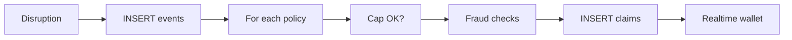

Fully automated, zero-touch claims. No forms, photos, or helplines. When a threshold is crossed, eligible riders receive payouts automatically.

## What Makes It "Parametric"

Traditional insurance requires the policyholder to:
1. Submit a claim form
2. Provide evidence (photos, reports)
3. Wait for an adjuster to verify
4. Receive payment after approval

Parametric insurance replaces all of this with **objective trigger thresholds**:
- The trigger condition (temperature ≥ 43°C for 3+ hours) is verified by a third-party API
- If the threshold is crossed, all eligible policyholders in the affected zone automatically receive a payout
- No manual verification, no claims form, no waiting

---

## Claim Lifecycle



**Flow:**

```
Disruption event detected by adjudicator
           ↓
INSERT live_disruption_events (event_type, severity, geofence, raw_api_data)
           ↓
For each active policy in affected geofence:
  ├── Check weekly claim cap (max_claims_per_week from plan_packages)
  ├── runAllFraudChecks() [parallel + sequential]
  │       ├── checkDuplicateClaim()   - same policy + same event?
  │       ├── checkRapidClaims()      - ≥ 5 claims in 24h?
  │       └── checkWeatherMismatch()  - raw data supports trigger?
  └── INSERT parametric_claims (status='paid', payout_amount_inr)
           ↓
Supabase Realtime fires → RealtimeWallet updates rider UI
```

---

## Geofence Eligibility

A rider is eligible for a payout only if their delivery zone is inside the disruption event's geofence. The check uses geodesic distance (via Turf.js):

```typescript
// lib/utils/geo.ts
export function isWithinCircle(
  pointLat, pointLng,   // rider's zone
  centerLat, centerLng, // event center
  radiusKm              // event radius (15–50 km)
): boolean {
  return distanceKm(pointLat, pointLng, centerLat, centerLng) <= radiusKm;
}
```

Riders without a zone coordinate recorded are skipped.

---

## Weekly Claim Cap

Each plan has a maximum number of claims per week (`max_claims_per_week`). Before inserting a claim, the adjudicator counts the rider's claims since the current Monday:

```typescript
const { count: weekClaimCount } = await supabase
  .from("parametric_claims")
  .select("id", { count: "exact", head: true })
  .eq("policy_id", policy.id)
  .gte("created_at", weekStart);  // ISO of current Monday

if ((weekClaimCount ?? 0) >= maxClaimsPerWeek) continue;  // Skip
```

This prevents unlimited payouts in high-disruption weeks.

---

## Payout Amount

The payout is determined by the rider's plan (`payout_per_claim_inr` from `plan_packages`):

| Plan | Payout per claim |
|---|---|
| Basic | ₹300 |
| Standard | ₹400 |
| Premium | ₹600 |

The `gateway_transaction_id` field stores a deterministic ID in the format `oasis_payout_<timestamp>_<policyId[0:8]>_<random>` for audit traceability.

---

## Real-Time Wallet Update

After a claim is inserted, Supabase Realtime pushes the change to all connected clients subscribed to that policy's claims. The `RealtimeWallet` component accumulates the total payout:

```typescript
// components/rider/RealtimeWallet.tsx
supabase
  .channel('wallet-updates')
  .on('postgres_changes', {
    event: 'INSERT',
    schema: 'public',
    table: 'parametric_claims',
    filter: `policy_id=eq.${policyId}`
  }, (payload) => {
    setBalance(prev => prev + payload.new.payout_amount_inr);
  })
  .subscribe();
```

Riders see their wallet balance increase in real time without refreshing the page.

---

## Manual Claim Review

Admins can manually review flagged claims in **Admin → Claims**. The admin can:
- View the fraud flag reason
- Override the flag (unflag a legitimate claim)
- Add a manual flag with a reason

This is accessible via `PATCH /api/admin/review-claim`:

```json
{
  "claimId": "uuid",
  "isFlagged": false,
  "reason": "Verified - GPS data confirmed rider was in zone"
}
```

---

## Location Verification (Optional)

Riders can optionally submit a GPS verification to confirm they were in the disruption zone. This is displayed as a prompt in the dashboard after a claim is created.

The `ClaimVerificationPrompt` component:
1. Requests browser geolocation
2. POSTs to `/api/claims/verify-location`
3. The server checks `isWithinCircle()` against the event geofence
4. Records the result in `claim_verifications` as `within_geofence` or `outside_geofence`

If verification records `outside_geofence`, the fraud detector's `checkLocationVerification()` will flag future claims for that rider.

---

## Claims Dashboard (Rider View)

The rider's `/dashboard/claims` page shows:
- All claims for the current week
- Payout amounts and status
- Disruption event type and date
- Total accumulated payout (wallet balance)

Claims in `status='paid'` are final - parametric insurance has no "pending" state.
