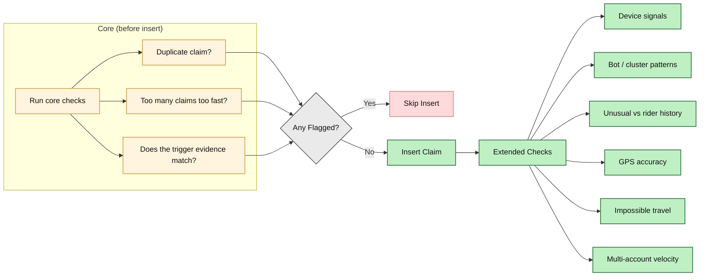

Multi-layered fraud checks run on every claim before and after insert. Ordered from cheapest (in-memory) to most expensive (DB) to minimize latency.

---

## Check Pipeline

The core `runAllFraudChecks()` runs before each claim insert. If any check returns `isFlagged: true`, the claim is skipped. Extended checks run asynchronously after insertion and can retroactively flag via `flagClaimAsFraud()`.

| Check | When | Threshold | Config constant |
|-------|------|-----------|-----------------|
| checkDuplicateClaim | Core (parallel) | Same policy + same event → skip | — |
| checkRapidClaims | Core (parallel) | ≥ 3 claims in 24h → flag | `FRAUD.RAPID_CLAIMS_THRESHOLD` |
| checkWeatherMismatch | Core (sync) | Raw API data doesn't support trigger → flag | — |
| checkGpsAccuracy | Extended (verify-location) | GPS accuracy > 100m → reject | `FRAUD.GPS_MAX_ACCURACY_METERS` |
| checkImpossibleTravel | Extended (verify-location) | > 50 km in < 30 min → reject | `FRAUD.IMPOSSIBLE_TRAVEL_KM/MINUTES` |
| checkDeviceFingerprint | Extended | Same device in 2+ distant zones in 1h | — |
| checkCrossProfileVelocity | Extended | Same profile verifies 2+ distant claims in 1h | — |
| checkClusterAnomaly | Extended | ≥ 10 claims for same event in 10 min | — |
| checkHistoricalBaseline | Extended | Claim rate > 3× 4-week rolling average | — |
| Self-report rate limit | Report endpoint | > 3 reports/day per rider | `FRAUD.SELF_REPORT_DAILY_LIMIT` |
| Self-report corroboration | Report endpoint | Weather/traffic data contradicts report | — |

---

## Check 1: Duplicate Claim

The simplest check: if a claim already exists for the same `(policy_id, disruption_event_id)` pair, the new claim is treated as a duplicate and skipped.

---

## Check 2: Rapid Claims

Flags a policy that has accumulated too many claims in a short time window. Threshold: **5 claims in 24 hours**.

Legitimate scenario: a rider in a high-disruption day (heat in the morning, rain in the afternoon, gridlock in the evening) might see 3 real claims. The threshold of 5 allows this while flagging anything above it.

---

## Check 3: Weather Mismatch

Validates that the raw API data stored on the disruption event actually supports the claimed trigger. This catches cases where the trigger type has been tampered with or the data arrived corrupted.

**Extreme heat:** Flag if `temperature < 40°C` in raw data (trigger requires ≥43°C — 3°C buffer for edge cases).

**Heavy rain:** Flag if `precipitationIntensity < 3 mm/h` in raw data (trigger requires ≥4 mm/h).

**Severe AQI (adaptive):** Flag if `current_aqi < adaptive_threshold × 0.8`. The raw data stores the current reading, the computed adaptive threshold, `baseline_p90`, and a `chronic_pollution` boolean. The check validates against the zone-specific threshold (which uses p75/p90 baselines), not a single hardcoded number.

---

## Check 4: GPS Accuracy Validation

When a rider submits a location verification, the client provides a `gpsAccuracy` value (in meters) from the browser Geolocation API. If the accuracy exceeds 100 meters, the verification is rejected immediately — low-accuracy GPS readings are too unreliable for geofence verification.

This prevents mock-GPS apps and indoor readings with poor satellite fix from passing verification.

---

## Check 5: Impossible Travel Detection

Compares the rider's current verification location and time against their most recent previous verification. If the rider appears to have traveled more than **50 km in under 30 minutes**, the verification is flagged as impossible.

---

## Check 6: Location Verification

If the rider has submitted a GPS verification (via `ClaimVerificationPrompt`), and that verification recorded `outside_geofence`, the claim is flagged.

---

## Check 7: Device Fingerprint

Detects the same device submitting claims for disruption events in multiple geographically distant zones within 1 hour. A real rider cannot physically be in two locations 55+ km apart in 60 minutes.

---

## Check 8: Cross-Profile Velocity

Detects the same phone number being used across multiple profiles to claim for the same disruption event. This catches duplicate/multi-account fraud where a single person creates multiple rider accounts to multiply payouts.

---

## Check 9: Cluster Anomaly

Detects coordinated or bot-like patterns where many claims for the same event are created in a very short window.

**Threshold:** ≥ 10 claims for the same `disruption_event_id` within a 10-minute window.

## Check 10: Historical Baseline

Compares the current event's claim volume against a 4-week rolling average. Uses the `zone_baseline_stats` database view when available.

**Threshold:** Current claim count > 3× the rolling weekly average.

## Check 11: Self-Report Rate Limiting & Corroboration

### Rate Limiting

Riders are limited to **3 self-reports per day** (`FRAUD.SELF_REPORT_DAILY_LIMIT`). The check runs before any file processing to minimize wasted compute:

### External Corroboration

After the LLM verifies the report content, the system cross-checks the rider's claim against real-time data at their GPS coordinates:

- **Weather check:** Tomorrow.io realtime API — if the rider claims rain but the API reports clear skies, `verified = false`
- **Traffic check:** TomTom Traffic Flow API — if the rider claims gridlock but traffic is free-flowing (speed ratio > 0.7), `verified = false`

Unverified self-reports are still stored but require admin review before payout.

---

## Fraud Review in Admin Dashboard

The **Admin → Fraud** page (`/admin/fraud`) lists all `parametric_claims` where `is_flagged = true`, sorted by creation time. For each flagged claim, admins can see:
- The `flag_reason` string (set by the fraud check that fired)
- The policy and rider details
- The disruption event details and subtype
- GPS accuracy and verification history
- An override button to unflag legitimate claims

Flagged claims are not deleted — they remain in the database for audit purposes.

---

## FraudCheckResult Type
The `FraudCheckResult` object used internally includes:

- **isFlagged**: whether the check thinks this claim is suspicious  
- **reason**: human-readable explanation stored on the claim for admin review  
- **checkName**: which check raised the flag (e.g. `"duplicate_claim"`, `"weather_mismatch"`, `"cross_profile_velocity"`)
