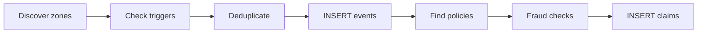

The parametric adjudicator is the core engine. It runs hourly, polls external APIs, evaluates five trigger types, and creates pending claims for eligible riders.

## Adjudicator Lifecycle



**Steps:**

```
runAdjudicator()
│
├── 1. Discover active zones
│       └── Query weekly_policies + profiles → cluster ~11 km grid
│
├── 2. Check triggers per zone (parallel, batch of 5)
│       ├── checkZoneTriggers(zone)
│       │   ├── Trigger 1: Extreme heat (Open-Meteo → Tomorrow.io fallback)
│       │   ├── Trigger 2: Heavy rain (Tomorrow.io)
│       │   ├── Trigger 3: AQI adaptive (WAQI → Open-Meteo fallback)
│       │   ├── Trigger 4: Traffic gridlock (NewsData + LLM)
│       │   └── Trigger 5: Zone curfew/strike (NewsData + LLM + geocoding)
│       └── Deduplicate: skip if same trigger type within 30 km
│
├── 3. For each trigger candidate:
│       ├── INSERT live_disruption_events
│       ├── Find active policies with riders inside geofence
│       ├── Check plan weekly claim cap (max_claims_per_week)
│       ├── runAllFraudChecks()
│       └── INSERT parametric_claims (status='pending_verification')
│
└── 4. Log result to system_logs
```

---

## Zone Discovery

Rather than hardcoding a single city, the adjudicator dynamically discovers where active riders are:

```typescript
async function getActiveZones(supabase): Promise<Array<{lat, lng}>> {
  // 1. Find all profiles with active policies this week
  const activePolicies = await supabase
    .from("weekly_policies")
    .select("profile_id")
    .eq("is_active", true)
    .lte("week_start_date", today)
    .gte("week_end_date", today);

  // 2. Get their zone coordinates
  const profiles = await supabase
    .from("profiles")
    .select("zone_latitude, zone_longitude")
    .in("id", profileIds);

  // 3. Cluster by ~11 km grid (round to 1 decimal degree)
  const seen = new Map();
  for (const p of profiles) {
    const key = `${Math.round(p.zone_latitude * 10) / 10},${...}`;
    if (!seen.has(key)) seen.set(key, { lat, lng });
  }

  return Array.from(seen.values());
  // Fallback: [{ lat: 12.9716, lng: 77.5946 }]  (Bangalore)
}
```

The 1-decimal-degree clustering ensures that riders within ~11 km share a single API call, preventing duplicate trigger checks for the same disruption.

---

## Trigger 1: Extreme Heat

**Threshold:** Temperature ≥ 43°C sustained for 3+ consecutive hours.

**Primary source:** Open-Meteo free API (no key required).
**Fallback:** Tomorrow.io realtime + forecast (requires `TOMORROW_IO_API_KEY`).

```
Open-Meteo hourly (past 24h) → last 3 readings all ≥ 43°C → triggered
```

If Open-Meteo check passes, the Tomorrow.io fallback is skipped. If Open-Meteo is unavailable, Tomorrow.io realtime gives the current temperature and the hourly forecast confirms 3+ consecutive hours ≥ 43°C.

**Geofence:** 15 km radius circle around the zone center.
**Severity:** 8/10.

---

## Trigger 2: Heavy Rain

**Threshold:** `precipitationIntensity ≥ 4 mm/h` from Tomorrow.io realtime data.

**Source:** Tomorrow.io realtime API (requires `TOMORROW_IO_API_KEY`). Checked in the same API call as the heat trigger to minimize rate limit usage.

**Geofence:** 15 km radius.
**Severity:** 7/10.

---

## Trigger 3: Severe AQI (Adaptive Threshold)

**Why adaptive?** Delhi's baseline AQI is ~250; Bangalore's is ~60. A fixed threshold (e.g., US EPA's 300) would never fire in Bangalore and fire too often in Delhi. An adaptive threshold compares each city against its own normal.

**Algorithm:**

```
1. Fetch current AQI via WAQI ground-station (preferred, most accurate)
   └── Fallback: Open-Meteo satellite AQI
2. Fetch 30-day hourly AQI history via Open-Meteo (free, no key)
3. Compute p75 of historical values
4. adaptive_threshold = min(400, max(150, round(p75 × 1.40)))
5. Trigger if current_aqi >= adaptive_threshold
6. severity = min(10, max(6, round(6 + excess_ratio × 8)))
```

The 400 cap prevents cities from becoming "immune" regardless of their historical pollution levels. The 150 floor ensures a minimum meaningful threshold in clean cities.

**Geofence:** 15 km radius.
**Severity:** 6–10 (scales with how far above baseline).

---

## Trigger 4: Traffic Gridlock

**Source:** NewsData.io + OpenRouter LLM.

```
1. NewsData.io search: "traffic OR gridlock OR road closure OR congestion"
   → country=in, language=en, limit=3
2. OpenRouter LLM (arcee-ai/trinity-large-preview:free):
   → "Do these headlines indicate severe gridlock affecting delivery work?"
   → Returns: {"qualifies": true/false, "severity": 0-10}
3. Trigger if qualifies=true AND severity >= 6
```

The LLM step reduces false positives from headlines about minor traffic jams that wouldn't significantly impact delivery earnings. The model is a free OpenRouter tier - no cost for moderate usage.

**Geofence:** 20 km radius around zone center.
**Severity:** LLM-assigned, minimum 6.

---

## Trigger 5: Zone Curfew / Strike / Lockdown

**Source:** NewsData.io + OpenRouter LLM + Open-Meteo geocoding.

```
1. NewsData.io search: "curfew OR strike OR lockdown"
   → country=in, language=en, limit=3
2. OpenRouter LLM:
   → "Does this indicate a zone lockdown preventing delivery work?"
   → Returns: {"qualifies": bool, "severity": 0-10, "zone": "city name"}
3. If qualifies AND severity >= 6:
   → Geocode "zone" string via Open-Meteo geocoding API
   → Build geofence at geocoded coordinates (20 km if specific zone, 50 km if India-wide)
```

The LLM extracts a city/region name from the headline when possible, enabling geofence precision to the affected area rather than defaulting to the entire country.

**Geofence:** 20 km (specific zone) or 50 km (national/unlocalized).
**Severity:** LLM-assigned, minimum 6.

---

## Trigger Deduplication

If the same trigger type fires for two zones within 30 km of each other, only the first candidate is kept. This prevents double-counting when nearby riders share the same weather event:

```typescript
const isDuplicate = allCandidates.some((existing) => {
  return existingTrigger === rawTrigger &&
    isWithinCircle(existingLat, existingLng, geofenceLat, geofenceLng, 30);
});
if (!isDuplicate) allCandidates.push(c);
```

---

## Demo Mode

Admins can inject a synthetic disruption event without real API calls:

```typescript
interface DemoTriggerOptions {
  eventSubtype: 'extreme_heat' | 'heavy_rain' | 'severe_aqi' | 'traffic_gridlock' | 'zone_curfew';
  lat: number;
  lng: number;
  radiusKm?: number;  // default 15
  severity?: number;  // default 8
}
```

The demo path bypasses all external API calls and creates the disruption event and claims directly. To keep demos reliable, demo claims can be auto-paid immediately after insertion so the wallet and payout ledger update without waiting for GPS. The `raw_api_data` is marked with `"demo": true, "source": "admin_demo_mode"`.

---

## API Rate Limits

| API | Free tier | Oasis usage |
|---|---|---|
| Open-Meteo | Unlimited | Heat check + AQI history (30 days) |
| Tomorrow.io | 500 calls/day | Rain + heat fallback (1 call/zone/hour) |
| WAQI | 1000 calls/day | Current AQI (1 call/zone/hour) |
| NewsData.io | 200 calls/day | 2 calls per adjudicator run (traffic + curfew) |
| OpenRouter | Free tier | 2 LLM calls per adjudicator run |
| Open-Meteo Geocoding | Unlimited | 1 call when curfew zone is identifiable |

With 5 active zones, a single adjudicator run uses approximately:
- Open-Meteo: 5 (heat) + 5 (AQI) + 5 (AQI history) = 15 calls
- Tomorrow.io: up to 10 calls (realtime + forecast, per zone)
- NewsData.io: 2 calls
- OpenRouter: 2 calls
