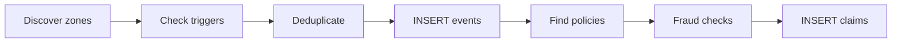

The parametric adjudicator is the core engine. It runs every 15 minutes, polls external APIs, evaluates five trigger types across dynamically discovered rider zones, and creates pending claims for eligible riders. Each event is stored with a specific `event_subtype` (e.g., `extreme_heat`, `heavy_rain`, `traffic_gridlock`, `zone_curfew`) for granular analytics.

## Adjudicator Lifecycle



**Steps:**

```
runAdjudicator()
│
├── 1. Discover active zones
│       └── Query weekly_policies + profiles → cluster ~11 km grid
│
├── 2. Check triggers per zone (parallel, batch of 5)
│       ├── checkZoneTriggers(zone)
│       │   ├── Trigger 1: Extreme heat (Open-Meteo → Tomorrow.io fallback)
│       │   ├── Trigger 2: Heavy rain (Tomorrow.io)
│       │   ├── Trigger 3: AQI adaptive (WAQI → Open-Meteo fallback)
│       │   ├── Trigger 4: Traffic gridlock (NewsData + LLM)
│       │   └── Trigger 5: Zone curfew/strike (NewsData + LLM + geocoding)
│       └── Deduplicate: skip if same trigger type within 30 km
│
├── 3. For each trigger candidate:
│       ├── INSERT live_disruption_events
│       ├── Find active policies with riders inside geofence
│       ├── Check plan weekly claim cap (max_claims_per_week)
│       ├── runAllFraudChecks()
│       └── INSERT parametric_claims (status='pending_verification')
│
└── 4. Log result to system_logs
```

---

## Zone Discovery

Rather than hardcoding a single city, the adjudicator dynamically discovers where active riders are:

```typescript
async function getActiveZones(supabase): Promise<Array<{lat, lng}>> {
  // 1. Find all profiles with active policies this week
  const activePolicies = await supabase
    .from("weekly_policies")
    .select("profile_id")
    .eq("is_active", true)
    .lte("week_start_date", today)
    .gte("week_end_date", today);

  // 2. Get their zone coordinates
  const profiles = await supabase
    .from("profiles")
    .select("zone_latitude, zone_longitude")
    .in("id", profileIds);

  // 3. Cluster by ~11 km grid (round to 1 decimal degree)
  const seen = new Map();
  for (const p of profiles) {
    const key = `${Math.round(p.zone_latitude * 10) / 10},${...}`;
    if (!seen.has(key)) seen.set(key, { lat, lng });
  }

  return Array.from(seen.values());
  // Fallback: [{ lat: 12.9716, lng: 77.5946 }]  (Bangalore)
}
```

The 1-decimal-degree clustering ensures that riders within ~11 km share a single API call, preventing duplicate trigger checks for the same disruption.

---

## Trigger 1: Extreme Heat

**Threshold:** Temperature ≥ 43°C sustained for 3+ consecutive hours.

**Primary source:** Open-Meteo free API (no key required).
**Fallback:** Tomorrow.io realtime + forecast (requires `TOMORROW_IO_API_KEY`).

```
Open-Meteo hourly (past 24h) → last 3 readings all ≥ 43°C → triggered
```

If Open-Meteo check passes, the Tomorrow.io fallback is skipped. If Open-Meteo is unavailable, Tomorrow.io realtime gives the current temperature and the hourly forecast confirms 3+ consecutive hours ≥ 43°C.

**Geofence:** 15 km radius circle around the zone center.
**Severity:** 8/10.

---

## Trigger 2: Heavy Rain

**Threshold:** `precipitationIntensity ≥ 4 mm/h` from Tomorrow.io realtime data.

**Source:** Tomorrow.io realtime API (requires `TOMORROW_IO_API_KEY`). Checked in the same API call as the heat trigger to minimize rate limit usage.

**Geofence:** 15 km radius.
**Severity:** 7/10.

---

## Trigger 3: Severe AQI (Two-Tier Adaptive Threshold)

**Why adaptive?** Delhi's baseline AQI is ~250; Bangalore's is ~60. A fixed threshold would never fire in Bangalore and fire too often in Delhi. A two-tier approach classifies zones as "chronic" or "normal" and applies different baselines and multipliers.

**Algorithm:**

```
1. Fetch current AQI via WAQI ground-station (preferred, most accurate)
   └── Fallback: Open-Meteo satellite AQI
2. Fetch 30-day hourly AQI history via Open-Meteo (free, no key)
3. Compute p75 AND p90 of historical values
4. Classify zone:
   - Chronic (p75 ≥ 200): cities like Delhi, Lucknow, Kanpur
   - Normal (p75 < 200): cities like Bangalore, coastal cities
5. Compute adaptive threshold:
   - Chronic: min(500, max(350, round(p90 × 1.15)))
   - Normal:  min(500, max(200, round(p75 × 1.30)))
6. Trigger if current_aqi >= adaptive_threshold
7. severity = min(10, max(6, round(6 + excess_ratio × 8)))
   where excess_ratio uses p90 for chronic zones, p75 for normal zones
```

| Zone Type | Baseline | Multiplier | Floor | Cap | Example City | Typical Threshold |
|---|---|---|---|---|---|---|
| Chronic (p75 ≥ 200) | p90 | × 1.15 | 350 | 500 | Delhi (p90 ~380) | ~437 |
| Normal (p75 < 200) | p75 | × 1.30 | 200 | 500 | Bangalore (p75 ~70) | ~200 |

The chronic-zone tier ensures that cities with perpetually high AQI only trigger payouts for genuinely anomalous spikes (well above their p90), preventing constant payouts that would make the product unsustainable. The `chronic_pollution` flag is stored in `raw_api_data` alongside `baseline_p90` for audit.

**Geofence:** 15 km radius.
**Severity:** 6–10 (scales with how far above the reference baseline).

---

## Trigger 4: Traffic Gridlock (Multi-Point Sampling)

**Source:** TomTom Traffic Flow API (primary) + NewsData.io + OpenRouter LLM (supplementary).

### TomTom Multi-Point Sampling

Rather than checking a single road segment, the adjudicator samples **5 points** per zone (center + N/E/S/W at 70% of the zone radius) for a representative picture:

```
For each zone:
  1. Generate 5 sample points (center + cardinal offsets)
  2. Query TomTom Flow Segment Data for each point (parallel)
  3. Compute currentSpeed / freeFlowSpeed ratio per point
  4. Trigger if:
     - Any road closure detected, OR
     - Majority (≥ 50%) of sampled points show congestion
       (ratio < 0.5, i.e., current speed < 50% of free-flow speed)
  5. Severity based on average ratio:
     - ratio ≤ 0.2 → severity 9
     - ratio ≤ 0.4 → severity 8
     - otherwise → severity 7
```

### News-Based Traffic (Supplementary)

```
1. NewsData.io search: "traffic OR gridlock OR road closure OR congestion"
   → country=in, language=en, limit=3
2. OpenRouter LLM (arcee-ai/trinity-large-preview:free):
   → "Do these headlines indicate severe gridlock affecting delivery work?"
   → Returns: {"qualifies": true/false, "severity": 0-10}
3. Trigger if qualifies=true AND severity >= 6
```

**Geofence:** 15 km radius (TomTom) or 20 km (news-based).
**Severity:** 7–10 (TomTom) or LLM-assigned (news).

---

## Trigger 5: Zone Curfew / Strike / Lockdown (Zone-Scoped)

**Source:** NewsData.io + OpenRouter LLM + Open-Meteo geocoding.

```
1. NewsData.io search: "curfew OR strike OR lockdown"
   → country=in, language=en, limit=3
2. OpenRouter LLM:
   → "Does this indicate a zone lockdown preventing delivery work?"
   → Returns: {"qualifies": bool, "severity": 0-10, "zone": "city name"}
3. If qualifies AND severity >= 6:
   → Geocode "zone" string via Open-Meteo geocoding API
   → Build geofence at geocoded coordinates (20 km if specific zone, 50 km if India-wide)
4. Zone-scoped filtering: only keep candidates whose geofence
   overlaps with at least one active rider zone
```

The LLM extracts a city/region name from the headline when possible, enabling geofence precision to the affected area rather than defaulting to the entire country. The zone-scoped filter prevents false triggers — a curfew in Kerala won't create claims for riders in Delhi.

**Geofence:** 20 km (specific zone) or 50 km (national/unlocalized).
**Severity:** LLM-assigned, minimum 6.

---

## Trigger Deduplication

If the same trigger type fires for two zones within 30 km of each other, only the first candidate is kept. This prevents double-counting when nearby riders share the same weather event:

```typescript
const isDuplicate = allCandidates.some((existing) => {
  return existingTrigger === rawTrigger &&
    isWithinCircle(existingLat, existingLng, geofenceLat, geofenceLng, 30);
});
if (!isDuplicate) allCandidates.push(c);
```

---

## Demo Mode

Admins can inject a synthetic disruption event without real API calls:

```typescript
interface DemoTriggerOptions {
  eventSubtype: 'extreme_heat' | 'heavy_rain' | 'severe_aqi' | 'traffic_gridlock' | 'zone_curfew';
  lat: number;
  lng: number;
  radiusKm?: number;  // default 15
  severity?: number;  // default 8
}
```

The demo path bypasses all external API calls and creates the disruption event and claims directly. To keep demos reliable, demo claims can be auto-paid immediately after insertion so the wallet and payout ledger update without waiting for GPS. The `raw_api_data` is marked with `"demo": true, "source": "admin_demo_mode"`.

---

## Event Subtype Tracking

Every disruption event is stored with an `event_subtype` column for granular analysis:

| event_type | event_subtype | Description |
|---|---|---|
| `weather` | `extreme_heat` | Temperature ≥ 43°C sustained 3+ hours |
| `weather` | `heavy_rain` | Precipitation ≥ 4 mm/h |
| `weather` | `severe_aqi` | AQI above adaptive threshold |
| `traffic` | `traffic_gridlock` | Speed < 50% of free-flow across zone |
| `social` | `zone_curfew` | Curfew/strike/lockdown from news |

This enables subtype-specific analytics, notification labels, and future trigger refinement.

---

## API Rate Limits

| API | Free tier | Oasis usage |
|---|---|---|
| Open-Meteo | Unlimited | Heat check + AQI history (30 days) |
| Tomorrow.io | 500 calls/day | Rain + heat fallback (1 call/zone/run) |
| WAQI | 1000 calls/day | Current AQI (1 call/zone/run) |
| TomTom | 2500 calls/day | 5 sample points × N zones per run |
| NewsData.io | 200 calls/day | 2 calls per adjudicator run (traffic + curfew) |
| OpenRouter | Free tier | 2 LLM calls per adjudicator run |
| Open-Meteo Geocoding | Unlimited | 1 call when curfew zone is identifiable |

With 5 active zones, a single adjudicator run uses approximately:
- Open-Meteo: 5 (heat) + 5 (AQI) + 5 (AQI history) = 15 calls
- Tomorrow.io: up to 10 calls (realtime + forecast, per zone)
- TomTom: 25 calls (5 sample points × 5 zones)
- NewsData.io: 2 calls
- OpenRouter: 2 calls
