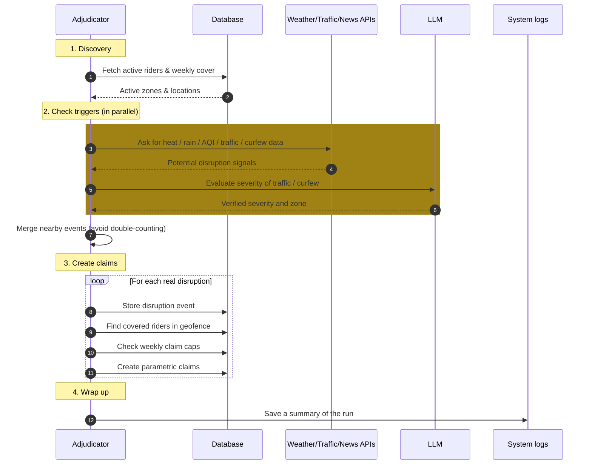
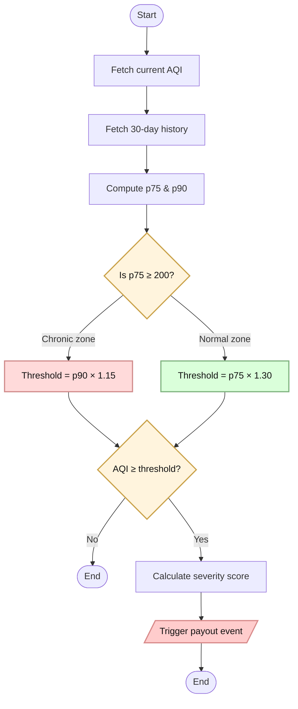

The parametric adjudicator is the core engine. It runs every 15 minutes, polls external APIs, evaluates five trigger types across dynamically discovered rider zones, and creates pending claims for eligible riders. Each event is stored with a specific `event_subtype` (e.g., `extreme_heat`, `heavy_rain`, `traffic_gridlock`, `zone_curfew`) for granular analytics.

## Adjudicator Lifecycle



In human terms:

1. **Look around:** Find zones where riders currently have active weekly cover.
2. **Sense the world:** Ask the APIs if anything serious is happening (heat, rain, pollution, traffic, curfews).
3. **Clean up the signals:** Merge overlapping events so one disruption doesn’t fire twice.
4. **Decide who’s affected:** For each real disruption, find covered riders inside the impacted area.
5. **Protect the pool:** Run lightweight fraud checks and respect per-week claim caps.
6. **Pay out automatically:** Create parametric claims and log what happened for later audit.

---

## Zone Discovery

Rather than hardcoding a single city, the adjudicator dynamically discovers where active riders are:

```typescript
async function getActiveZones(supabase): Promise<Array<{lat, lng}>> {
  // 1. Find all profiles with active policies this week
  const activePolicies = await supabase
    .from("weekly_policies")
    .select("profile_id")
    .eq("is_active", true)
    .lte("week_start_date", today)
    .gte("week_end_date", today);

  // 2. Get their zone coordinates
  const profiles = await supabase
    .from("profiles")
    .select("zone_latitude, zone_longitude")
    .in("id", profileIds);

  // 3. Cluster by ~11 km grid (round to 1 decimal degree)
  const seen = new Map();
  for (const p of profiles) {
    const key = `${Math.round(p.zone_latitude * 10) / 10},${...}`;
    if (!seen.has(key)) seen.set(key, { lat, lng });
  }

  return Array.from(seen.values());
  // Fallback: [{ lat: 12.9716, lng: 77.5946 }]  (Bangalore)
}
```

The 1-decimal-degree clustering ensures that riders within ~11 km share a single API call, preventing duplicate trigger checks for the same disruption.

---

## Trigger 1: Extreme Heat

**Threshold:** Temperature ≥ 43°C sustained for 3+ consecutive hours.

**Primary source:** Open-Meteo free API (no key required).
**Fallback:** Tomorrow.io realtime + forecast (requires `TOMORROW_IO_API_KEY`).

```
Open-Meteo hourly (past 24h) → last 3 readings all ≥ 43°C → triggered
```

If Open-Meteo check passes, the Tomorrow.io fallback is skipped. If Open-Meteo is unavailable, Tomorrow.io realtime gives the current temperature and the hourly forecast confirms 3+ consecutive hours ≥ 43°C.

**Geofence:** 15 km radius circle around the zone center.
**Severity:** 8/10.

---

## Trigger 2: Heavy Rain

**Threshold:** `precipitationIntensity ≥ 4 mm/h` from Tomorrow.io realtime data.

**Source:** Tomorrow.io realtime API (requires `TOMORROW_IO_API_KEY`). Checked in the same API call as the heat trigger to minimize rate limit usage.

**Geofence:** 15 km radius.
**Severity:** 7/10.

---

## Trigger 3: Severe AQI (Two-Tier Adaptive Threshold)

**Why adaptive?** Delhi's baseline AQI is ~250; Bangalore's is ~60. A fixed threshold would never fire in Bangalore and fire too often in Delhi. A two-tier approach classifies zones as "chronic" or "normal" and applies different baselines and multipliers.

**Algorithm (visual):**



In words:

1. **Measure now + history:** Get today’s AQI and the last 30 days of hourly AQI.
2. **Understand the baseline:** Compute **p75** and **p90** to see what “normal bad” looks like for that city.
3. **Label the city:** If p75 ≥ 200, treat it as a **chronic-pollution** city; otherwise as **normal**.
4. **Set an adaptive bar:** Use a slightly higher threshold for each category so only **unusually bad spikes** cross it.
5. **Fire only on real spikes:** If current AQI beats that adaptive threshold, we trigger an event and compute a severity score between 6 and 10.

| Zone Type | Baseline | Multiplier | Floor | Cap | Example City | Typical Threshold |
|---|---|---|---|---|---|---|
| Chronic (p75 ≥ 200) | p90 | × 1.15 | 350 | 500 | Delhi (p90 ~380) | ~437 |
| Normal (p75 < 200) | p75 | × 1.30 | 200 | 500 | Bangalore (p75 ~70) | ~200 |

The chronic-zone tier ensures that cities with perpetually high AQI only trigger payouts for genuinely anomalous spikes (well above their p90), preventing constant payouts that would make the product unsustainable. The `chronic_pollution` flag is stored in `raw_api_data` alongside `baseline_p90` for audit.

**Geofence:** 15 km radius.
**Severity:** 6–10 (scales with how far above the reference baseline).

---

## Trigger 4: Traffic Gridlock (Multi-Point Sampling)

**Source:** TomTom Traffic Flow API (primary) + NewsData.io + OpenRouter LLM (supplementary).

### TomTom Multi-Point Sampling

Rather than checking a single road segment, the adjudicator samples **5 points** per zone (center + N/E/S/W at 70% of the zone radius) for a representative picture:

- **1) Pick 5 sample points**: zone center + North/East/South/West offsets  
- **2) Ask TomTom for each point** (in parallel)
- **3) Compute congestion ratio** per point: \(currentSpeed / freeFlowSpeed\)
- **4) Trigger when it’s genuinely bad**:
  - Road closure detected, **or**
  - At least **half** the sample points are congested (ratio < 0.5)
- **5) Set severity** from the average ratio:
  - ratio ≤ 0.2 → severity **9**
  - ratio ≤ 0.4 → severity **8**
  - otherwise → severity **7**

### News-Based Traffic (Supplementary)

- **1) Search headlines** for traffic gridlock signals (India, English, top 3)
- **2) Ask the LLM to judge severity** (does it affect delivery work?)
- **3) Trigger only if** it qualifies and severity ≥ 6

**Geofence:** 15 km radius (TomTom) or 20 km (news-based).
**Severity:** 7–10 (TomTom) or LLM-assigned (news).

---

## Trigger 5: Zone Curfew / Strike / Lockdown (Zone-Scoped)

**Source:** NewsData.io + OpenRouter LLM + Open-Meteo geocoding.

- **1) Search headlines** for curfew/strike/lockdown (India, English, top 3)
- **2) Ask the LLM**: “Does this prevent delivery work?” → returns qualifies + severity + a place name (if available)
- **3) If it qualifies (severity ≥ 6)**:
  - Convert the place name into coordinates (geocoding)
  - Build a geofence (20 km if specific, 50 km if broad)
- **4) Keep it relevant**: only trigger if the geofence overlaps at least one active rider zone

The LLM extracts a city/region name from the headline when possible, enabling geofence precision to the affected area rather than defaulting to the entire country. The zone-scoped filter prevents false triggers — a curfew in Kerala won't create claims for riders in Delhi.

**Geofence:** 20 km (specific zone) or 50 km (national/unlocalized).
**Severity:** LLM-assigned, minimum 6.

---

## Trigger Deduplication

If the same trigger type fires for two zones within 30 km of each other, only the first candidate is kept. This prevents double-counting when nearby riders share the same weather event:

```typescript
const isDuplicate = allCandidates.some((existing) => {
  return existingTrigger === rawTrigger &&
    isWithinCircle(existingLat, existingLng, geofenceLat, geofenceLng, 30);
});
if (!isDuplicate) allCandidates.push(c);
```

---

## Demo Mode

Admins can inject a synthetic disruption event without real API calls:

```typescript
interface DemoTriggerOptions {
  eventSubtype: 'extreme_heat' | 'heavy_rain' | 'severe_aqi' | 'traffic_gridlock' | 'zone_curfew';
  lat: number;
  lng: number;
  radiusKm?: number;  // default 15
  severity?: number;  // default 8
}
```

The demo path bypasses all external API calls and creates the disruption event and claims directly. To keep demos reliable, demo claims can be auto-paid immediately after insertion so the wallet and payout ledger update without waiting for GPS. The `raw_api_data` is marked with `"demo": true, "source": "admin_demo_mode"`.

---

## Event Subtype Tracking

Every disruption event is stored with an `event_subtype` column for granular analysis:

| event_type | event_subtype | Description |
|---|---|---|
| `weather` | `extreme_heat` | Temperature ≥ 43°C sustained 3+ hours |
| `weather` | `heavy_rain` | Precipitation ≥ 4 mm/h |
| `weather` | `severe_aqi` | AQI above adaptive threshold |
| `traffic` | `traffic_gridlock` | Speed < 50% of free-flow across zone |
| `social` | `zone_curfew` | Curfew/strike/lockdown from news |

This enables subtype-specific analytics, notification labels, and future trigger refinement.

---

## API Rate Limits

| API | Typical free tier | How Oasis uses it |
|---|---|---|
| Open‑Meteo Weather | Varies by provider policy | **1 call/zone/run** for heat (hourly temps, past 24h) |
| Open‑Meteo Air Quality | Varies by provider policy | **2 calls/zone/run** for AQI (current + 30‑day history) |
| WAQI (optional) | Varies by plan | **1 call/zone/run** for current AQI (only if `WAQI_API_KEY` is set) |
| Tomorrow.io (optional) | Varies by plan | **0 calls** if Open‑Meteo heat already qualifies; otherwise **2 calls/zone/run** (realtime + hourly forecast). Also provides rain intensity in the realtime call. |
| TomTom Traffic | Varies by plan | **5 calls/zone/run** (5 sample points in parallel) |
| NewsData.io | Varies by plan | **2 calls/run total** (traffic headlines + curfew/strike headlines) |
| OpenRouter LLM | Varies by plan/model | **2 calls/run total** (one for traffic headlines, one for curfew/strike) |
| Open‑Meteo Geocoding | Varies by provider policy | **Up to 1 call/run** (only when a curfew/strike has a place name to geocode) |

With **5 active zones**, one run is approximately:

- **Open‑Meteo**: 5 (heat) + 10 (AQI current + 30‑day history) = **15 calls**
- **TomTom**: 5 points × 5 zones = **25 calls**
- **NewsData.io**: **2 calls**
- **OpenRouter**: **2 calls**
- **WAQI** (if enabled): 5 zones = **5 calls**
- **Tomorrow.io** (only when Open‑Meteo heat fails): up to 2 calls × 5 zones = **10 calls**

:::note
“Free tier” limits change frequently across providers. The counts above (calls per zone/run) are based on how Oasis is implemented; use the provider dashboards to confirm current quotas.
:::
