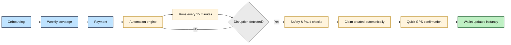

import { Icon, CardGrid, Card } from '@astrojs/starlight/components';

# Oasis

**Parametric wage protection for India's Q-commerce delivery partners.**

When external disruptions hit-extreme heatwaves, government lockdowns, or severe traffic gridlocks-riders dynamically lose their ability to complete orders, plummeting their daily wage. **Oasis** detects these events via weather and news APIs and provides automated payouts to policyholders without requiring manual claims or waiting periods.

:::note[Scope]
Oasis strictly covers **loss of income** associated with external systemic disruptions. It does *not* provide health, life, accident, or vehicle repair coverage.
:::

---

## Executive Summary
Oasis is a Next.js 15 + Supabase application utilizing a **Parametric Insurance** model. Unlike traditional indemnity insurance where a user must prove their loss, parametric insurance pays out *automatically* when predefined data parameters (e.g., Temperature > 43°C) are met.

This completely eliminates the overhead of claims adjusters, fraud investigators, and processing delays, instantly crediting the rider's wallet the moment a disruption event is validated.

## The Problem Statement
Companies like Zepto and Blinkit operate on incredibly tight **10-minute delivery SLAs** across hyper-local zones. A rider's income is directly tied to their volume of completed trips.

However, riders operate in highly volatile physical environments.
1. **Unpredictable Weather:** Heatwaves force riders to log off for safety, while sudden heavy rains flood roads, slowing completion times.
2. **Civic Disruptions:** Strike actions, VIP movements, or localized curfews (Section 144) can forcefully shut down entire delivery zones for hours.
3. **The Proof Burden:** When these events happen, riders lose income. Attempting to claim compensation from traditional insurers requires filing paperwork, proving the loss, and waiting weeks-a process incompatible with a gig worker's daily cashflow needs.

<CardGrid>
  <Card title="Extreme Heat" icon="sun">
    A rider logs off because it is physically unsafe to ride. **Oasis detects the heatwave via weather APIs and auto-credits the protected wage.**
  </Card>
  <Card title="Zone Lockdown" icon="error">
    A curfew blocks delivery operations. **News APIs and LLMs verify the police order and trigger instant payouts for riders within the geofence.**
  </Card>
  <Card title="Heavy Rain" icon="rain">
    Localized flooding halts area movement. **Precipitation thresholds are met, and policyholders immediately receive automated payouts.**
  </Card>
</CardGrid>

## The Oasis Solution
By removing the human element from the claims process, Oasis creates a highly scalable, zero-friction protection net.

### Technical Implementation Workflow
1. **Continuous Ingestion:** A Vercel Cron (`runAdjudicator`) polls active delivery zones every **15 minutes**.
2. **Data Validation:** The adjudicator queries **Tomorrow.io** (weather), **WAQI/Open-Meteo** (AQI), **TomTom** (traffic), and **NewsData.io** (civic issues). If a headline suggests a disruption, an **OpenRouter Vision/Text LLM** verifies the severity and extracts the affected geolocations.
3. **Parametric Trigger:** If the parsed data crosses a predefined threshold (e.g., Severity >= 6/10), the system generates a `live_disruption_event`.
4. **Instant Adjudication:** The system finds all riders with active policies inside that event's geofence, runs an **11-step automated fraud detection** pipeline, and immediately inserts `parametric_claims`.
5. **Real-time Settlement:** Supabase Realtime broadcasts the database insertion directly to the rider's dashboard, updating their wallet balance instantly without a page reload.

## How It Works

<CardGrid>
  <Card title="1. Onboard" icon="pencil">
    Platform, zone, gov ID, face verification.
  </Card>
  <Card title="2. Subscribe" icon="approve-check">
    Weekly coverage (₹49–₹199), dynamic by zone risk.
  </Card>
  <Card title="3. Monitor" icon="magnifier">
    15-min cron polls weather, AQI, traffic, news.
  </Card>
  <Card title="4. Payout" icon="rocket">
    Threshold hit → adjudicator creates claims → Supabase Realtime updates wallet.
  </Card>
</CardGrid>

## Premium Plans

- **Period:** Monday – Sunday
- **Range:** ₹49 – ₹199/week
- **Renewal:** Sunday 17:30 UTC via cron

| Plan | Premium | Payout/Claim | Max Claims |
|------|---------|--------------|------------|
| Basic | ₹49 | ₹300 | 1 |
| Standard | ₹99 | ₹700 | 2 |
| Premium | ₹199 | ₹1,500 | 3 |

## Stack

<CardGrid>
  <Card title="Framework"><Icon name="node" size="1.2em" /> Next.js 15</Card>
  <Card title="Database & Auth"><Icon name="document" size="1.2em" /> Supabase</Card>
  <Card title="AI / LLM"><Icon name="puzzle" size="1.2em" /> OpenRouter</Card>
  <Card title="Data Triggers"><Icon name="information" size="1.2em" /> Tomorrow.io, WAQI, TomTom, NewsData.io</Card>
  <Card title="Payments"><Icon name="approve-check-circle" size="1.2em" /> Stripe</Card>
  <Card title="Hosting"><Icon name="vercel" size="1.2em" /> Vercel</Card>
</CardGrid>
