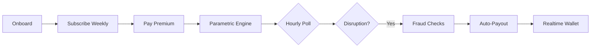

import { Icon } from '@astrojs/starlight/components';

# Oasis

Parametric wage protection for gig workers on Zepto and Blinkit. When external disruptions hit—extreme heat, zone lockdowns, traffic gridlock—riders get automated payouts. No claims forms. No waiting.

:::note[Scope]
Loss of income only. No health, life, accident, or vehicle repair coverage.
:::

## The Problem

Q-commerce runs on 10-minute delivery SLAs. Small disruptions cause big drops in completions and rider earnings.

| Scenario | Outcome |
|----------|---------|
| **Extreme heat** | Rider logs off for safety. Oasis detects via weather API → auto-credits protected wage |
| **Zone lockdown** | Curfew blocks delivery. NewsData + LLM verify → instant payouts for riders in geofence |
| **Heavy rain** | Local flooding halts area. Weather APIs detect → policyholders get automated payouts |

## How It Works

1. **Onboard** — Platform, zone, gov ID, face verification
2. **Subscribe** — Weekly coverage (₹79–₹149), dynamic by zone risk
3. **Monitor** — Hourly cron polls weather, AQI, news
4. **Payout** — Threshold hit → adjudicator creates claims → Supabase Realtime updates wallet

## Triggers

| Trigger | Source | Threshold |
|---------|--------|-----------|
| Extreme heat | Open-Meteo / Tomorrow.io | >43°C for 3+ hours |
| Heavy rain | Tomorrow.io | ≥4 mm/hr precipitation |
| Severe AQI | WAQI / Open-Meteo | 40% above zone baseline |
| Curfew / strike | NewsData.io + LLM | Severity ≥6/10 |
| Traffic gridlock | NewsData.io + LLM | Severity ≥6/10 |

## Premium Plans

- **Period:** Monday – Sunday
- **Range:** ₹79 – ₹149/week
- **Renewal:** Sunday 17:30 UTC via cron

| Plan | Premium | Payout/Claim | Max Claims |
|------|---------|--------------|------------|
| Basic | ₹79 | ₹300 | 2 |
| Standard | ₹99 | ₹400 | 2 |
| Premium | ₹149 | ₹600 | 3 |

## Stack

| Layer | Technology |
|-------|------------|
| **Framework** | <Icon name="node" size="1em" /> Next.js 15 |
| **Database & Auth** | <Icon name="document" size="1em" /> Supabase (Postgres, Auth, Realtime) |
| **LLM** | <Icon name="puzzle" size="1em" /> OpenRouter |
| **Triggers** | <Icon name="information" size="1em" /> Tomorrow.io, NewsData.io |
| **Payments** | <Icon name="approve-check-circle" size="1em" /> Stripe |
| **Hosting** | <Icon name="vercel" size="1em" /> Vercel |
