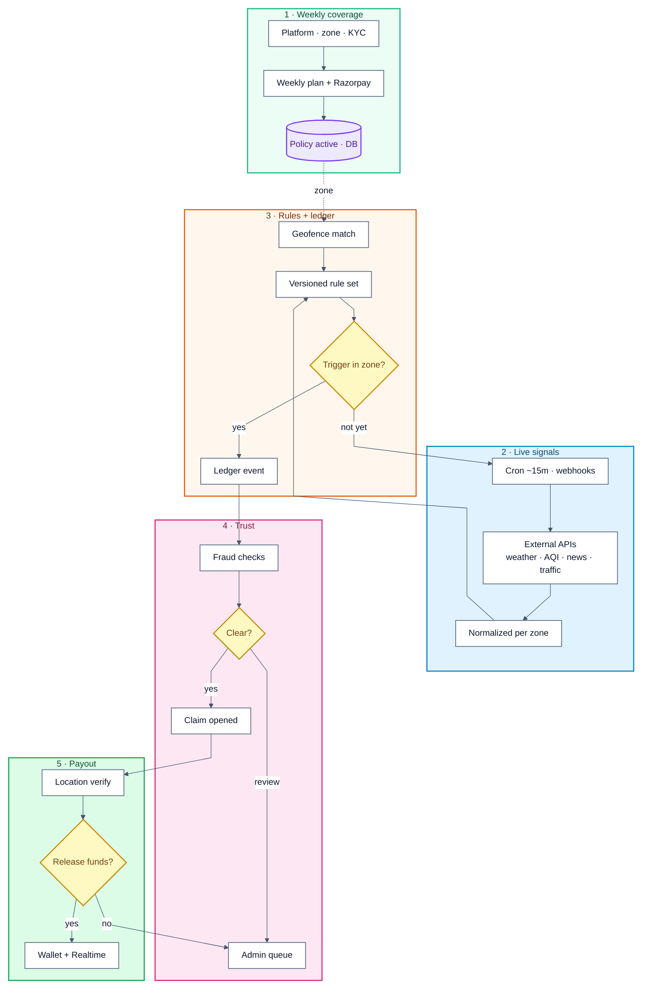

<div align="center">


<br />

<br />
<strong>AI-powered parametric wage protection.</strong><br />
Weekly billing. Automatic triggers. Zero claim forms.
<br /><br />
<a href="https://oasis-murex-omega.vercel.app">
  
</a>
&nbsp;&nbsp;
<a href="https://oasisdocs.vercel.app">
  
</a>
&nbsp;&nbsp;
<a href="https://github.com/lohitkolluri/Oasis/issues">
  
</a>
<br />
<a href="https://youtu.be/UUzpdJyqzHc">
  
</a>
&nbsp;&nbsp;
<a href="https://youtu.be/pO56XCf9l0c">
  
</a>
&nbsp;&nbsp;
<a href="https://youtu.be/y7WI73mMNIc">
  
</a>
<br />


</div>

<!-- ━━━━━━━━━━━━━━━━━━━━━━━━━━━━━━━━━━━━━━━━━ -->

## Project Title

**Oasis - AI Parametric Income Shield for Delivery Riders**

## About the Project

Oasis was inspired by a simple pattern we kept seeing in Indian quick-commerce logistics: riders can perform well all week and still lose meaningful income in a single bad shift because of weather shocks, AQI spikes, sudden traffic standstills, or local disruption orders. Traditional insurance products are usually paperwork-heavy, claim-driven, and too slow for gig workers who live on weekly cash flow. We built Oasis to flip that experience from "prove your loss later" to "get protected proactively."

The core USP is a **parametric wage-protection model** that triggers from real-world external signals instead of manual claim forms. Riders subscribe weekly, the system continuously monitors disruption feeds, and eligible incidents can auto-create claims with fraud and location checks in the loop. This design creates a fast path to trust: **low premium, automated detection, transparent rules, and near real-time payout visibility**.

From a market strategy perspective, Oasis is positioned as a **B2B2C embedded protection layer**:

- **Rider value proposition (B2C pull):** affordable weekly plans, zero-paper claims experience, predictable protection against income shocks.
- **Platform value proposition (B2B push):** lower churn, better rider retention, and differentiated employer brand without running a manual claims operation.
- **Distribution strategy:** partner with delivery platforms, dark-store operators, and insurer/MGA channels; launch city-wise pilots in high-disruption clusters.
- **Monetization strategy:** weekly subscription premiums, platform co-pay/sponsorship options, and enterprise analytics for disruption-risk planning.
- **Defensibility:** zone-level trigger governance, payout ledgers, fraud controls, and operational data flywheels that improve pricing and trigger quality over time.

How we built it:

- A Next.js + TypeScript production app with rider and admin surfaces.
- Supabase for Postgres, Auth, Realtime, and storage-backed operational workflows.
- Parametric trigger engine across weather, AQI, traffic, and news data pipelines.
- Razorpay-based weekly billing and payout-linked wallet workflows.
- AI-assisted verification and classification through OpenRouter-enabled flows.
- Fraud checks, geospatial validation, and rule-versioned adjudication pipelines.

What we learned:

- In this domain, **operational reliability and explainability matter as much as model accuracy**.
- Weekly subscription economics are highly sensitive to trigger precision, false positives, and payout latency.
- API-first LLM workflows can dramatically reduce infra overhead versus training and serving large custom models for vision/language-heavy tasks.
- Trust is a product feature: clear policy scope and visible event trails improve adoption.

Challenges we faced:

- Designing trigger thresholds that stay fair across city zones with different baseline conditions.
- Balancing automatic payout speed with anti-fraud guardrails and geolocation confidence.
- Maintaining clean data pipelines across heterogeneous external APIs with variable latency and schema drift.
- Keeping weekly unit economics healthy while still delivering meaningful rider protection.

Business efficiency framing used in Oasis planning:

$$
\text{Contribution Margin per Rider per Week} = P - E[\text{Payout}] - C_{\text{ops}} - C_{\text{payments}}
$$

$$
\text{LTV:CAC} = \frac{\text{ARPU}_{\text{weekly}} \times \text{Gross Margin} \times \text{Avg. Retention Weeks}}{\text{Customer Acquisition Cost}}
$$

Success depends on improving trigger precision and retention so that expected payout quality rises while operating cost per protected rider declines.

## Built With

Next.js 15, React 18, TypeScript, Tailwind CSS, shadcn/ui, Supabase (Postgres/Auth/Realtime/Storage), Razorpay, OpenRouter, MapLibre GL, Turf.js, Recharts, Vitest, Playwright, Astro Starlight, Vercel

## Phase Videos

- Phase 1 Video: [https://youtu.be/y7WI73mMNIc](https://youtu.be/y7WI73mMNIc)
- Phase 2 Video: [https://youtu.be/pO56XCf9l0c](https://youtu.be/pO56XCf9l0c)
- Phase 3 Video: [https://youtu.be/UUzpdJyqzHc](https://youtu.be/UUzpdJyqzHc)

<!-- ━━━━━━━━━━━━━━━━━━━━━━━━━━━━━━━━━━━━━━━━━ -->

<a id="toc-overview"></a>

## The Problem

Millions of quick-commerce riders in India (Zepto, Blinkit, Swiggy Instamart) work without a safety net. A heavy monsoon, a pollution spike, or a zone lockdown can wipe **₹400 to ₹800** in a single shift and break weekly incentive streaks.

Traditional insurance was not built for gig schedules. Oasis is a **parametric** prototype: payouts are tied to **measurable external signals**, not slow claim forms.

<!-- ━━━━━━━━━━━━━━━━━━━━━━━━━━━━━━━━━━━━━━━━━ -->

## What Oasis Does

<table>
<tr>
<td width="50%">

**For Riders**

- Pay **₹49 to ₹199 per week** (less than a chai per day)
- System monitors weather, AQI, traffic, and news 24/7
- Disruption in your zone? Claim created _automatically_
- Payout hits your wallet. No forms. No phone calls.

</td>
<td width="50%">

**For Platforms**

- Reduce rider churn from income shocks
- Subsidize or co-brand coverage at low cost
- Automated pipeline: no manual claims desk
- Real-time analytics on disruption patterns

</td>
</tr>
</table>

> [!IMPORTANT]
> **Scope:** Oasis covers **loss of income from external disruptions only**. It does **not** cover health, life, accidents, or vehicle repairs. Billing is strictly weekly.

<!-- ━━━━━━━━━━━━━━━━━━━━━━━━━━━━━━━━━━━━━━━━━ -->

### Table of Contents

- [Overview](#toc-overview)
  - [The Problem](#the-problem)
  - [What Oasis Does](#what-oasis-does)
  - [How It Works](#how-it-works)
  - [Machine learning](#machine-learning-baselines)
  - [LLM APIs vs. legacy trained models](#llm-apis-vs-legacy-trained-models)
- [Product](#toc-product)
  - [Rider Experience](#rider-experience)
  - [Admin Experience](#admin-experience)
- [Stack & codebase](#toc-stack)
  - [Tech Stack](#tech-stack)
  - [Project Layout](#project-layout)
- [Develop & run](#toc-develop)
  - [Getting Started](#getting-started)
  - [Environment Variables](#environment-variables)
  - [Try the Demo](#try-the-demo)
  - [Running Tests](#running-tests)
  - [Deploying](#deploying)
  - [API Surface](#api-surface)
- [Roadmap](#roadmap)
  - [Shipped](#shipped)
  - [Coming Later](#coming-later)
- [Legal & references](#toc-legal)
- [License](#license)
  - [References](#references)

<!-- ━━━━━━━━━━━━━━━━━━━━━━━━━━━━━━━━━━━━━━━━━ -->

## How It Works



**Reading order:** follow **1 → 5** top to bottom. **Dashed** edge = policy tied to the rider’s zone. **“not yet”** loops until the next cron run. **Trust** and **payout** only run after a trigger is recorded.

> [!NOTE]
> **Parametric model:** trigger thresholds (e.g. rainfall above X mm, AQI above Y in-zone) are defined upfront. The data itself is the proof. No manual loss assessment needed.

<a id="machine-learning-baselines"></a>

### Machine learning

**Sklearn** baselines are versioned under [`models/artifacts/`](models/artifacts/) (synthetic data aligned with our constants) and catalogued in [`lib/ml/trained-models-registry.ts`](lib/ml/trained-models-registry.ts). The live service implements the same decision surfaces—geodesic checks, `FRAUD` / `TRIGGERS`, and the premium curve—in TypeScript alongside those artifacts. See [`models/README.md`](models/README.md) for training and metrics.

| Baseline (artifact)        | Role               | Reported quality (synthetic holdout) |
| -------------------------- | ------------------ | ------------------------------------ |
| `geofence_circle.joblib`   | Zone membership    | ~96.1% accuracy                      |
| `impossible_travel.joblib` | GPS jump vs time   | ~95.8% accuracy                      |
| `trigger_tabular.joblib`   | Trigger mimic      | ~96.1% accuracy                      |
| `premium_weekly.joblib`    | Premium regression | R² ~0.91, MAE ~₹3.3                  |

<a id="llm-apis-vs-legacy-trained-models"></a>

### LLM APIs vs. legacy trained models

For **vision** (government ID and face checks), **news classification**, and **rider self-report** flows, Oasis standardizes on **hosted LLM APIs** via **OpenRouter**. For those workloads, **API inference is the default**: it wins on **cost, speed to ship, operational burden, and model quality per dollar** compared to training and maintaining a **legacy** custom neural net in-house.

**Why API calls are the right default (pros)**

- **No ML factory:** You don’t fund a GPU farm, training jobs, feature stores, or a permanent “ML platform” team to ship inference.
- **Usage-aligned pricing:** Pay **per token** (or per request); cost scales **down** when traffic is quiet—no “always-on” GPU burn for idle capacity.
- **Fast iteration:** Swap a **model slug** in env, tune prompts and guardrails, and ship—**hours**, not a full retrain cycle.
- **Always-current models:** Providers improve **foundation** weights; you inherit gains without retraining your own checkpoint.
- **Strong out-of-the-box behavior:** Instruction-tuned models handle **messy** real inputs (IDs, glare, screenshots, varied news wording) without a proprietary labeled corpus the size of a research lab.
- **Simple security surface:** One **HTTPS** contract and API key rotation; **no** open inference ports on your own servers for giant weights.

**Where legacy “train it yourself” ML hurts (cons)**

- **Up-front and recurring burn:** Data labeling, GPU time, **MLOps** (registry, canaries, rollbacks), and on-call for **training** failures—before you ever beat a hosted baseline.
- **Stale by default:** A frozen `.pt` / `.onnx` artifact **ages**; document layouts, fraud tactics, and phrasing shift—**without** a retrain budget, accuracy drops in the wild.
- **Talent tax:** You need people who can **train**, **serve**, and **monitor**—not just call an API from a product engineer.
- **Capacity risk:** Inference spikes or **cold** GPU pools create latency; **you** own queueing, autoscaling, and regional failover.
- **Narrow wins only:** A custom model only pays off **if** you have **large, fresh, domain-specific** labels and a long horizon—otherwise you pay for **privilege** you don’t use.
- **Compliance drift:** Every ID format or policy change can force **new** labels and a **new** validation cycle—API models adapt with **prompt and routing** changes first.

**At a glance:** across **infra, cost, speed, reliability of outcomes, and team focus**, **API calls beat legacy custom training** for the perception-and-language workloads below—unless you are a hyperscaler with endless labels and GPUs.

| Dimension                | Hosted LLM APIs (this stack)                                                                                                                         | Typical “train your own” legacy ML                                                                                                   |
| :----------------------- | :--------------------------------------------------------------------------------------------------------------------------------------------------- | :----------------------------------------------------------------------------------------------------------------------------------- |
| **Infrastructure**       | Stateless HTTPS; no GPU cluster to provision, patch, or right-size                                                                                   | GPUs, training pipelines, job queues, artifact storage, and **serving** replicas that cost money even when idle                      |
| **Velocity**             | Change model **slug** in env and deploy; iterate on prompts and guardrails in hours                                                                  | Re-label → retrain → validate → promote: weeks per meaningful cycle                                                                  |
| **Latency**              | Bounded by provider routing and cold-start; predictable for short prompts                                                                            | **Your** queue depth, batching, and autoscaling on inference hardware                                                                |
| **Unit economics**       | Pay **per token** (or per request); marginal cost tracks real usage only                                                                             | Up-front **data labeling**, **fixed** GPU burn, and ML engineer time amortized across fewer use cases                                |
| **Scalability**          | Provider absorbs global load spikes; you add **concurrency** at the API layer                                                                        | **You** shard inference, fight OOMs, and pay for peak-shaped GPU headroom                                                            |
| **Accuracy in practice** | Strong **zero-shot** behavior on messy real-world inputs (IDs, screenshots, varying lighting) and **provider updates** that improve models over time | Custom models only win when you have **large, fresh, domain-labeled** datasets; otherwise weights **stale-date** as the world shifts |
| **Governance & audit**   | One vendor integration; change models with config; clear **API** logs                                                                                | Every retrain needs its own **sign-off**, benchmark suite, and rollback story                                                        |

**Illustrative API pricing** (order of magnitude; varies by model and provider): **~US$0.0000088 per inference** for Llama-class calls on a router-style API—on the order of **tens of millions of inferences per dollar** at that band. Legacy pipelines spend more than that **per minute** just keeping **idle** GPUs warm—before anyone opens a document.

**Bottom line:** for **this product’s** AI surfaces, **API LLMs are the profit-preserving choice**: lower **fixed** cost, faster **ship**, fewer **specialists**, and **better** real-world robustness per rupee than betting the roadmap on a home-grown model you must constantly retrain.

> [!NOTE]
> **Tabular** baselines (zones, premium curves, lightweight fraud heuristics) stay in **sklearn** artifacts under [`models/`](models/)—small, auditable, fast. Anything that looks like **vision or open-ended language** routes through **LLM APIs** so we never pay the **custom-model tax** for problems foundation models already solve.

<!-- ━━━━━━━━━━━━━━━━━━━━━━━━━━━━━━━━━━━━━━━━━ -->

<a id="toc-product"></a>

<h2 id="rider-experience">🏍️ Rider Experience</h2>

<table>
<tr><td>

- **Onboarding**
  - Choose platform (Zepto, Blinkit) and delivery zone
  - KYC via AI: government ID + face verification
- **Plans & Payment**
  - Three weekly tiers: Basic, Standard, Premium
  - Razorpay checkout (UPI, cards, wallets)
- **Day-to-Day**
  - Live dashboard with coverage, claims, wallet, risk radar
  - Realtime updates pushed to your screen
  - PWA: installable, works offline on low-end phones

</td></tr>
</table>

<!-- ━━━━━━━━━━━━━━━━━━━━━━━━━━━━━━━━━━━━━━━━━ -->

<h2 id="admin-experience">🛡️ Admin Experience</h2>

<table>
<tr><td>

- **Operations**
  - Rider and policy overview with zone-level heatmaps
  - Trigger health panel: feed freshness, errors, latency
- **Risk & Finance**
  - Fraud queue and hold workflows
  - Premium vs payout by plan, reserve monitoring
- **Governance**
  - Versioned disruption rules with full audit trail
  - Demo trigger panel for safe end-to-end testing

</td></tr>
</table>

<!-- ━━━━━━━━━━━━━━━━━━━━━━━━━━━━━━━━━━━━━━━━━ -->

<a id="toc-stack"></a>

<h2 id="tech-stack">🛠 Tech Stack</h2>

<div align="center">

<br />

<a href="https://skillicons.dev">
  
</a>

<br /><br />

</div>

<details>
<summary>&nbsp;<strong>Full stack breakdown</strong>&nbsp;</summary>

<br />

| Layer        | Technology                                   | Role                                       |
| :----------- | :------------------------------------------- | :----------------------------------------- |
| **App**      | Next.js 15, React 18                         | App Router, SSR, API routes                |
| **Language** | TypeScript (strict)                          | End-to-end type safety                     |
| **UI**       | Tailwind CSS, shadcn/ui, Framer Motion       | Components, layout, animation              |
| **Database** | Supabase (Postgres, Auth, Realtime, Storage) | Data, sessions, live updates, file storage |
| **Payments** | Razorpay                                     | UPI, cards, wallets (INR)                  |
| **Maps**     | MapLibre GL, Turf.js                         | Zone visualization and geospatial logic    |
| **Charts**   | Recharts                                     | Rider and admin analytics                  |
| **Weather**  | Tomorrow.io, Open-Meteo                      | Forecasts and realtime conditions          |
| **AQI**      | WAQI, Open-Meteo                             | Air quality monitoring                     |
| **Traffic**  | TomTom (optional)                            | Gridlock and closure detection             |
| **News**     | NewsData.io                                  | Lockdown and curfew triggers               |
| **AI**       | OpenRouter                                   | ID verification, news classification, risk |
| **Tests**    | Vitest, Playwright                           | Unit, component, and E2E testing           |
| **Docs**     | Astro Starlight                              | Hosted documentation + OpenAPI             |

</details>

<!-- ━━━━━━━━━━━━━━━━━━━━━━━━━━━━━━━━━━━━━━━━━ -->

<h2 id="project-layout">📁 Project Layout</h2>

Directories that matter for the product and day-to-day development:

```
oasis/
├── app/                  Next.js App Router: (auth), (dashboard), (admin), api/*, layouts
├── components/           Rider, admin, landing UI + shared primitives under components/ui
├── design-system/        Design system notes and references (companion to UI code)
├── hooks/                Reusable client hooks
├── lib/                  Business logic: adjudicator, fraud, pricing, payments, geo, Supabase clients
├── public/               Static assets (logo, PWA icons, marketing art)
├── scripts/              configure-env, setup-storage, and other dev/ops helpers
├── supabase/             migrations/, Edge Functions, local tooling
├── tests/                Vitest (unit) + Playwright (e2e)
├── docs/                 Astro Starlight docs site (deploy separately from the app)
└── .github/workflows/    CI and cron (e.g. adjudicator / weekly premium)
```

**Root you’ll touch often**

| File                   | Role                                              |
| :--------------------- | :------------------------------------------------ |
| `package.json`         | Scripts and dependencies (Node 20+, Bun friendly) |
| `next.config.ts`       | Next.js + PWA and build options                   |
| `middleware.ts`        | Supabase session refresh on matched routes        |
| `tailwind.config.ts`   | Theme and Tailwind setup                          |
| `components.json`      | shadcn/ui registry config                         |
| `tsconfig.json`        | TypeScript project settings                       |
| `vitest.config.ts`     | Unit / component test runner                      |
| `playwright.config.ts` | Browser e2e tests                                 |
| `Makefile`             | `make dev`, `make setup`, `make configure`, etc.  |
| `.env.local.example`   | Template for local secrets (copy to `.env.local`) |

<!-- ━━━━━━━━━━━━━━━━━━━━━━━━━━━━━━━━━━━━━━━━━ -->

<a id="toc-develop"></a>

<h2 id="getting-started">🚀 Getting Started</h2>

**Prerequisites:** [Node.js](https://nodejs.org) 20+, [Bun](https://bun.sh) (or npm), a [Supabase](https://supabase.com) project, and [Razorpay](https://razorpay.com) test keys.

```bash
# 1. Clone and install
git clone https://github.com/lohitkolluri/Oasis.git && cd Oasis && bun install

# 2. Configure environment
cp .env.local.example .env.local    # then fill in your keys

# 3. Database setup
bun run db:migrate && bun run setup-storage

# 4. Launch
bun dev                             # → http://localhost:3000
```

<details>
<summary>&nbsp;<strong>Interactive setup (alternative)</strong>&nbsp;</summary>

<br />

```bash
make configure                      # walks you through each env variable
```

Or use `make setup` to run the full chain (install, configure, migrate, storage) in one go:

```bash
make setup
```

All available `make` targets:

| Command                    | What it does                                        |
| :------------------------- | :-------------------------------------------------- |
| `make setup`               | Full setup: install + configure + migrate + storage |
| `make configure`           | Interactive `.env.local` configuration              |
| `make dev`                 | Start dev server                                    |
| `make build`               | Production build                                    |
| `make test`                | Unit tests (Vitest)                                 |
| `make test-e2e`            | E2E tests (Playwright)                              |
| `make lint`                | Lint check                                          |
| `make docs`                | Start docs site locally                             |
| `make db-migrate`          | Apply Supabase migrations                           |
| `make setup-storage`       | Create storage buckets                              |
| `make webhook-tunnel-help` | Razorpay webhook tunnel instructions                |

</details>

<details>
<summary>&nbsp;<strong>Run docs site locally</strong>&nbsp;</summary>

<br />

```bash
cd docs && bun install && bun dev   # → http://localhost:4321
```

</details>

<!-- ━━━━━━━━━━━━━━━━━━━━━━━━━━━━━━━━━━━━━━━━━ -->

<h2 id="environment-variables">🔑 Environment Variables</h2>

```bash
cp .env.local.example .env.local
```

<details>
<summary>&nbsp;<strong>Required for local development</strong>&nbsp;</summary>

<br />

| Variable                        | Purpose                                                    |
| :------------------------------ | :--------------------------------------------------------- |
| `NEXT_PUBLIC_SUPABASE_URL`      | Supabase project URL                                       |
| `NEXT_PUBLIC_SUPABASE_ANON_KEY` | Public anon key                                            |
| `SUPABASE_SERVICE_ROLE_KEY`     | Service role key (server only)                             |
| `ADMIN_EMAILS`                  | Comma-separated admin email addresses                      |
| `TOMORROW_IO_API_KEY`           | Weather trigger data                                       |
| `NEWSDATA_IO_API_KEY`           | News trigger data                                          |
| `OPENROUTER_API_KEY`            | AI-assisted verification and classification                |
| `KYC_VISION_MODEL`              | Vision model slug for KYC (Gov ID + face verification)     |
| `SELF_REPORT_VISION_MODEL`      | Vision model slug for rider self-report photo verification |
| `NEXT_PUBLIC_RAZORPAY_KEY_ID`   | Must be `rzp_test_*` in development                        |
| `RAZORPAY_KEY_SECRET`           | Razorpay server secret                                     |

</details>

<details>
<summary>&nbsp;<strong>Required in production</strong>&nbsp;</summary>

<br />

| Variable                    | Purpose                                        |
| :-------------------------- | :--------------------------------------------- |
| `CRON_SECRET`               | Protects `/api/cron/*` endpoints               |
| `NEXT_PUBLIC_APP_URL`       | Canonical public URL for redirects             |
| `GOV_ID_ENCRYPTION_KEY`     | Encrypts government ID images (32-byte base64) |
| `FACE_PHOTO_ENCRYPTION_KEY` | Encrypts face photos (32-byte base64)          |

</details>

<details>
<summary>&nbsp;<strong>Optional</strong>&nbsp;</summary>

<br />

| Variable                  | Purpose                               |
| :------------------------ | :------------------------------------ |
| `TOMTOM_API_KEY`          | Traffic triggers (2,500 free req/day) |
| `WAQI_API_KEY`            | AQI data (falls back to Open-Meteo)   |
| `RAZORPAY_WEBHOOK_SECRET` | Webhook signature verification        |
| `WEBHOOK_SECRET`          | External disruption push auth         |

</details>

> [!CAUTION]
> Never commit `.env.local` to version control. Never paste keys in issues or chat.

<!-- ━━━━━━━━━━━━━━━━━━━━━━━━━━━━━━━━━━━━━━━━━ -->

<h2 id="try-the-demo">🎮 Try the Demo</h2>

**Demo videos (walkthroughs on YouTube)**

|         | Link                                                 |
| :------ | :--------------------------------------------------- |
| Phase 3 | [youtu.be/UUzpdJyqzHc](https://youtu.be/UUzpdJyqzHc) |
| Phase 2 | [youtu.be/pO56XCf9l0c](https://youtu.be/pO56XCf9l0c) |
| Phase 1 | [youtu.be/y7WI73mMNIc](https://youtu.be/y7WI73mMNIc) |

<table>
<tr>
<td align="center"><strong>Role</strong></td>
<td align="center"><strong>Email</strong></td>
<td align="center"><strong>Password</strong></td>
</tr>
<tr>
<td align="center">Rider</td>
<td><code>rider@oasis.com</code></td>
<td><code>Rider@123</code></td>
</tr>
<tr>
<td align="center">Admin</td>
<td><code>admin@oasis.com</code></td>
<td><code>Admin@123</code></td>
</tr>
</table>

<details>
<summary>&nbsp;<strong>Rider walkthrough</strong>&nbsp;</summary>

<br />

1. **Create an account and land in onboarding**
   - Sign up with email and password, then sign in.
   - Pick your delivery platform (e.g. Zepto, Blinkit) so coverage matches how you work.
   - Choose your **delivery zone** on the map so triggers and pricing use the right geography.

2. **Complete KYC (Know Your Customer)**
   - Upload a clear photo of your **government-issued ID** (as prompted).
   - Take or upload a **selfie / face photo** for matching; the app uses automated checks (no manual “paper KYC” queue in the happy path).
   - Wait for verification to pass before subscribing, if your environment enforces it.

3. **Subscribe to a weekly plan**
   - Open the **policy / plan** flow and pick a tier (Basic, Standard, or Premium). Premiums are **weekly only** (roughly ₹49–₹199 depending on zone risk).
   - Pay with **Razorpay** using [test card / UPI details](https://razorpay.com/docs/payments/payments/test-card-details/) in development (no real money when keys are `rzp_test_*`).
   - After payment, the app verifies the order server-side and your **weekly coverage window** should show as active.

4. **Use the rider dashboard day to day**
   - **Dashboard** summarizes active coverage, upcoming renewal, and disruption-related alerts where configured.
   - **Policy** shows plan details and weekly billing cadence.
   - **Claims** lists parametric events when the system detects a qualifying disruption in your zone (no traditional claim form).
   - **Wallet** shows payouts when a claim is verified and paid.
   - **Profile** holds your settings and KYC status.

5. **What happens when a disruption hits**
   - Background jobs and data feeds (weather, AQI, traffic, news) run on a schedule; if your zone matches a rule, a **claim** may be created automatically.
   - **Fraud and location checks** may run before money moves; honest riders still see a mostly automated path.
   - When paid, your **wallet balance updates** (often in near real time via the app’s live connection).

</details>

<details>
<summary>&nbsp;<strong>Admin walkthrough</strong>&nbsp;</summary>

<br />

1. **Get admin access**
   - Sign in with an email listed in `ADMIN_EMAILS`, **or** use an account whose profile role is set to **admin** in Supabase (depending on your setup).
   - You should land in the **admin** area (`/admin` routes), separate from the rider app.

2. **Orient yourself on the overview**
   - Scan high-level **analytics**: rider counts, active policies, claim activity, and zone exposure where exposed in the UI.
   - Use **system or API health** views if present to confirm the app and cron paths are reachable in your environment.

3. **Manage riders and policies**
   - Open **riders / users** lists to find accounts, onboarding status, and policy state.
   - Inspect **weekly policies** and payment-related records to confirm Razorpay checkouts and activations line up with expectations.

4. **Monitor triggers and data quality**
   - Review **trigger** or **ingestion health** screens: freshness of weather, news, and other feeds, plus errors or latency.
   - Check **governance / rule** views if you use versioned parametric rules, so you know which rule set is live.

5. **Fraud and financial oversight**
   - Visit **fraud** or **hold** queues to see flagged claims or accounts that need review.
   - Use **financial** or **reserves**-style dashboards (where available) to compare premiums vs payouts by plan and monitor exposure.

6. **Demo and operations**
   - Use **demo triggers** (if enabled) to simulate a disruption and watch claims and ledger behavior without waiting for real-world events.
   - Confirm **cron** or scheduled jobs are configured in production (e.g. GitHub Actions, Vercel Cron, or Supabase) so adjudication and weekly billing run on schedule.

</details>

<!-- ━━━━━━━━━━━━━━━━━━━━━━━━━━━━━━━━━━━━━━━━━ -->

<h2 id="running-tests">🧪 Running Tests</h2>

| Goal          | Command              |
| :------------ | :------------------- |
| Unit tests    | `bun run test`       |
| Watch mode    | `bun run test:watch` |
| E2E (browser) | `bun run test:e2e`   |
| Lint          | `bun run lint`       |

<!-- ━━━━━━━━━━━━━━━━━━━━━━━━━━━━━━━━━━━━━━━━━ -->

<h2 id="deploying">☁️ Deploying</h2>

<details>
<summary>&nbsp;<strong>Vercel (recommended)</strong>&nbsp;</summary>

<br />

1. Push to GitHub and import the repo on [vercel.com](https://vercel.com)
2. Set all production environment variables in the Vercel dashboard
3. Deploy. Next.js is auto-detected, no special config needed.

</details>

<details>
<summary>&nbsp;<strong>Background jobs</strong>&nbsp;</summary>

<br />

| Endpoint                             | Cadence   | Purpose                                                  |
| :----------------------------------- | :-------- | :------------------------------------------------------- |
| `/api/cron/adjudicator`              | ~15 min   | Ingest signals, detect disruptions, create claims        |
| `/api/cron/self-report-verification` | As needed | Drain queued self-reports and re-run vision verification |
| `/api/cron/weekly-premium`           | Weekly    | Bill riders, rotate coverage windows                     |

Scheduling options:

- **GitHub Actions:** pre-configured in `.github/workflows/cron.yml`
- **Vercel Cron:** on Pro/Enterprise plans
- **Supabase:** via the included Edge Function

</details>

<details>
<summary>&nbsp;<strong>Documentation site</strong>&nbsp;</summary>

<br />

Deploy `docs/` as a separate Vercel project with root directory set to `docs/`.

</details>

<!-- ━━━━━━━━━━━━━━━━━━━━━━━━━━━━━━━━━━━━━━━━━ -->

<h2 id="api-surface">🔌 API Surface</h2>

Full OpenAPI spec: [`docs/openapi.yaml`](./docs/openapi.yaml) | Interactive reference: [oasisdocs.vercel.app](https://oasisdocs.vercel.app)

| Area       | Prefix              | Handles                         |
| :--------- | :------------------ | :------------------------------ |
| Rider      | `/api/rider/*`      | Profile, policy, wallet         |
| Payments   | `/api/payments/*`   | Orders, verification, webhooks  |
| Admin      | `/api/admin/*`      | Operations, analytics, triggers |
| Claims     | `/api/claims/*`     | Location verification           |
| Onboarding | `/api/onboarding/*` | KYC document processing         |
| Cron       | `/api/cron/*`       | Scheduled automation            |
| Webhooks   | `/api/webhooks/*`   | Inbound disruption data         |
| Geo        | `/api/geo/*`        | Zone search, coordinates        |
| Health     | `/api/health`       | Liveness check                  |

<!-- ━━━━━━━━━━━━━━━━━━━━━━━━━━━━━━━━━━━━━━━━━ -->

<h2 id="roadmap">📋 Roadmap</h2>

<h3 id="shipped">Shipped</h3>

- [x] Multi-signal disruption engine (weather, AQI, traffic, news)
- [x] Dynamic weekly pricing with per-zone ML risk scoring
- [x] Razorpay payment collection (UPI, cards, wallets)
- [x] AI-assisted KYC (government ID + face verification)
- [x] Fully automated parametric claims pipeline
- [x] Fraud controls: geo validation, velocity caps, cluster detection
- [x] Payment safety: DB-level weekly policy uniqueness + webhook retry logging
- [x] Cron mutual exclusion via Postgres advisory locks
- [x] Append-only trigger ledger with versioned rule governance
- [x] Admin console: analytics, fraud monitoring, financial dashboards
- [x] Rider console: coverage, claims, wallet with realtime updates
- [x] Role-based access control (rider vs admin)
- [x] Multi-platform and multi-insurer support
- [x] Progressive Web App with offline support
- [x] Starlight documentation site with OpenAPI reference

<h3 id="coming-later">Coming Later</h3>

- [ ] Embeddable partner widget for white-label integration
- [ ] Warehouse and hub IoT sensors for hyper-local indices
- [ ] Production observability (structured logging, tracing, uptime)
- [ ] Reinsurance workflows at scale
- [ ] Regional language support (Hindi, Kannada, Tamil, Telugu)
- [ ] Rider appeals workflow for edge-case disputes
- [ ] Load testing and capacity planning
- [ ] Kubernetes packaging via Helm charts

<!-- ━━━━━━━━━━━━━━━━━━━━━━━━━━━━━━━━━━━━━━━━━ -->

<a id="toc-legal"></a>

## License

Distributed under the **MIT License**. See [`LICENSE`](./LICENSE) for details.

<!-- ━━━━━━━━━━━━━━━━━━━━━━━━━━━━━━━━━━━━━━━━━ -->

## References

<details>
<summary>&nbsp;<strong>Research and frameworks cited in product design</strong>&nbsp;</summary>

<br />

- [NITI Aayog: India's Gig & Platform Economy](https://www.niti.gov.in/sites/default/files/2022-06/25th_June_Final_Report_27062022.pdf)
- [GFDRR: Parametric Insurance for Disaster Response](https://www.gfdrr.org/sites/default/files/publication/Parametric-insurance-brief-eng.pdf)
- [IAIS/FSI: Insights on Parametric Insurance](https://www.iais.org/uploads/2024/12/FSI-IAIS-Insights-on-parametric-insurance.pdf)
- [Swiss Re: Guide to Parametric Insurance](https://corporatesolutions.swissre.com/dam/jcr:0cd24f12-ebfb-425a-ab42-0187c241bf4a/2023-01-corso-guide-of-parametric-insurance.pdf)
- [NCAER: Food Delivery Platform Workers Study](https://www.ncaer.org/wp-content/uploads/2023/08/NCAER_Report_Platform_Workers_August_28_2023.pdf)
- [IRDAI: Regulatory Sandbox Regulations](https://irdai.gov.in/document-detail?documentId=6541188)

</details>

<!-- ━━━━━━━━━━━━━━━━━━━━━━━━━━━━━━━━━━━━━━━━━ -->


<div align="center">

<a href="https://oasis-murex-omega.vercel.app"><strong>Live Demo</strong></a> &nbsp;·&nbsp;
<a href="https://oasisdocs.vercel.app"><strong>Docs</strong></a> &nbsp;·&nbsp;
<a href="https://github.com/lohitkolluri/Oasis/issues"><strong>Issues</strong></a>

<br />

</div>
