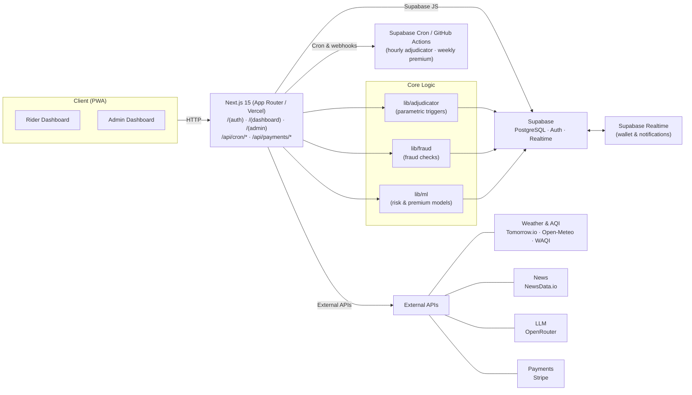

# Oasis

**AI-powered parametric wage protection for India's Q-commerce delivery partners.**

Oasis safeguards gig workers (Zepto, Blinkit) against income loss caused by external disruptions — extreme weather, zone lockdowns, and traffic gridlock — through automated trigger detection, fast payout release, and weekly pricing aligned to their earnings cycle.

> Coverage is strictly for **loss of income only** — no health, life, accident, or vehicle repair coverage.

---

## Documentation

- **Hosted docs:** [`https://oasisdocs.vercel.app`](https://oasisdocs.vercel.app)
- **Source docs:** [`/docs`](./docs) folder (Astro Starlight).

| Section                                                                | Description                             |
| ---------------------------------------------------------------------- | --------------------------------------- |
| [Onboarding](./docs/src/content/docs/features/onboarding.md)           | Two-step KYC: gov ID + face verification |
| [Architecture](./docs/src/content/docs/architecture.md)                | System design, data flow, key modules   |
| [Development Setup](./docs/src/content/docs/development-setup.md)       | Local setup, env vars, DB migrations    |
| [Parametric Triggers](./docs/src/content/docs/features/parametric-triggers.md) | How the adjudicator works               |
| [Fraud Detection](./docs/src/content/docs/features/fraud-detection.md) | 7-layer fraud check pipeline            |
| [Claims Processing](./docs/src/content/docs/features/claims-processing.md) | End-to-end parametric claims            |
| [Database Schema](./docs/src/content/docs/database.md)                 | All tables, RLS, relationships         |
| [API Reference](./docs/src/content/docs/api.md)                        | Every endpoint, request/response shapes  |
| [Deployment](./docs/src/content/docs/deployment.md)                   | Vercel deployment, cron setup            |
| [Payments (Stripe)](./docs/PAYMENTS.md)                               | Stripe-only; Razorpay deprecated         |
| [Realtime triggers](./docs/REALTIME-TRIGGERS.md)                     | Webhook + 15-min cron for adjudicator    |
| [Supabase Integrations](./docs/src/content/docs/features/supabase-integrations.md) | Cron, Queues, Stripe options            |

To run the docs site locally:

```bash
cd docs && npm install && npm run dev
```

The docs include `llms.txt`, `llms-full.txt`, and `llms-small.txt` for AI context (via starlight-llms-txt), plus OpenAPI-generated API reference from `openapi.yaml`.

---

## Quick Start

```bash
# 1. Clone and install
git clone https://github.com/lohitkolluri/oasis.git
cd oasis && yarn install

# 2. Set up environment variables (do not commit .env.local)
cp .env.local.example .env.local
# Required: NEXT_PUBLIC_SUPABASE_URL, NEXT_PUBLIC_SUPABASE_ANON_KEY,
# SUPABASE_SERVICE_ROLE_KEY, ADMIN_EMAILS, TOMORROW_IO_API_KEY, NEWSDATA_IO_API_KEY,
# STRIPE_SECRET_KEY, STRIPE_WEBHOOK_SECRET, CRON_SECRET. Optional: see list below.
# Run: make configure  (or npx tsx scripts/configure-env.ts) to fill interactively.

# 3. Apply database migrations (Supabase Dashboard → SQL Editor, run in order)
#    or via CLI: npx supabase link && yarn db:migrate

# 4. Create storage buckets (rider-reports, government-ids, face-photos)
yarn setup-storage

# 5. Run
yarn dev
```

**Environment variables (do not commit .env.local):**

| Variable | Required | Description |
|----------|----------|-------------|
| `NEXT_PUBLIC_SUPABASE_URL` | Yes | Supabase project URL |
| `NEXT_PUBLIC_SUPABASE_ANON_KEY` | Yes | Supabase anon key |
| `SUPABASE_SERVICE_ROLE_KEY` | Yes | Supabase service role key |
| `ADMIN_EMAILS` | Yes | Comma-separated admin emails |
| `TOMORROW_IO_API_KEY` | Yes | Weather / triggers |
| `NEWSDATA_IO_API_KEY` | Yes | News / disruption triggers |
| `STRIPE_SECRET_KEY` | Yes | Stripe API secret (sk_test_...) |
| `STRIPE_WEBHOOK_SECRET` | Yes | Stripe webhook secret (whsec_...); use [Stripe CLI](https://stripe.com/docs/stripe-cli) to forward locally |
| `CRON_SECRET` | Yes (prod) | Random string for /api/cron/*; required in production |
| `WEBHOOK_SECRET` | If using webhook | For POST /api/webhooks/disruption (realtime). No fallback to CRON_SECRET; set when using disruption webhook |
| `NEXT_PUBLIC_APP_URL` | Yes (prod) | Canonical app URL (e.g. https://your-app.vercel.app). Required in production for Stripe redirects and links |
| `OPENROUTER_API_KEY` | Yes | LLM (gov ID / face verification) |
| `WAQI_API_KEY` | No | AQI (optional fallback) |
| `NEXT_PUBLIC_STRIPE_PUBLISHABLE_KEY` | No | Stripe publishable key (pk_test_...) |
| `GOV_ID_ENCRYPTION_KEY` | **Production** | 32-byte base64 key; required in production to store government ID images (KYC). Omit in dev to store unencrypted. |
| `FACE_PHOTO_ENCRYPTION_KEY` | **Production** | 32-byte base64 key; required in production to store face verification photos. Falls back to `GOV_ID_ENCRYPTION_KEY` if unset. |

Run `make configure` (or `npx tsx scripts/configure-env.ts`) to set these interactively.

See [Development Setup](./docs/src/content/docs/development-setup.md) for the full guide.

---

## Architecture Overview



**How it works:**

1. **Rider onboards** → Step 1: platform (Zepto/Blinkit), name, phone, zone. Step 2: government ID (Aadhaar) + face liveness verification.
2. **Subscribes weekly** → pays ₹79–₹149/week via Stripe (3 tiers, dynamic pricing).
3. **Disruption triggers** → **Realtime:** providers that support push (e.g. Tomorrow.io Alerts) POST to `/api/webhooks/disruption`. **Every 15 min:** cron polls weather, AQI, and news APIs for the rest.
4. **Disruption detected** → 7-check fraud pipeline → `parametric_claims` inserted with `status='pending_verification'`.
5. **Payout release** → rider completes lightweight GPS verification (automatically when possible on mobile), then the claim is marked `paid` and the wallet updates in real time. No manual claims form required.

---

## Idea & Strategy (Hackathon Deliverable)

### Personas & Workflows

- **Rider – Q‑commerce delivery partner (primary persona)**
  - Scenario: Rahul is a Zepto rider in Bangalore. A week of heavy rain and local flooding cuts his active delivery slots in half.
  - Workflow:
    1. Registers and completes onboarding (platform, zone, KYC).
    2. Buys a **weekly** Oasis plan (₹79–₹149 depending on risk tier).
    3. Continues working as usual; Oasis runs in the background.
    4. When a disruption crosses a parametric trigger in Rahul’s zone, Oasis auto‑creates a claim.
    5. Rahul gets a notification, confirms GPS location (1‑tap or auto on mobile), and his wallet balance updates instantly when the claim moves to `paid`.

- **Ops / Insurance Partner – Admin (secondary persona)**
  - Scenario: An operations manager wants to understand which zones are being hit most often, whether payouts are within loss‑ratio targets, and where fraud risk is rising.
  - Workflow:
    1. Logs into the **admin console**.
    2. Monitors KPIs (active riders, active policies, loss ratio, trigger distribution).
    3. Reviews the live trigger feed and fraud queue.
    4. Uses the **demo console** to simulate disruptions for sales demos or testing.
    5. Uses analytics to tune pricing and underwriting rules for future weeks.

- **Platform / Aggregator – Future persona**
  - Scenario: A platform (e.g., Zepto) wants coverage embedded into its rider app. Oasis exposes APIs and a dashboard that can be integrated downstream.

### Weekly Premium Model

- **Why weekly**
  - Delivery partners think in weekly buckets: “What did I make this week?”
  - Cashflow is tight; monthly/annual premiums are misaligned and harder to justify.
  - Hackathon constraint explicitly requires weekly pricing, which matches parametric, event‑driven payouts.

- **Model**
  - Three plans in `plan_packages`:
    - `Basic`: ₹79/week → ₹300 per claim, up to 2 claims/week.
    - `Standard`: ₹99/week → ₹400 per claim, up to 2 claims/week.
    - `Premium`: ₹149/week → ₹600 per claim, up to 3 claims/week.
  - Pricing is derived from:
    - Historical disruption frequency per zone (heat/rain/AQI/lockdown/traffic).
    - Target loss ratio bands (e.g., 60–80%).
    - Platform‑specific risk multipliers (Zepto vs Blinkit vs others).
  - Premiums are charged weekly via Stripe; a Supabase cron (or webhook) runs the **weekly premium** job and enforces coverage windows (`week_start_date` / `week_end_date`).

### Parametric Triggers (Summary)

The adjudicator (see `lib/adjudicator`) evaluates five trigger types:

- **Extreme Heat** – Open‑Meteo / Tomorrow.io
  - Trigger: temperature \> 43°C for 3+ consecutive hours.
  - Geofence: 15km radius around clustered rider zones.

- **Heavy Rain** – Tomorrow.io
  - Trigger: `precipitationIntensity ≥ 4 mm/h`.
  - Geofence: 15km radius.

- **Severe AQI (adaptive)** – WAQI / Open‑Meteo
  - Trigger: current AQI ≥ 140% of the zone’s 30‑day p75 baseline (with sensible floor/cap).
  - Geofence: 15km radius.

- **Traffic Gridlock** – NewsData.io + LLM
  - Trigger: headlines classify as severe gridlock with severity ≥ 6/10.
  - Geofence: 20km radius.

- **Zone Curfew / Strike / Lockdown** – NewsData.io + LLM + geocoding
  - Trigger: LLM extracts a zone/region and severity ≥ 6/10.
  - Geofence: 20–50km depending on localization.

All triggers are converted into `live_disruption_events` rows with geofences, severity, and raw API data. The adjudicator then:
- Finds active weekly policies in the geofence.
- Enforces weekly claim caps.
- Runs a multi‑stage fraud pipeline.
- Inserts `parametric_claims` as `pending_verification` and notifies riders.

### Web vs Mobile Platform Justification

- **Primary surface: mobile PWA**
  - Riders mostly operate on low‑end Android phones; asking them to install a heavy native app is unrealistic for a hackathon and slows adoption.
  - Oasis ships as an installable PWA with offline support and a home‑screen icon, using `@ducanh2912/next-pwa`.
  - GPS verification, notifications, and the bottom navigation are optimized for small screens.

- **Admin surface: web dashboard**
  - Ops teams and insurers typically work on laptops/desktops; the admin console is optimized for a wide layout and rich charts (Recharts).
  - This separation keeps the rider UX clean while still providing deep analytics and control for partners.

### AI / ML Integration

- **Premium Calculation (planned / partial)**
  - `lib/ml/premium-calc.ts` (and the `next-week-risk` module) estimate upcoming claims volume based on:
    - Tomorrow.io forecast (heat + rain hours).
    - Open‑Meteo AQI forecasts.
    - Current active policy counts by zone.
  - These models drive:
    - Expected claim range per week.
    - Zone‑level risk categories (low/medium/high).
    - Future premium tuning for specific zones or platforms.

- **Fraud Detection**
  - Rule‑based pipeline in `lib/fraud`:
    - Duplicate claim checks per policy/event.
    - Rapid‑fire claims from the same device/phone.
    - Weather mismatch checks (trigger vs raw data).
    - Location verification mismatches (`outside_geofence`).
  - ML extension (future): anomaly detection over claims, geo‑patterns, and device fingerprints.

- **LLM Usage**
  - **ID & face verification**: OpenRouter LLM helps validate government IDs and face matches (with deterministic prompts and scoring).
  - **News severity classification**: OpenRouter is used to score traffic/lockdown headlines and extract affected zones for triggers.

### Tech Stack & Development Plan

- **Tech stack** (summary)
  - Frontend: Next.js 15 (App Router), TypeScript, Tailwind, Framer Motion, PWA.
  - Backend: Supabase (PostgreSQL, Auth, Realtime, Storage, Functions).
  - Data & APIs: Tomorrow.io, Open‑Meteo, WAQI, NewsData.io, Stripe.
  - AI/LLM: OpenRouter (`arcee-ai/trinity-large-preview:free`).
  - Infra: Vercel (bom1 region), Supabase project, GitHub Actions for cron.

- **Phase 1 – Prototype (this submission)**
  - Rider onboarding, KYC, weekly subscription, wallet, basic analytics.
  - Parametric trigger engine wired to external APIs and demo mode.
  - GPS‑gated payouts with full audit trail.

- **Phase 2 – Deepening automation**
  - More robust ML‑driven premium recommendations per zone.
  - Expanded fraud scoring and explainability for admins.
  - Partner‑facing APIs for embedding Oasis coverage into existing apps.

- **Phase 3 – Scaling to production**
  - Harden security, RLS policies, and observability.
  - Multi‑tenant support for different platforms/insurers.
  - SLA and monitoring for trigger latency and payout times.

---

## Parametric Triggers

| Trigger              | Source                   | Threshold                            |
| -------------------- | ------------------------ | ------------------------------------ |
| Extreme heat         | Open-Meteo / Tomorrow.io | >43°C for 3+ hours                   |
| Heavy rain           | Tomorrow.io              | ≥ 4 mm/hr precipitation              |
| Severe AQI           | WAQI / Open-Meteo        | 40% above zone's 30-day p75 baseline |
| Zone curfew / strike | NewsData.io + LLM        | LLM severity ≥ 6/10                  |
| Traffic gridlock     | NewsData.io + LLM        | LLM severity ≥ 6/10                  |

---

## Tech Stack

| Layer      | Stack                                               |
| ---------- | --------------------------------------------------- |
| Frontend   | Next.js 15, TypeScript, Tailwind CSS, Framer Motion |
| Backend    | Supabase (PostgreSQL, Auth, Realtime)               |
| AI / LLM   | OpenRouter (`arcee-ai/trinity-large-preview:free`)  |
| Weather    | Tomorrow.io, Open-Meteo, WAQI                       |
| News       | NewsData.io                                         |
| Payments   | Stripe (test mode)                                  |
| Deployment | Vercel — Mumbai region (`bom1`)                     |
| PWA        | `@ducanh2912/next-pwa` with offline fallback        |

---

## Database Setup

Apply all migrations in `supabase/migrations/` (run in timestamp order) to your Supabase project:

**Option A — Supabase Dashboard:** SQL Editor → run each file in timestamp order.

**Option B — CLI:**

```bash
npx supabase link --project-ref <project-ref>
yarn db:migrate
```

---

## Cron Jobs

- **Adjudicator:** every **15 minutes** (covers weather/AQI/news that don’t support webhooks). For **realtime**, use `POST /api/webhooks/disruption` for providers that support push (see [Realtime Triggers](./docs/REALTIME-TRIGGERS.md)).
- **Weekly premium:** Sunday 17:30 UTC.

**Free option:** use the GitHub Actions workflow in `.github/workflows/cron.yml` — add `CRON_SECRET` and `APP_URL` as repo secrets. See [Deployment → Cron Jobs](docs/docs/deployment.md#cron-jobs) for setup.

---

## License

MIT
