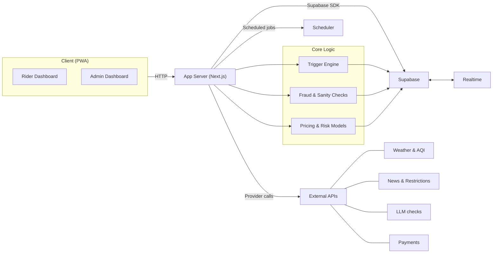

<h1 align="center">Oasis</h1>

<p align="center">
  AI‑powered parametric wage protection for India's Q‑commerce delivery partners.
</p>

<p align="center">
  
  
  
  
  
</p>

Oasis safeguards gig workers (Zepto, Blinkit, etc.) against **loss of income** caused by external disruptions (extreme weather, zone lockdowns, traffic gridlock) using **weekly premiums**, **parametric triggers**, and **automatic payouts** without manual claims forms.

> Coverage is strictly for **loss of income only**; there is no health, life, accident, or vehicle repair coverage.

---

## Table of Contents

- [Features](#features)
- [Tech Stack](#tech-stack)
- [Architecture](#architecture)
- [Project Structure](#project-structure)
- [Getting Started](#getting-started)
  - [Prerequisites](#prerequisites)
  - [Installation](#installation)
  - [Environment Variables](#environment-variables)
- [Usage](#usage)
- [Screenshots / Demo](#screenshots--demo)
- [Roadmap](#roadmap)
- [License](#license)

---

## Features

- **Parametric wage protection** for Q‑commerce delivery partners driven by external disruption triggers.
- **Multi-source trigger engine** using weather, AQI, traffic, and news feeds (Tomorrow.io, Open‑Meteo, WAQI, NewsData.io).
- **Weekly premium model** with configurable plans (Basic, Standard, Premium) and automatic weekly coverage windows.
- **Adjudicator engine** that runs on cron and webhooks to auto-create and verify claims without manual adjustment.
- **Fraud and sanity checks** pipeline (caps, duplication checks, geo validation, device heuristics).
- **Rider PWA dashboard** for onboarding, KYC (government ID and face verification), policies, wallet, and claim history.
- **Admin console** for system health, riders, triggers, payouts, fraud monitoring, and financial analytics.
- **Supabase Auth with row-level security** for secure multi-role access (rider and admin).
- **Stripe integration** for weekly premium payments and payout tracking.
- **Realtime user experience** via Supabase Realtime for live wallet and claim updates.
- **Documentation site** built with Astro Starlight covering architecture, APIs, database schema, and deployment.

---

## Tech Stack

| Layer         | Technologies                                                                    |
| ------------- | ------------------------------------------------------------------------------- |
| Framework     | Next.js 15 (App Router), React 18                                               |
| Language      | TypeScript                                                                      |
| Styling/UI    | Tailwind CSS, shadcn/ui (Radix primitives), Framer Motion, Lucide icons         |
| Backend API   | Next.js API routes (`/api/*`)                                                   |
| Data & Auth   | Supabase (PostgreSQL, Auth, Realtime, Storage)                                  |
| Payments      | Stripe                                                                          |
| External APIs | Tomorrow.io, Open‑Meteo, WAQI, NewsData.io, OpenRouter (LLM)                    |
| Realtime      | Supabase Realtime                                                               |
| PWA           | `@ducanh2912/next-pwa`                                                          |
| Docs          | Astro + Starlight (`Docs/` workspace, hosted at `https://oasisdocs.vercel.app`) |
| Tooling       | Node.js ≥ 20, ESLint, Tailwind, `tsx`                                           |

---

## Architecture

Oasis is a **Next.js 15 App Router** application backed by **Supabase** for data, auth, storage, and realtime updates, with background jobs and webhooks driving the parametric trigger engine.

- **Client layer**: Rider and admin dashboards implemented as a mobile-first PWA with a separate admin layout.
- **Application layer**: Next.js API routes handle onboarding, policies, claims, payments, and admin features.
- **Data and services layer**: Supabase PostgreSQL for core tables and row-level security, plus external providers for weather, AQI, traffic, news, payments, and LLM tasks.
- **Automation layer**: Cron endpoints and webhooks run the adjudicator and weekly premium jobs, creating parametric claims and updating wallets automatically.

### Architecture Overview



**How it works:**

1. **Rider onboards** → platform (Zepto/Blinkit), identity, zone + KYC (government ID + face liveness).
2. **Subscribes weekly** → pays ₹49–₹199/week via Stripe (weekly tiers, dynamic pricing).
3. **Disruption triggers** → realtime push (webhooks) when available; otherwise cron polls weather/AQI/news on a 15‑minute cadence.
4. **Disruption detected** → fraud pipeline runs → `parametric_claims` inserted with `status='pending_verification'`.
5. **Payout release** → lightweight GPS verification (automatic when possible) → claim marked `paid` and wallet updates via realtime. No manual claims form required.

For full sequence diagrams and a detailed system breakdown, refer to the Architecture section in the docs site at [`https://oasisdocs.vercel.app`](https://oasisdocs.vercel.app).

---

## Project Structure

High-level structure of the main app workspace:

```text
oasis/
├─ app/                        # Next.js App Router (routes, layouts, pages)
│  ├─ (auth)/                  # Public auth flows (login, register, onboarding)
│  ├─ (dashboard)/             # Rider dashboard (policies, claims, wallet, wallet history)
│  ├─ (admin)/                 # Admin console (analytics, riders, triggers, fraud, health)
│  ├─ api/                     # API routes (admin, rider, payments, cron, webhooks)
│  ├─ layout.tsx               # Root layout
│  └─ page.tsx                 # Landing / entry page
├─ components/                 # Shared UI and feature components
│  ├─ admin/                   # Admin dashboard components
│  ├─ rider/                   # Rider dashboard components
│  └─ ui/                      # Design system primitives (shadcn-based, Radix wrappers)
├─ hooks/                      # React hooks (for example, mobile layout helpers)
├─ lib/                        # Core business logic (adjudicator, fraud, ML, Supabase helpers)
├─ public/                     # Static assets (logos, PWA icons, background graphics)
├─ scripts/                    # Local tooling (env configuration, database reset)
├─ supabase/                   # Supabase migrations, types, and edge functions
├─ docs/                       # Astro Starlight documentation site (oasisdocs.vercel.app)
├─ .github/workflows/          # CI and scheduled cron workflows
├─ .cursor/                    # Cursor agent configuration and rules
├─ middleware.ts               # Next.js middleware (auth/session handling)
├─ next.config.ts              # Next.js configuration
└─ tailwind.config.ts          # Tailwind CSS configuration
```

See the documentation site (`https://oasisdocs.vercel.app`) for detailed database schema, API reference, and feature-level docs.

---

## Getting Started

### Prerequisites

- **Node.js** `>= 20`
- **Package manager**: Yarn (recommended) or npm
- **Supabase project** with:
  - PostgreSQL instance
  - Auth and Realtime enabled
- **Supabase CLI** (optional but recommended) for `db:migrate`
- **Stripe account & CLI** (for local webhook testing)
- Access tokens / API keys for:
  - Tomorrow.io / Open‑Meteo / WAQI
  - NewsData.io
  - OpenRouter (LLM)

### Installation

Clone the repository and install dependencies using Bun:

```bash
# 1. Clone
git clone https://github.com/lohitkolluri/oasis.git
cd oasis

# 2. Install dependencies
bun install
```

Apply database migrations to your Supabase project (see the Development Setup section in the docs for full instructions):

```bash
# Run database migrations defined under supabase/migrations
bun run db:migrate
```

Set up Supabase storage buckets used by the app:

```bash
bun run setup-storage
```

### Environment Variables

Create a local env file:

```bash
cp .env.local.example .env.local
```

You can optionally run the interactive env configurator:

```bash
make configure
# or
npx tsx scripts/configure-env.ts
```

Core variables (see docs for the full list):

| Variable                             | Required   | Description                                                                                        |
| ------------------------------------ | ---------- | -------------------------------------------------------------------------------------------------- |
| `NEXT_PUBLIC_SUPABASE_URL`           | Yes        | Supabase project URL                                                                               |
| `NEXT_PUBLIC_SUPABASE_ANON_KEY`      | Yes        | Supabase anon key                                                                                  |
| `SUPABASE_SERVICE_ROLE_KEY`          | Yes        | Supabase service role key (server-side only)                                                       |
| `ADMIN_EMAILS`                       | Yes        | Comma-separated admin emails allowed into the admin console                                        |
| `TOMORROW_IO_API_KEY`                | Yes        | Weather API key for disruption detection                                                           |
| `NEWSDATA_IO_API_KEY`                | Yes        | News API key for traffic/lockdown triggers                                                         |
| `STRIPE_SECRET_KEY`                  | Yes        | Stripe secret key (test or live)                                                                   |
| `STRIPE_WEBHOOK_SECRET`              | Yes        | Stripe webhook signing secret for payments callbacks                                               |
| `CRON_SECRET`                        | Yes (prod) | Shared secret for cron endpoints under `/api/cron/*`                                               |
| `WEBHOOK_SECRET`                     | If used    | Secret for `POST /api/webhooks/disruption` when using realtime push from providers                 |
| `NEXT_PUBLIC_APP_URL`                | Yes (prod) | Canonical app URL used for redirects and links (e.g. `https://your-app.vercel.app`)                |
| `OPENROUTER_API_KEY`                 | Yes        | LLM API key used for gov ID / face verification and news severity classification                   |
| `WAQI_API_KEY`                       | No         | Optional AQI data source                                                                           |
| `NEXT_PUBLIC_STRIPE_PUBLISHABLE_KEY` | No         | Stripe publishable key for checkout                                                                |
| `GOV_ID_ENCRYPTION_KEY`              | Prod       | 32-byte base64 key for encrypting stored government ID images                                      |
| `FACE_PHOTO_ENCRYPTION_KEY`          | Prod       | 32-byte base64 key for encrypting face verification photos (falls back to `GOV_ID_ENCRYPTION_KEY`) |

> **Do not commit** `.env.local` or any secrets to version control.

Start the development server:

```bash
bun dev
```

The app runs by default at `http://localhost:3000`.

To run the documentation site locally:

```bash
cd Docs
bun install
bun dev
```

The docs site will be available at `http://localhost:4321` by default (Astro).

---

## Usage

Common workflows after setup:

- **Rider flow**
  - Visit the app, register via `(auth)` routes, and complete **KYC onboarding** (government ID + face verification).
  - Choose a **weekly plan** and complete payment via Stripe.
  - Use the **dashboard** to view active coverage, disruption-based claims, and wallet payouts.

- **Admin flow**
  - Log in with an email included in `ADMIN_EMAILS` (or `role = 'admin'` in Supabase).
  - Use the **admin console** to:
    - Monitor riders, policies, and zone-level exposure.
    - Inspect **parametric triggers**, disruptions, and fraud signals.
    - Review system health, logs, and weekly revenue.

- **Background processing**
  - Configure cron (GitHub Actions, Supabase cron, or external scheduler) to call:
    - `/api/cron/adjudicator` every **15 minutes** for disruption detection and claims.
    - `/api/cron/weekly-premium` weekly for premium billing and coverage windows.
  - Optionally wire providers to `POST /api/webhooks/disruption` for **realtime push** instead of polling.

Refer to the docs (`Development Setup`, `Parametric Triggers`, `Claims Processing`, `Deployment`) for exact endpoints and payloads.

---

## Roadmap

This is an indicative roadmap; see issues and docs for up-to-date status.

- [x] Rider onboarding with KYC (gov ID + face verification)
- [x] Weekly premium plans with Stripe checkout
- [x] Parametric trigger engine (weather, AQI, traffic, lockdowns)
- [x] Automated claims creation and realtime wallet updates
- [x] Admin console for riders, triggers, fraud, and financials
- [x] Documentation site (architecture, APIs, database, deployment)
- [ ] Deeper ML-driven pricing and risk scoring per zone
- [ ] Expanded fraud scoring and anomaly detection
- [ ] Partner-facing embedding APIs and webhooks
- [ ] Multi-tenant support for multiple platforms/insurers
- [ ] Production hardening (observability, SLAs, scaling benchmarks)

---

## License

This project is licensed under the **MIT License**.
See the [`LICENSE`](./LICENSE) file for details.
